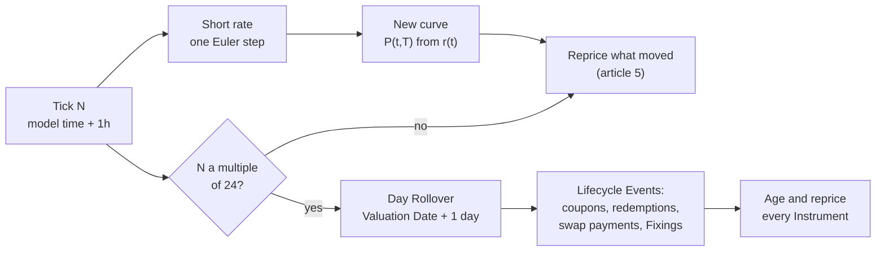
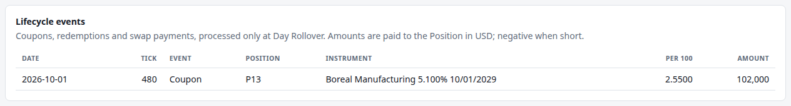

# 3. Moving the curve through time

!!! warning "Draft"

    This article is a draft under review and may change.

*Hull-White, simulated time, and why the Valuation Date moves only at Day Rollover.*


**Previously:** [article 2](02-the-yield-curve.md) built the engine's starting curve from the fourteen par
yields the US Treasury published for 11 September 2026: a discount factor, a zero rate and a forward rate
for every maturity. That curve is a snapshot. A risk system exists because the curve does not stay still.

## The real-world problem

A risk engine is only interesting while the market moves. Its whole job is to notice what has changed and
reprice what that affects. A frozen market would leave nothing to show. The engine therefore needs a
market that moves, continuously and on demand, on a laptop, with no live data feed.

It also needs the market to move *realistically*. Shifting each Pillar of the curve by its own random
amount would not do. Rates at nearby maturities move together, and the curve keeps a plausible shape. The
very first move also has to start from the curve article 2 built, not from somewhere nearby, or every
price would jump on the first Tick for no reason.

Then there is time. As the market moves, time passes: a bond gets closer to its maturity, coupons fall
due, a swap reaches its next reset date. A simulation has to decide how its own clock relates to the
calendar that pricing uses. That is less obvious than it sounds.

This article covers both: the model that moves the curve, and the two clocks that separate market moves
from the calendar.

## How it works

### One number that moves the whole curve

The simplest realistic way to move a whole yield curve is to model one number, the **short rate**: the
interest rate for borrowing over the next instant. It is a natural starting point, because the rate a
central bank controls is a very short-term one.[^frbsf] If the short rate is known, and the model says how
it tends to move, then the price of every bond, and so the whole curve, follows by arbitrage.

This idea goes back to Vasicek (1977).[^vasicek] He assumed that the short rate follows a random process
and that bond prices depend only on it, and showed that no-arbitrage then pins down the price of every
bond. In his example the short rate is *mean-reverting*. A drift pulls it back towards a long-run level,
with a force "proportional to the deviation of the process from the mean",[^vasicek] and random shocks
push it about. Rates wander, but they do not wander off forever.

Vasicek's model has a practical flaw for a risk system. Its handful of constant parameters produce a
curve of a fixed family of shapes. Almost never is that exactly today's curve. Hull and White put the
problem plainly: such models "do not provide a perfect fit to the initial term structure of interest
rates".[^hw1990] A model that misprices today's Treasuries on its first step is no use as a starting
point.

### Hull-White: Vasicek that fits today's curve

Hull and White's fix (1990) was to let the drift depend on time.[^hw1990] The model keeps Vasicek's two
constants:

- **the mean reversion $a$**, how fast the short rate is pulled back. The demo uses $a = 0.05$ a year, a
  slow pull: a deviation takes about $1/a = 20$ years to fade to about a third of its size (a factor of
  $1/e$);
- **the volatility $\sigma$**, the size of the random shocks. The demo uses $\sigma = 0.01$, which is 100bp
  a year for the short rate.

It then adds a time-dependent term, $\theta(t)$, chosen so that the model reproduces today's discount curve
exactly. Hull and White describe it as a mean-reversion level that is "a function ... of time".[^hw1990] In
practice, $\theta(t)$ is fitted to the initial curve, and $a$ and $\sigma$ are chosen to fit the prices of
interest rate options.[^hw2000] The demo sets $a$ and $\sigma$ by hand (the `risk.hull-white.a` and
`risk.hull-white.sigma` settings), because it has no option prices to fit.

!!! formula "The Hull-White model"

    The short rate $r$ follows

    $$
    dr = \big[\theta(t) - a\,r\big]\,dt + \sigma\,dW ,
    $$

    where $dW$ is a Brownian motion shock. For constant $a$ and $\sigma$, the drift that makes the model
    reproduce today's instantaneous forward curve $f(0,t)$ exactly is[^textbook-theta]

    $$
    \theta(t) = \frac{\partial f(0,t)}{\partial t} + a\,f(0,t) + \frac{\sigma^2}{2a}\left(1 - e^{-2at}\right).
    $$

    The model starts from $r(0) = f(0,0)$, today's instantaneous short forward. On the demo's curve that
    is 3.924%, the same as the 1-month zero rate: the interpolator sets the slope at the start of the
    curve equal to the slope of its first segment.

This is where article 2's attention to forward rates pays off. $\theta(t)$ is built from the forward curve
*and its slope*. A curve whose forwards jumped at every knot would give a $\theta$ with spikes at every
knot, and the simulated short rate would be yanked about at each one. The engine's continuous forwards
keep $\theta$ free of jumps.

### From the short rate to the whole curve

Hull-White is popular because it is "very tractable analytically".[^hw1990] Given the short rate at time
$t$, every discount factor from $t$ has a closed form, with no simulation and no numerical integration.
The engine rebuilds the whole curve on every Tick from that formula and the current short rate.

!!! formula "The whole curve from one number"

    The price at time $t$ of 1 paid at $T$, given the short rate $r$ at $t$, is

    $$
    P(t,T) = A(t,T)\,e^{-B(t,T)\,r},
    \qquad
    B(t,T) = \frac{1 - e^{-a(T-t)}}{a},
    $$

    $$
    \ln A(t,T) = \ln\frac{P(0,T)}{P(0,t)} + B(t,T)\,f(0,t) - \frac{\sigma^2}{4a}\left(1 - e^{-2at}\right)B(t,T)^2 ,
    $$

    where $P(0,\cdot)$ and $f(0,\cdot)$ are today's discount and forward curves.[^textbook-theta] At
    $t = 0$, with $r = f(0,0)$, this returns today's curve exactly.

    The zero rate for maturity $\tau = T - t$ is $-\ln P(t,T)/\tau$. It depends on $r$ through the term
    $B(t,T)\,r/\tau$. So a move of $\Delta r$ in the short rate moves that zero rate by

    $$
    \Delta R(\tau) = \frac{B(\tau)}{\tau}\,\Delta r = \frac{1 - e^{-a\tau}}{a\,\tau}\,\Delta r .
    $$

That last formula is the model's picture of how a curve moves. The *loading* $B(\tau)/\tau$ is almost 1
at the short end and falls with maturity. With $a = 0.05$:

| Pillar | Loading $B(\tau)/\tau$ |
|---|---|
| 3M | 0.994 |
| 1Y | 0.975 |
| 2Y | 0.952 |
| 3Y | 0.929 |
| 5Y | 0.885 |
| 7Y | 0.844 |
| 10Y | 0.787 |
| 20Y | 0.632 |
| 30Y | 0.518 |

A 1bp rise in the short rate raises the 3-month zero rate by 0.99bp and the 30-year by only 0.52bp. **The
short end moves more than the long end.** That is mean reversion at work: a shock to today's short rate
is expected to fade, so it matters less for the average rate over thirty years than over three months.
The faster the reversion, the faster the loading falls.

Every Pillar's move comes from the same single shock, so every Pillar moves in the same direction on
every Tick, in fixed proportions. Vasicek said so from the start: with one state variable, "the
instantaneous returns on bonds of different maturities are perfectly correlated".[^vasicek] Real curves do
not behave like that. Studies summarised by the Federal Reserve Bank of San Francisco find that three
factors capture most yield-curve movement: a *level* shift that moves all maturities almost equally, a
*slope* change that moves short rates much more than long ones, and a *curvature* change centred on the
middle.[^frbsf] A one-factor model has only one of them, and its single factor is a blend of level and
slope. Articles 4 and 5 show why the engine still measures risk Pillar by Pillar despite this.

### Stepping the short rate: Euler-Maruyama

The model is continuous; the simulation moves in steps. Each Tick advances model time by
$\Delta t$ (one simulated hour in the demo) and moves the short rate by its drift over that hour plus a
random shock. That is the Euler-Maruyama scheme, the simplest way to step a stochastic differential
equation.[^kp]

!!! formula "One Tick of the short rate"

    With $Z$ a standard normal draw,

    $$
    r(t + \Delta t) = r(t) + \big[\theta(t) - a\,r(t)\big]\,\Delta t + \sigma\sqrt{\Delta t}\;Z .
    $$

    With one hour per Tick, $\Delta t = 1/8760$ years (the engine counts time as ACT/365), so the random
    part has a standard deviation of

    $$
    \sigma\sqrt{\Delta t} = 0.01 \times \sqrt{1/8760} \approx 1.07\ \text{bp per Tick}.
    $$

The Hull-White short rate actually has an exact Gaussian transition, so it could be stepped with no
discretisation error at all. At one-hour steps, Euler's error is far below anything visible, and the
simple scheme is easier to read.

Two details make the demo reproducible:

- **One seeded random source.** Every random number in a session, for rates, credit and futures alike,
  comes from a single generator seeded from `risk.simulation.seed`. It is a named algorithm
  (`L64X128MixRandom`) rather than the JDK default, so the same seed replays the same run on any Java
  build.
- **Shocks come from outside the model.** The short-rate simulator does not draw its own random numbers.
  It is handed a shock $Z$. That shock is one of a set of correlated shocks drawn together each Tick, so
  that rates, credit spreads and the futures Basis can move together. Article 10 covers how.

### Two clocks

Simulated time in the engine runs on two clocks, and keeping them apart is a deliberate design choice.

**Ticks move the market.** A [Tick](../glossary.md#tick) is one step of the simulation. It advances
*model time* by a fixed amount (`risk.simulation.simulated-time-per-tick`, one hour in the demo), moves
the short rate, and so moves the curve and every other market factor. Ticks are what make the risk
numbers change from second to second.

**Day Rollovers move the calendar.** The [Valuation Date](../glossary.md#valuation-date) is the calendar
date that pricing uses: for accrued interest, for the time left to each cash flow, and for which cash
flows are still to come. It stays fixed for a whole simulated day. Every `risk.simulation.ticks-per-day`
Ticks (24 in the demo), a [Day Rollover](../glossary.md#day-rollover) moves it on by one day, and at that
moment:

- every Instrument is aged by a day and repriced;
- any coupon, redemption or swap payment that fell due is paid, as a
  [Lifecycle Event](../glossary.md#lifecycle-event);
- any swap resetting that day records its [Fixing](../glossary.md#fixing) (article 9).

Why not let the Valuation Date move a little every Tick? Because the calendar side of pricing is counted
in whole days. Accrued interest counts days, and coupons fall on dates. An hour of calendar time has no
meaning for either. Letting it drift intraday would also make every Instrument's price change on every
Tick purely from ageing, even with the market standing still, which would hide exactly the market moves
the engine exists to show. With a fixed Valuation Date, an Instrument's price changes within the day only
when its market inputs move. Ageing happens all at once, at the rollover, where it can be seen.

The two settings are independent: the time per Tick decides how big each market move is, and the Ticks
per day decides how often the calendar turns. That lets a run show visible per-Tick moves without ageing
the Book unrealistically fast. The demo sets them consistently: 24 one-hour Ticks make one simulated day,
so model time and the calendar agree at every rollover.



## How the system does it

`HullWhiteModel` holds the three formulas from the boxes above: $\theta(t)$, $B(t,T)$ and the closed-form
discount factor. They are built from article 2's `DiscountCurve`, which supplies today's log discount
factors and forward rates. The slope of the forward curve in $\theta(t)$ is taken numerically, as a central
difference over $\pm 10^{-4}$ years:

```java title="HullWhiteModel.java" linenums="39"
    /** θ(t) = ∂f(0,t)/∂t + a·f(0,t) + (σ²/2a)·(1 − e^(−2at)). */
    public double theta(double t) {
        double lower = Math.max(0, t - DERIVATIVE_STEP);
        double upper = t + DERIVATIVE_STEP;
        double forwardSlope = (initialCurve.instantaneousForward(upper) - initialCurve.instantaneousForward(lower))
                / (upper - lower);
        return forwardSlope + a * initialCurve.instantaneousForward(t)
                + sigma * sigma / (2 * a) * (1 - Math.exp(-2 * a * t));
    }

    /** B(t,T) = (1 − e^(−a(T−t))) / a. */
    public double b(double t, double maturity) {
        return (1 - Math.exp(-a * (maturity - t))) / a;
    }

    /** Closed-form zero-coupon bond price P(t,T) = A(t,T)·exp(−B(t,T)·r). */
    public double discountFactor(double t, double maturity, double shortRate) {
        double b = b(t, maturity);
        double lnA = initialCurve.logDiscountFactor(maturity) - initialCurve.logDiscountFactor(t)
                + b * initialCurve.instantaneousForward(t)
                - sigma * sigma / (4 * a) * (1 - Math.exp(-2 * a * t)) * b * b;
        return Math.exp(lnA - b * shortRate);
    }
```

[View on GitHub](https://github.com/suhasghorp/fixed-income-risk-engine/blob/series-v1/backend/src/main/java/com/fixedincomerisk/model/HullWhiteModel.java#L39-L61)

The simulator is the Euler step, and nothing else. The shock arrives as an argument:

```java title="HullWhiteSimulator.java" linenums="26"
    /** Advances by {@code dt} years using a standard normal {@code shock}. */
    public void advance(double dt, double shock) {
        HullWhiteParameters parameters = model.parameters();
        shortRate += (model.theta(time) - parameters.meanReversion() * shortRate) * dt
                + parameters.volatility() * Math.sqrt(dt) * shock;
        time += dt;
    }
```

[View on GitHub](https://github.com/suhasghorp/fixed-income-risk-engine/blob/series-v1/backend/src/main/java/com/fixedincomerisk/model/HullWhiteSimulator.java#L26-L32)

The market curve on each Tick is `model.curveAt(time, shortRate)`: discount factors $P(t, t+\tau)$ for a
cash flow $\tau$ years away. Pricing measures $\tau$ from the Valuation Date. Within a simulated day, the
curve therefore moves with each hour of model time, but no cash flow gets any closer. That is the two
clocks in one line.

The calendar clock is `SimulationClock`. It counts Ticks, and rolls the Valuation Date over when a
simulated day is complete:

```java title="SimulationClock.java" linenums="24"
    /** Advances one Tick, rolling the Valuation Date over when the simulated day is complete. */
    public Step advance() {
        tick++;
        LocalDate previous = valuationDate;
        if (tick % ticksPerDay == 0) {
            valuationDate = valuationDate.plusDays(1);
        }
        return new Step(yearsPerTick, previous, valuationDate);
    }
```

[View on GitHub](https://github.com/suhasghorp/fixed-income-risk-engine/blob/series-v1/backend/src/main/java/com/fixedincomerisk/simulation/SimulationClock.java#L24-L32)

`MarketSimulator.advance` puts the pieces together, in order. It moves the clock, draws the Tick's
correlated shocks, and steps the short rate, the futures Basis and the credit factors. Only on a Day
Rollover does it process the cash flows that fell due and record the day's Fixings. Then it publishes the
new market state:

```java title="MarketSimulator.java" linenums="118"
    MarketTick advance() {
        if (!canAdvance()) {
            throw new IllegalStateException("The simulation is stopped at tick " + clock.tick());
        }
        SimulationClock.Step step = clock.advance();
        CorrelatedShockGenerator.Shocks tickShocks = shocks.next(random, futures.size());
        shortRate.advance(step.dt(), tickShocks.shortRate());
        List<CtdSwitchEvent> switches = ctdSwitchEvents(futuresBasis.advance(step.dt(), tickShocks.basis(), random));
        creditFactors.advance(clock.tick(), step.dt(), tickShocks.systemic(), random);
        marker.update(clock.tick(), creditFactors.observables(), creditObservations.advance(step.dt(), random));
        List<LifecycleEvent> events = step.isDayRollover()
                ? lifecycleEvents(step.previousValuationDate(), step.valuationDate())
                : List.of();
        if (step.isDayRollover()) {
            recordFixings();
        }
        market = currentMarket();
        return tick(step.isDayRollover(), events, switches, tickShocks);
    }
```

[View on GitHub](https://github.com/suhasghorp/fixed-income-risk-engine/blob/series-v1/backend/src/main/java/com/fixedincomerisk/session/MarketSimulator.java#L118-L136)

`MarketSimulator` never prices anything. It only moves the market and publishes it, which is what lets it
run on its own thread in article 11.

## See it running

Start the demo as usual and watch the header. Adding `stop-at-tick` freezes it at the states described
below:

```bash
# Terminal 1: the engine (replace N with 23, 24 or 480)
cd backend && mvn spring-boot:run -Dspring-boot.run.profiles=demo \
    -Dspring-boot.run.arguments=--risk.simulation.stop-at-tick=N

# Terminal 2: the UI, then open http://localhost:5173
cd frontend && npm install && npm run dev
```

At one Tick per second, Tick 480 takes eight minutes to reach.

**The last hour of the first day.** At Tick 23 the simulated time is +23h, the Valuation Date is still
the curve date, 2026-09-11, and the next Day Rollover is "in 1 tick":


**The first Day Rollover.** One Tick later the Valuation Date is 2026-09-12 and the countdown has reset to
24 Ticks:


That Tick repriced every Instrument in the Book, aged by one day. In [article 1](01-what-a-risk-system-is-for.md)'s
screenshot at Tick 30, most rows still said "last priced tick 24": they had not needed repricing since
this rollover.

**How the curve moves.** On the chart, the curve barely seems to move: a few basis points on an axis
three percentage points tall. The Pillar values under the chart do change on every Tick, and they move
exactly as the loadings above predict. Here is how far each Pillar has moved from its Tick-0 value at
three points in the run:


| Pillar (change since Tick 0, bp) | Tick 12 (+12h) | Tick 120 (+5d) | Tick 480 (+20d) |
|---|---|---|---|
| 3M | −5.42 | +6.42 | +3.51 |
| 1Y | −5.37 | +5.45 | −1.98 |
| 2Y | −5.28 | +4.91 | −3.68 |
| 3Y | −5.17 | +4.61 | −4.32 |
| 5Y | −4.93 | +4.30 | −4.48 |
| 7Y | −4.71 | +4.07 | −4.42 |
| 10Y | −4.39 | +3.80 | −4.09 |
| 20Y | −3.53 | +3.01 | −3.46 |
| 30Y | −2.90 | +2.44 | −2.93 |

- **After half a day** the curve has fallen, and the fall shrinks with maturity: 5.4bp at 3 months, 2.9bp
  at 30 years. The ratio of the 30-year move to the 3-month move is 0.54, close to the ratio of the
  loadings, $0.518 / 0.994 = 0.52$.
- **After five days** the curve has risen instead, in the same shape: the most at the short end, the
  least at the long end. Across the first 500 Ticks, the Tick-to-Tick moves at 3 months and at 30 years
  have a correlation of 0.999996. One shock drives them all.
- **After twenty days** the curve has changed *shape*: the 3-month rate is up 3.5bp while the 5-year is
  down 4.5bp. No single short-rate shock does that. This is the passage of time. As model time advances,
  the curve is the one seen from a later date, and today's forward curve is not flat. Twenty days in, the
  deterministic drift built into $\theta(t)$ has carried the short end up along today's rising short-end
  forwards, while the accumulated shocks have pulled the rest of the curve down. The random part still
  moves every maturity in lockstep. The shape changes come from time, not from a second factor.

The Tick-to-Tick moves have the size the model predicts, too. Over the first 500 Ticks, the standard
deviation of the 3-month move is 1.07bp per Tick and of the 30-year move 0.56bp. The formulas give
$0.994 \times 1.07 = 1.06$bp and $0.518 \times 1.07 = 0.55$bp.

**The first Lifecycle Event.** Nothing is paid until Tick 480, the Day Rollover into 1 October 2026. That
day Boreal Manufacturing's 5.10% bond pays its semi-annual coupon, 2.55 per 100 of face. Position P13
holds 4 million face, so it receives $102,000:




The coupon appears at Tick 480 exactly, not at the Tick where model time first passes midnight on
1 October. That is the same moment in the demo, but only because the demo's settings make them coincide.
Cash flows belong to the calendar clock.

!!! realdesk "What a real desk does differently"

    - **Desks do not simulate their own market.** A trading desk's risk system reads live prices, and the
      curve moves because the market moves. The engine simulates only because a public, reproducible
      demo cannot depend on a live feed.
    - **Models like Hull-White price derivatives; they do not drive the day.** Hull and White built their
      model to price interest rate derivatives: instruments whose value depends on where rates may go,
      not only on where they are.[^hw1990] On a desk, such a model sits inside the pricing of those
      instruments, fed by the live curve. It is not the source of the curve.
    - **Calibration to options.** A desk chooses $a$ and $\sigma$ (often as functions of time) so the model
      prices a set of actively traded caps and swaptions correctly.[^hw2000] The demo's values are picked
      by hand.
    - **More than one factor.** One factor moves the curve in lockstep. Hull and White themselves warn
      that practitioners using such models should monitor "all possible shifts in the term structure of
      interest rates (not just those that are consistent with the model)".[^hw1990-fn] Models that let the
      curve twist include two-factor short-rate models such as G2++, and market models such as the LIBOR
      market model.[^multifactor] Heath, Jarrow and Morton's framework fits any volatility structure, but
      in its general form Hull and White found it "computationally quite time consuming".[^hw1990] A demo
      that reprices a Book every second has good reason to prefer one fast factor.
    - **Business-day calendars.** The engine's Valuation Date moves on every calendar day, weekends
      included, so the demo's first rollover lands on Saturday 12 September 2026 (the bundled curve is
      from Friday 11 September). A desk's valuation date moves on business days, following a holiday
      calendar.

## Further reading

Primary sources:

- O. Vasicek, "An Equilibrium Characterization of the Term Structure", *Journal of Financial Economics*
  5(2), 1977, pp. 177–188, [doi:10.1016/0304-405X(77)90016-2](https://doi.org/10.1016/0304-405X(77)90016-2).
  The paper that started short-rate modelling.
- J. Hull and A. White, "Pricing Interest-Rate-Derivative Securities", *The Review of Financial Studies*
  3(4), 1990, pp. 573–592, [doi:10.1093/rfs/3.4.573](https://doi.org/10.1093/rfs/3.4.573). The extended
  Vasicek model that fits today's curve.
- J. Hull and A. White, [*The General Hull-White Model and Super
  Calibration*](https://w4.stern.nyu.edu/finance/docs/WP/2000/pdf/wpa00024.pdf), working paper, 2000
  (later in *Financial Analysts Journal* 57(6), 2001). How the model is calibrated in practice.
- T. Wu, [*What Makes the Yield Curve
  Move?*](https://www.frbsf.org/research-and-insights/publications/economic-letter/2003/06/what-makes-the-yield-curve-move/),
  FRBSF Economic Letter 2003-15. Level, slope and curvature, in plain language.
- R. B. Litterman and J. Scheinkman, "Common Factors Affecting Bond Returns", *The Journal of Fixed
  Income* 1(1), 1991, pp. 54–61, [doi:10.3905/jfi.1991.692347](https://doi.org/10.3905/jfi.1991.692347).
  The original level, slope and curvature study.

Textbooks:

- John C. Hull, *Options, Futures, and Other Derivatives*, 11th ed., Pearson, 2021. Short-rate models and
  Hull-White, including $\theta(t)$ and the bond price formula.
- Damiano Brigo and Fabio Mercurio, *Interest Rate Models: Theory and Practice*, 2nd ed., Springer, 2006.
  Vasicek, Hull-White (§3.3), and the two-factor G2++ model.
- Peter E. Kloeden and Eckhard Platen, *Numerical Solution of Stochastic Differential Equations*,
  Springer, 1992. Euler-Maruyama and higher-order schemes.

[^vasicek]: Vasicek (1977). The short rate "follows the so-called Ornstein-Uhlenbeck process", whose drift "represents a force that keeps pulling the process towards its long-term mean ... with magnitude proportional to the deviation of the process from the mean". On one-factor models: "Since there exists only one state variable, the instantaneous returns on bonds of different maturities are perfectly correlated."
[^hw1990]: Hull and White (1990), introduction and §1. Earlier models "do not provide a perfect fit to the initial term structure of interest rates"; the extended model adds a time-dependent drift and can be read as one where "the reversion level is a function ... of time"; it "is shown to be very tractable analytically"; Heath, Jarrow and Morton's general model "is computationally quite time consuming".
[^hw1990-fn]: Hull and White (1990), footnote 7.
[^hw2000]: Hull and White (2000): "The function θ(t) is selected so that the model fits the initial term structure. The functions a(t) and σ(t) are volatility parameters that are chosen to fit the market prices of a set of actively traded interest-rate options."
[^textbook-theta]: The explicit constant-parameter formulas are the standard textbook forms; see Hull, *Options, Futures, and Other Derivatives*, or Brigo and Mercurio, §3.3. The 1990 paper gives the fit in general form.
[^frbsf]: Wu (2003): "more than 99% of the movement of various Treasury bond yields are captured by three factors, which are often called 'level,' 'slope,' and 'curvature' (Litterman and Scheinkman 1991)"; and "the Fed controls only a very short-term rate, the federal funds rate".
[^kp]: Kloeden and Platen (1992).
[^multifactor]: Brigo and Mercurio (2006) for G2++; R. Rebonato, *Modern Pricing of Interest-Rate Derivatives: The LIBOR Market Model and Beyond*, Princeton University Press, 2002, for the LIBOR market model.

## Next

The curve now moves on every Tick, and the calendar turns every 24. [Article 4](04-pricing-a-bond-and-measuring-its-risk.md)
prices a bond off that moving curve: clean and dirty prices, accrued interest counted in days from the
Valuation Date, and DV01, the number every risk screen leads with.
