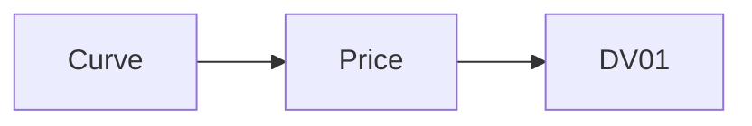

# N. Article title

<!--
The fixed skeleton every article follows. Section weights vary by article; the order does not.
This page is built but not listed in the navigation, so the features below can be checked in place.
-->

**Previously:** three lines recapping what the reader already knows and linking the earlier articles.

## The real-world problem

Why a desk cares. Glossary terms such as DV01, Mark or Staleness show their definition on hover.

## How it works

Intuition and pictures first. The maths follows in a box the reader can skip:

!!! formula "DV01 by bump and reprice"

    For a price $P(z)$ as a function of the zero curve $z$,

    $$
    \mathrm{DV01} = -\frac{P(z + 1\,\mathrm{bp}) - P(z - 1\,\mathrm{bp})}{2}
    $$



## How the system does it

```java title="SensitivityCalculator.java (excerpt)" linenums="1"
private static double bumpAndReprice(Instrument instrument, MarketState market, DoubleUnaryOperator shift) {
    double up = instrument.dirtyValue(bumped(market, shift));
    double down = instrument.dirtyValue(bumped(market, t -> -shift.applyAsDouble(t)));
    return (down - up) / 2;
}
```

[View on GitHub](https://github.com/suhasghorp/fixed-income-risk-engine/blob/series-v1/backend/src/main/java/com/fixedincomerisk/risk/SensitivityCalculator.java)

## See it running

```bash
cd backend && mvn spring-boot:run -Dspring-boot.run.profiles=demo \
    -Dspring-boot.run.arguments=--risk.simulation.stop-at-tick=121
```

An annotated screenshot goes here.

!!! realdesk "What a real desk does differently"

    Where the engine simplifies, and what production systems do instead.

## Further reading

- A primary source for every real-world claim.[^example]

[^example]: For example, CME Group, *Treasury Futures Conversion Factors*.

## Next

A pointer to the next article.
