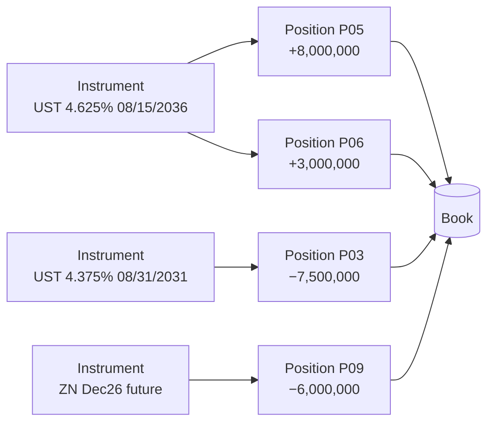
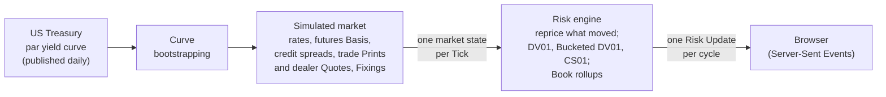
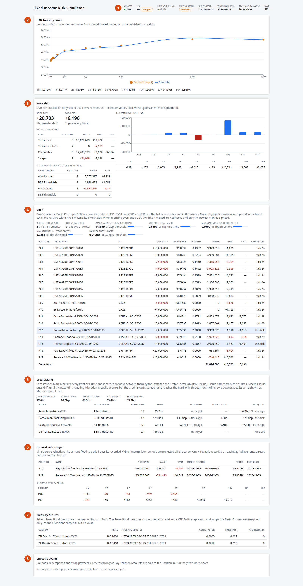

# 1. What a risk system is for

!!! warning "Draft"

    This article is a draft under review and may change.

*What a fixed income desk holds, why it needs continuous risk, and a tour of the running engine.*


**Previously:** nothing. This is the first article in the series. It sets out what a fixed income risk
system is for, introduces the engine that the other ten articles take apart, and gives a map of the
series.

## The real-world problem

A fixed income desk holds promises to pay money in the future. A US Treasury note promises a coupon every
six months and the face amount at maturity. A corporate bond makes the same kind of promise, but from a
company that might not keep it. An interest rate swap exchanges a fixed stream of payments for a floating
one. A Treasury future is an agreement to deliver a Treasury note on a date a few months away.

All of these are worth something today only because of what the market says about the future: where
interest rates will be, and how likely each borrower is to pay. When those views move, the value of
everything the desk holds moves with them, and it moves all day, not just at the close. A trader needs to
know, at any moment, how much the desk stands to lose if rates rise by a basis point, which part of the
curve that exposure sits on, and how much of it comes from credit rather than rates. The trader then
decides whether to hedge, to cut, or to add. A risk manager needs the same numbers to hold the desk to
its limits.

That is what a risk system is for. It answers one question, continuously: **if the market moves, what
happens to the value of what we hold?**

The question sounds simple, and in 2007–08 many banks could not answer it. After the crisis, the Basel
Committee concluded that banks' IT and data architectures had been inadequate for managing financial
risk: many "lacked the ability to aggregate risk exposures and identify concentrations quickly and
accurately".[^bcbs239]

Answering that question is harder in fixed income than it looks, for three reasons. The rest of the
series is organised around them.

### 1. Most prices are derived, not observed

An equity trader can look up the last trade price of a listed US stock at any moment. Every exchange
must send its quotes and trades to a consolidator, which publishes the last sale and the best bid and
offer across all venues: the consolidated tape.[^sec-tape] Fixed income has no equivalent. Most bonds
trade over the counter, through dealers, rather than on an exchange, and nothing consolidates bond
quotations the way the equity tape does.[^bsv]

Most bonds also trade rarely. Each bond issue is its own contract, with its own coupon, maturity and
place in the queue if the issuer defaults. In one study, an individual corporate bond did not trade at
all on 52% of days, and averaged 2.4 trades on the days it did.[^bsv] Corporate bond trades are reported
to FINRA's TRACE system within 15 minutes, but that is a report of a trade that has already happened, not
a live price.[^trace] Even the Treasury market, the most liquid bond market in the world, had no public
record of individual trades until 2024, and that record is published at the end of the day.[^finra-ust]
The Treasury's own official yield curve is built from dealers' indicative quotes, not from
trades.[^ust-method]

So a fixed income desk cannot price its holdings by looking them up. It *derives* them. It builds a yield
curve from a handful of liquid benchmark instruments. It prices every other bond from that curve plus a
credit spread. It estimates the spread of a bond that has not traded from the ones that have. Each price
the desk uses is the output of a model, fed by whatever observations are available. In the engine, the
price of a corporate bond comes from a [Mark](glossary.md#mark): the engine's best estimate of the
issuer's spread, reset whenever a trade report or dealer quote arrives, and carried forward in between.
Articles 2, 7 and 8 cover how those prices are built.

### 2. Risk factors are hierarchical and correlated

If every price comes from a model, then what actually moves is the model's inputs: the curve, credit
spreads, the gap between a future and its deliverable bond. The engine calls each of these a
[Risk Factor](glossary.md#risk-factor).

Risk Factors are not independent. A corporate bond's spread is partly the market's view of credit in
general, partly its sector's, and partly the issuer's own. Rates and spreads also tend to move together.
In a typical stress episode investors sell risky assets and buy safe ones, so government bond prices rise
while risky assets, corporate bonds among them, fall.[^flight] Such relationships can also break down: in
March 2020 investors sold even Treasuries for cash.[^flight] A risk system that treated every input as
independent would get both the hedges and the stress scenarios wrong. Articles 3, 7 and 10 cover this.

### 3. The whole Book cannot be repriced on every tick

A real desk's holdings, its [Book](glossary.md#book), can contain thousands of
[Positions](glossary.md#position). Pricing one Position properly, with its sensitivities, means pricing
it many times, once for each bumped input. Doing that for every Position on every market move is too
slow, and most of the work would be wasted: most moves are too small to change most numbers that matter.

The central engineering problem of a real-time risk system is deciding *what to recompute*. The engine
solves it with selective repricing. An Instrument is repriced only when one of the Risk Factors it depends
on has moved past a [Materiality Threshold](glossary.md#materiality-threshold) since the last time it
was priced. Article 5 is about this, and it is the thread that runs through the rest of the series.

## How it works

Before any of that, a risk system needs a model of what the desk holds. Three nouns carry the whole
series.

**An [Instrument](glossary.md#instrument) is the terms of a contract.** "The US Treasury 4.125% note
maturing 31 August 2028" is an Instrument, and so is "pay 3.95% fixed against the 3-month rate until July
2031". An Instrument knows its coupon, its dates and its conventions, and it can price itself per unit of
notional: per 100 of face, for a bond. It holds no quantity. It says nothing about how much of it anyone
owns.

**A Position is a signed quantity of one Instrument.** "Long 10 million face of that 2028 note" is a
Position. The sign says which side the desk is on. A positive quantity is long: the desk owns the bond
and gains when its price rises. A negative quantity is short: the desk has sold a bond it does not own,
and gains when the price falls. Several Positions can reference the same Instrument, because different
traders or strategies may hold the same bond for different reasons. The engine's sample Book holds the
10-year note twice, as two separate Positions.

A swap is the exception to "the sign is the side". Whether a swap pays or receives fixed is part of its
terms, so it lives on the Instrument. A swap Position's quantity is its notional and is always positive.

**A Book is the set of Positions that risk rolls up to.** Rolling up is mostly addition. A Position's value
is its price per unit times its signed quantity, and the Book's value is the sum. The same goes for most
sensitivities. Long and short Positions in instruments that behave alike partly cancel, or *net*. That
netting is the point of hedging.



### Risk as "what if"

With a Book in hand, "risk" has a precise meaning. It is a *sensitivity*: how much the value changes when
one input moves by a small, fixed amount, with everything else held still.

The most important sensitivity in fixed income is [DV01](glossary.md#dv01), the "dollar value of a
basis point". It is the change in value when interest rates move by one basis point (0.01%). A long bond
loses value when rates rise, so a desk long 10 million of a two-year note has a DV01 of roughly
\$1,900: every basis point up in rates costs about that much. Article 4 covers DV01 and its more useful
cousin, [Bucketed DV01](glossary.md#bucketed-dv01), which splits the exposure across points on the
curve. Article 7 covers [CS01](glossary.md#cs01), the same idea for credit spreads.

Sensitivities also add up. The Book's DV01 is the sum of its Positions' DV01s. That is why a single number
at the top of a risk screen can summarise thousands of Positions, and why a short Position can hedge a
long one.

!!! formula "Position Value and DV01"

    A Position's value is its dirty price per 100 of face, times its signed quantity:

    $$
    V_{\text{position}} = \frac{P_{\text{dirty}}}{100} \times q
    $$

    Its DV01 is measured by *bump and reprice*: move the whole zero curve $z$ down and up by one basis
    point, reprice each time, and take half the difference:

    $$
    \mathrm{DV01} = \frac{V(z - 1\,\mathrm{bp}) - V(z + 1\,\mathrm{bp})}{2}
    $$

    With this sign convention a long bond has a positive DV01: it gains when rates fall. For small moves,
    the change in value is approximately

    $$
    \Delta V \approx -\,\mathrm{DV01} \times \Delta z_{\text{bp}}
    $$

    and for a Book, $\mathrm{DV01}_{\text{Book}} = \sum_i \mathrm{DV01}_i$.

There is one wrinkle to that sum. Treasury futures are margined daily: gains and losses are settled in
cash every day, so an open futures Position is worth nothing on its own. The engine's
[Position Value](glossary.md#position-value) for a future is therefore zero. The future's DV01 is still
real, and it is exactly why a desk holds futures: to change the Book's rate exposure without tying up the
cash that buying bonds would need. Article 6 covers futures.

## How the system does it

The engine's model of holdings is the smallest part of it, and deliberately so. A Position is a record
holding an Instrument and a signed quantity. Its one rule enforces the swap exception above:

```java title="Position.java" linenums="11"
public record Position(String positionId, Instrument instrument, double quantity) {

    public Position {
        if (instrument.requiresPositiveQuantity() && !(quantity > 0)) {
            throw new IllegalArgumentException("Position " + positionId + " in " + instrument.id()
                    + " must have a positive quantity (its notional); the side is set by the Instrument, not the sign");
        }
    }
}
```

[View on GitHub](https://github.com/suhasghorp/fixed-income-risk-engine/blob/series-v1/backend/src/main/java/com/fixedincomerisk/book/Position.java#L11-L19)

A Book is an immutable list of Positions with unique ids:

```java title="Book.java" linenums="7"
/** The set of Positions that risk rolls up to. */
public record Book(List<Position> positions) {

    public Book {
        positions = List.copyOf(positions);
        Set<String> ids = new HashSet<>();
        for (Position position : positions) {
            if (!ids.add(position.positionId())) {
                throw new IllegalArgumentException("Duplicate position id: " + position.positionId());
            }
        }
    }
}
```

[View on GitHub](https://github.com/suhasghorp/fixed-income-risk-engine/blob/series-v1/backend/src/main/java/com/fixedincomerisk/book/Book.java#L7-L19)

The sample Book is a CSV file of 17 Positions in 16 Instruments. The Instruments are:

- seven real on-the-run US Treasury notes and bonds, from two to 30 years;
- two Treasury futures, the 10-year (ZN) and the 5-year (ZF);
- five bonds from four fictional corporate issuers;
- two interest rate swaps.

An excerpt:

```text title="refdata/book.csv (excerpt)" linenums="1"
# Sample Book. quantity = signed face amount in USD (negative = short).
positionId,instrumentId,quantity
P01,91282CRH6,10000000
P02,91282CRG8,5000000
P03,91282CRK9,-7500000
P04,91282CRJ2,-4000000
P05,91282CRF0,8000000
P06,91282CRF0,3000000
...
P09,ZNZ6,-6000000
...
P16,IRS-5Y-PAY,20000000
P17,IRS-10Y-REC,15000000
```

[View on GitHub](https://github.com/suhasghorp/fixed-income-risk-engine/blob/series-v1/backend/src/main/resources/refdata/book.csv)

The Instruments are identified the way a desk would identify them. Treasuries by their real CUSIPs
(`91282CRH6` is the 2-year note issued on 31 August 2026). Futures by their exchange codes
(`ZNZ6` is the December 2026 10-year note future). Corporates and swaps by descriptive ids. P05 and P06
are the two Positions in the same 10-year note.

Around this small model sits the rest of the engine. It is a pipeline from market data to a browser:



- **Market data.** The starting point is real: the US Treasury's published par yield curve for a given
  day.[^ust-method] The engine turns it into zero rates and discount factors (article 2).
- **The simulated market.** From there the market is simulated, one
  [Tick](glossary.md#tick) at a time. Rates move under a Hull-White model (article 3). The futures
  Basis, credit spreads and trade reports move under their own processes, with correlated shocks
  (articles 6, 7, 8 and 10). Simulation is what makes a real-time system possible to study on a laptop:
  the market moves every second, and a fixed seed makes every run identical.
- **The risk engine.** On each Tick the engine reprices the Instruments whose Risk Factors have moved
  materially, computes their sensitivities, and rolls them up (articles 4 and 5).
- **The browser.** Each cycle's changes stream to the UI as a [Risk Update](glossary.md#risk-update)
  (article 11).

## See it running

Every number and screenshot in the series comes from one reproducible run. The `demo` profile pins:

- the bundled Treasury curve for 11 September 2026, instead of whatever today's live curve is;
- the random seed, 42;
- one simulated hour per Tick, 24 Ticks per simulated day, one Tick per second.

The `stop-at-tick` setting freezes the simulation at an exact Tick so the screen can be read at leisure.
This article stops at Tick 30:

```bash
# Terminal 1: the engine
cd backend && mvn spring-boot:run -Dspring-boot.run.profiles=demo \
    -Dspring-boot.run.arguments=--risk.simulation.stop-at-tick=30

# Terminal 2: the UI, then open http://localhost:5173
cd frontend && npm install && npm run dev
```

After 30 seconds the header shows **Tick 30** with a *Stopped* badge.



A tour, top to bottom:

**① The header.** The Tick (30) and the simulated time since the start (+1d 6h). The
[Curve Source](glossary.md#curve-source) is *Bundled*, meaning the curve was loaded from the snapshot
shipped with the code, not fetched from the Treasury site. The curve date is 2026-09-11. The
[Valuation Date](glossary.md#valuation-date) is 2026-09-12. The engine keeps two clocks. Ticks move the
market every simulated hour, but the Valuation Date, which pricing uses for accrued interest and time to
maturity, moves only at a [Day Rollover](glossary.md#day-rollover), every 24 Ticks. The first one
happened at Tick 24, and the next is 18 Ticks away. The seed, 42, is what makes the run replayable.
Article 3 covers the two clocks.

**② The USD Treasury curve.** The orange dots are the published par yields the curve was built from.
The blue line is the engine's current zero curve, after 30 Ticks of simulated rate moves. The row
beneath lists the zero rate at each [Pillar](glossary.md#pillar), the fixed tenors where risk is
reported: 4.019% at 3 months, 4.906% at 10 years, 5.341% at 30 years. Article 2 builds this curve.

**③ Book risk.** The two headline numbers:

- **Book DV01 +20,703.** If the whole zero curve falls one basis point, the Book gains about \$20,703. If
  it rises, the Book loses about that much.
- **Book CS01 +6,196.** The same for a one-basis-point fall in every corporate issuer's spread.

The table below splits the Book by Instrument type. The eight Treasury Positions are worth \$20,179,699
and carry DV01 +14,482. The two futures are worth zero but carry DV01 −2,113. The bar chart splits DV01
across the Pillars. The Book is heavily exposed at 10 years (+16,714) and short at 5 years (−6,010), so a
steepening of the curve and a parallel shift affect it very differently. Article 4 explains Bucketed DV01.

**④ The Book.** One row per Position: its Instrument, signed quantity, clean price, accrued interest,
dirty value, DV01, CS01, and the Tick it was last priced. Short Positions show in red. P03 is short
7.5 million of the 5-year note, worth −\$7,385,053 with DV01 −3,329. P09 is short 6 million of the ZN
future: value 0, DV01 −3,876. The Book total is **\$32,826,883**.

The last column is the one this series is about. At Tick 30:

- most rows say *tick 24*, the last Day Rollover, when every Instrument is repriced;
- two rows are highlighted and say *this tick*: P13, a Boreal Manufacturing bond, and P15, a Delmar
  Logistics bond;
- the strip above the table reads **2 / 16 Instruments** repriced this cycle.

The market moved on every one of the six Ticks since the rollover, yet 14 of the 16 Instruments were
not repriced. None of their inputs had moved past its Materiality Threshold. The strip shows how far the
unrepriced inputs have drifted, their [Staleness](glossary.md#staleness). For example, curve Pillars
are at most 0.89bp from where their Instruments were last priced, against a 2bp threshold. For Boreal,
the reason it did reprice is visible in the next panel: a new dealer Quote reset its Mark on this Tick.
Article 5 is about this trade-off.

**⑤ Credit Marks.** One row per corporate issuer: its [Rating Bucket](glossary.md#rating-bucket), how
often its bonds trade, its current Mark, and the last observed trade report
([Print](glossary.md#print)) and dealer [Quote](glossary.md#quote). Two issuers trade about four
times a simulated day. The other two barely trade at all. Neither Acme nor Delmar has printed yet, and
Delmar has not even been quoted, so their Marks come from the model alone. Articles 7 and 8 cover credit.

**⑥ Interest rate swaps.** The two swaps: their notional, value, DV01, the current floating period, and
its [Fixing](glossary.md#fixing), the floating rate already recorded for it. The pay-fixed swap P16
has DV01 −8,404. It gains when rates rise, the opposite of a bond. Article 9 covers swaps.

**⑦ Treasury futures.** Each future's price, the [Proxy Bond](glossary.md#proxy-bond) standing in
for its cheapest-to-deliver note, the conversion factor, and the [Basis](glossary.md#basis). Article 6
covers futures.

**⑧ Lifecycle events.** Coupons, redemptions and swap payments, processed at Day Rollover. At Tick 30
there are none yet. The first ones arrive later in the run, and article 3 follows them.

!!! realdesk "What a real desk does differently"

    - **Scale.** A real Book holds thousands of Positions, across many desks and legal entities, rolled
      up through a hierarchy of books to the firm. The engine's Book has 17 Positions so every row fits
      on one screen.
    - **Where Positions come from.** Positions are not a CSV file. Trades are booked in a trade-capture
      system, and a position-keeping system turns them into Positions, handling amendments,
      cancellations, settlements and corporate actions. The risk system consumes those Positions; it
      does not own them.
    - **Front office and middle office.** The desk's own risk view (front office) is used to trade and
      hedge in real time. An independent risk function (middle office) produces the official numbers,
      checks the desk's prices and models, and enforces limits. The Basel rules for market risk require
      a risk control unit that is independent of the trading units, produces daily reports, and reports
      to senior management with the authority to make traders cut positions.[^frtb-control] Regulators
      also define the trading desk itself, as a group of traders with one business strategy, and approve
      risk models desk by desk.[^frtb-desk] The front and middle office often run different systems, and
      reconciling them is its own job.
    - **Limits.** Real desks run against limits on DV01, Bucketed DV01, CS01 and loss, and a risk system's
      most important job is often to show how close each desk is to them. The engine computes the
      numbers but enforces no limits.
    - **Real-time and end-of-day.** The official numbers are end-of-day. Basel's hypothetical P&L, for
      example, revalues the previous day's end-of-day positions at today's end-of-day market data, and
      deliberately ignores intraday trading.[^frtb-hpl] Supervisors do expect some position and exposure
      information intraday in a crisis.[^bcbs239-intraday] Intraday risk of the kind this engine shows is
      used for trading decisions, and trades some accuracy for speed. That trade-off is exactly what
      article 5 measures.
    - **Real market data.** A desk prices off live curves, dealer runs, trade reports and vendor
      evaluated prices, not a simulation.

## Further reading

Primary sources:

- Basel Committee on Banking Supervision, [*Principles for effective risk data aggregation and risk
  reporting*](https://www.bis.org/publ/bcbs239.pdf) (BCBS 239), January 2013. Why banks must be able to
  add up their risk quickly, in normal times and in a crisis.
- Basel Committee on Banking Supervision, [*Minimum capital requirements for market
  risk*](https://www.bis.org/bcbs/publ/d457.pdf) (FRTB, d457), January 2019. The trading desk,
  independent risk control, and desk-level P&L tests.
- US Securities and Exchange Commission, [*Market Data
  Infrastructure*](https://www.sec.gov/files/rules/final/2020/34-90610.pdf), Release 34-90610, December
  2020. How the equity consolidated tape works.
- H. Bessembinder, C. Spatt and K. Venkataraman, [*A Survey of the Microstructure of Fixed-Income
  Markets*](https://www.sec.gov/spotlight/fixed-income-advisory-committee/survey-of-microstructure-of-fixed-income-market.pdf),
  Journal of Financial and Quantitative Analysis 55(1), 2020. The best single overview of how bond
  markets actually trade.
- FINRA, [*Trade Reporting and Compliance Engine (TRACE)*](https://www.finra.org/filing-reporting/trace).
- US Treasury, [*Treasury Yield Curve
  Methodology*](https://home.treasury.gov/policy-issues/financing-the-government/interest-rate-statistics/treasury-yield-curve-methodology).
- US Treasury, Federal Reserve, FRBNY, SEC and CFTC, [*Joint Staff Report: The U.S. Treasury Market on
  October 15, 2014*](https://home.treasury.gov/system/files/276/joint-staff-report-the-us-treasury-market-on-10-15-2014.pdf),
  July 2015. What happens when the most liquid bond market moves 37bp in a morning.

Textbooks:

- Bruce Tuckman and Angel Serrat, *Fixed Income Securities: Tools for Today's Markets*, 4th ed., Wiley,
  2022. The standard practitioner introduction to the markets, prices, curves and DV01.
- John C. Hull, *Risk Management and Financial Institutions*, 6th ed., Wiley, 2023. How banks organise
  trading-desk risk, and the Basel market risk framework.

[^bcbs239]: BCBS 239, Introduction, para 1.
[^bcbs239-intraday]: BCBS 239, Principle 10, para 71: "Some position/exposure information may be needed immediately (intraday)".
[^sec-tape]: SEC, *Market Data Infrastructure* (2020), §I. The same rule moves the equity tape towards competing consolidators.
[^bsv]: Bessembinder, Spatt and Venkataraman (2020), §I. The trading-frequency figures are from Edwards, Harris and Piwowar, *Journal of Finance*, 2007.
[^trace]: FINRA, TRACE reporting timeframes: corporate bonds "within 15 minutes of time of execution".
[^finra-ust]: FINRA, [*FINRA Enhances Post-Trade Transparency in U.S. Treasury Securities Market*](https://www.finra.org/media-center/newsreleases/2024/finra-enhances-post-trade-transparency-us-treasury-securities-market), 28 March 2024, and Regulatory Notice 24-06. Treasury trades have been reported to FINRA since 2017, for regulators only; individual trades in on-the-run notes and bonds have been published end-of-day since 25 March 2024.
[^ust-method]: US Treasury, *Treasury Yield Curve Methodology*: "indicative, bid-side market price quotations (not actual transactions)", collected by the New York Fed at or near 3:30 p.m.
[^frtb-control]: FRTB (d457), MAR30.6 and MAR30.9. Basel speaks of "business trading units" and an "independent risk control unit"; "front office" and "middle office" are the industry's names for them.
[^frtb-desk]: FRTB (d457), MAR12.1–12.2 and MAR32.1.
[^frtb-hpl]: FRTB (d457), MAR32.25.
[^flight]: Financial Stability Board, [*Holistic Review of the March Market Turmoil*](https://www.fsb.org/uploads/P171120-2.pdf), November 2020, §2: a "flight to safety" phase, then a "dash for cash" in which "investors sold risky as well as relatively safe assets". Article 10 goes further.

## Next

Every price on that screen starts from the yield curve. [Article 2](02-the-yield-curve.md) builds it: from
the par yields the US Treasury publishes each day, to a zero curve that can price any cash flow
on any date.

### The series

1. **What a risk system is for** (this article)
2. [The yield curve](02-the-yield-curve.md): from published par yields to zero rates and discount factors.
3. [Moving the curve through time](03-moving-the-curve-through-time.md): Hull-White, simulated time, and the Valuation Date.
4. [Pricing a bond and measuring its risk](04-pricing-a-bond-and-measuring-its-risk.md): clean and dirty prices, DV01, Bucketed DV01.
5. [Real-time risk without recomputing everything](05-real-time-risk-without-recomputing-everything.md): Risk Factors, Dependencies, Materiality Thresholds and Staleness.
6. [Treasury futures](06-treasury-futures.md): the cheapest-to-deliver, conversion factors and the Basis.
7. [Credit and the missing tape](07-credit-and-the-missing-tape.md): Marks, Prints and Quotes, Matrix Pricing and CS01.
8. [When credit breaks](08-when-credit-breaks.md): Credit Events, Rating Migrations, and Dependencies that change at runtime.
9. [Interest rate swaps](09-interest-rate-swaps.md): fixed vs floating, Fixings, and single-curve vs OIS.
10. [Correlation](10-correlation.md): flight to quality, and correlated shocks with a Cholesky factor.
11. [The runtime](11-the-runtime.md): threads, a latest-wins hand-off, coalescing, and streaming risk to the browser.
