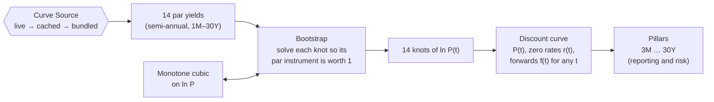
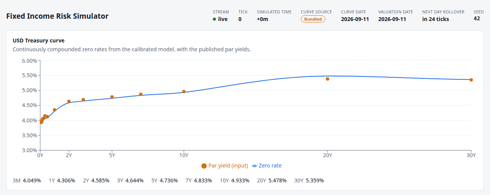

# 2. The yield curve

!!! warning "Draft"

    This article is a draft under review and may change.

*From published par yields to zero rates and discount factors: building today's real Treasury curve.*


**Previously:** [article 1](01-what-a-risk-system-is-for.md) set out what a risk system is for: to say, at
any moment, how the value of a [Book](glossary.md#book) changes when the market moves. It showed that
fixed income prices are mostly derived rather than observed, and that the derivation starts from one object:
the yield curve.

## The real-world problem

Every Instrument in the engine's Book is a set of promised cash flows. A 10-year Treasury note pays a
coupon every six months and its face value at the end. A swap pays and receives on schedules of its own.
Pricing any of them comes down to one question, asked over and over: **what is a dollar paid on a given
future date worth today?**

The answer is that date's *discount factor*, and a yield curve is a way of knowing the discount factor for
every date. Pricing needs this for any date, not just a few: a bond issued years ago has coupons on dates
nobody chose to fit a neat grid, and a Book of hundreds of bonds and swaps touches thousands of different
dates.

The market does not publish discount factors. What it publishes, in the US, is the Treasury's daily **par
yield curve**. Each trading day, the New York Fed collects dealers' indicative bid-side prices for the most
recently auctioned Treasury bills, notes and bonds at about 3:30 p.m.[^ust-method] The Treasury turns them
into a curve and publishes par yields at fourteen fixed maturities, from one month to 30 years, usually by
6 p.m.[^ust-method][^ust-faq] Here is the curve the engine's demo is pinned to, for 11 September 2026:

| Tenor | 1M | 1.5M | 2M | 3M | 4M | 6M |
|---|---|---|---|---|---|---|
| Par yield (%) | 3.93 | 3.99 | 4.05 | 4.07 | 4.15 | 4.12 |

| Tenor | 1Y | 2Y | 3Y | 5Y | 7Y | 10Y | 20Y | 30Y |
|---|---|---|---|---|---|---|---|---|
| Par yield (%) | 4.35 | 4.63 | 4.69 | 4.78 | 4.87 | 4.96 | 5.38 | 5.35 |

Fourteen numbers. From them the engine has to derive a discount factor for any date out to 30 years and
beyond. The Treasury itself does not publish a zero-coupon curve, so the engine has to build
one.[^ust-faq] That construction has two steps, bootstrapping and interpolation. They are less separate
than they look, and the choice of interpolation decides whether the curve's forward rates make any sense.

## How it works

### What "par" means

A bond trades *at par* when its price equals its face value: 100 per 100. A *par yield* is the coupon
rate at which a bond of a given maturity would trade at exactly par. The 2-year par yield of 4.63% says
that a 2-year note paying 4.63% a year, in two semi-annual coupons of 2.315, would be worth exactly 100
today.

These are not the yields of real bonds. The Treasury is explicit that a published rate, such as the
20-year, "represents the par yield for a new theoretical 20-year bond", read off its fitted curve, and
"may not match the exact yield on any one specific security".[^ust-faq] They are quoted the way Treasury
coupons pay: as semi-annual bond-equivalent yields.[^ust-faq]

Par yields are convenient to publish, because every tenor is a bond priced at 100 and the numbers compare
directly. They are inconvenient to price with. The 2-year par yield mixes the value of money at six months,
one year, eighteen months and two years into one number. To price an arbitrary cash flow, the engine has to
unmix them.

### Discount factors, zero rates and forwards

Three views of the same curve are used throughout the series:

- **The discount factor** $P(t)$: the value today of 1 paid at time $t$ (in years). $P(0) = 1$, and with
  positive rates it falls as $t$ grows. A bond's value is the sum of its cash flows, each multiplied by
  the discount factor for its date. This is what pricing wants.
- **The zero rate** $r(t)$: the single continuously compounded rate that turns 1 today into $1/P(t)$ at
  $t$. It is how a person reads the curve. "The 10-year zero rate is 4.93%" is easier to compare than
  "the 10-year discount factor is 0.6106".
- **The instantaneous forward rate** $f(t)$: the rate the curve implies for borrowing over a very short
  period starting at $t$. The zero rate at $t$ is the average of the forwards from today to $t$. Forwards
  show the curve's shape most sharply, and they expose a badly built curve at once.

!!! formula "Discount factors, zero rates and forwards"

    With continuous compounding, the three views are related by

    $$
    P(t) = e^{-r(t)\,t}, \qquad
    r(t) = -\frac{\ln P(t)}{t}, \qquad
    f(t) = -\frac{d}{dt}\ln P(t),
    $$

    and the zero rate is the average forward:

    $$
    r(t) = \frac{1}{t}\int_0^t f(s)\,ds .
    $$

    The average forward between two dates $t_1 < t_2$ follows directly from the two zero rates:

    $$
    \bar f(t_1, t_2) = \frac{r(t_2)\,t_2 - r(t_1)\,t_1}{t_2 - t_1}.
    $$

    A discount factor that falls with maturity is the same thing as a positive forward rate.[^hw2008]

Practitioners commonly work in continuously compounded rates, even though no bond is quoted that
way.[^hw2008] Discount factors then multiply and log discount factors add, which keeps the maths short.
The engine quotes all its zero rates this way. The Treasury's par yields, in contrast, are semi-annual.
Converting between the two is part of the bootstrap.

### Bootstrapping: par yields to discount factors

Bootstrapping works along the curve from the short end, solving for one new discount factor at each
input maturity. Each step uses the discount factors already found for the earlier coupon dates.

The Treasury says every point on its par curve is "consistent with a semiannual coupon security with that
amount of time remaining to maturity".[^ust-faq] The engine follows that. An input longer than six months
is a par note that pays $y/2$ every six months, counted back from maturity, plus 1 at the end. An input
of six months or less pays $1 + y\,T$ at maturity and nothing before. At exactly six months that is the
same thing, a single payment of $1 + y/2$; below six months it treats the yield as a simple rate.

The first two steps can be done by hand with the demo's curve:

1. **Six months.** The 6-month par yield is 4.12%, so 1 invested pays $1 + 0.0412 \times 0.5 = 1.0206$ in
   six months. The discount factor is $P(0.5) = 1/1.0206 = 0.979816$, which is a zero rate of
   $-\ln(0.979816)/0.5 = 4.078\%$.
2. **One year.** A 1-year par note at 4.35% pays 0.02175 at six months and 1.02175 at one year, and is
   worth exactly 1. The six-month cash flow is discounted with the factor just found, which leaves one
   unknown:

    $$
    1 = 0.02175 \times 0.979816 + 1.02175 \times P(1)
    \quad\Rightarrow\quad P(1) = 0.957856,
    $$

    a zero rate of 4.306%.

The two-year step is where the method needs help. A 2-year par note pays at 0.5, 1, 1.5 and 2 years. The
first two discount factors are known, and $P(2)$ is the unknown being solved for, but nobody has said
anything about 1.5 years. There is no 18-month input. The missing value has to come from interpolating
between the knots at one and two years, so it depends on the very number being solved for.

This is the central point of curve building. Bootstrapping and interpolation are not two steps but one
process, because "the bootstrap proceeds with incomplete information", and the interpolation scheme is
what fills it in.[^hw2008] Change the interpolation and the bootstrapped knots change too.

!!! formula "The bootstrap equation"

    For an input of maturity $T$ and par yield $y$, the knot $P(T)$ is the value that makes the par
    instrument worth exactly 1 on the curve:

    $$
    T \le \tfrac12:\quad (1 + y\,T)\,P(T) = 1
    $$

    $$
    T > \tfrac12:\quad \frac{y}{2}\sum_{i} P(t_i) + P(T) = 1,
    \qquad t_i = T,\ T - \tfrac12,\ T - 1,\ \dots > 0 .
    $$

    Every $P(t_i)$ that falls between knots is read off the interpolated curve, which itself depends on
    $P(T)$. The engine therefore solves for each knot with a root finder, and repeats the pass over
    all the knots until none of them moves.

### Interpolation: why it matters

The simplest choice is to draw straight lines between the zero rates at the knots. It looks harmless on a
chart of zero rates. It is not harmless for forwards. The forward rate is the zero rate plus maturity
times its slope, $f = r + t\,r'$, and a straight-line zero curve changes slope abruptly at every knot. So
the forward curve jumps at every knot, and the jumps grow with maturity because the slope is multiplied by
$t$. Linear interpolation of zero rates does not even guarantee positive forwards: Hagan and West give an
example where two perfectly reasonable inputs produce negative forwards.[^hw2008]

The left panel below shows this on the demo's curve. The engine's own knots are joined by straight lines
in zero rate, and the forwards those lines imply are drawn in orange. The forward curve breaks into
thirteen segments. Where the curve's slope changes most, at 20 years, it drops by 133bp in an instant, from
6.57% to 5.24%. A curve like that says that borrowing for a day starting just before 20 years costs 1.3%
more than borrowing for a day starting just after. No market believes that, and any Instrument sensitive
to forward rates (a swap's floating leg, for example) would be priced off it.


*Both panels use the same 14 knots, bootstrapped from the Treasury par yields of 11 September 2026. Grey
dots: the par yields. Grey line: the zero curve. Coloured line: the instantaneous forward curve.*

Hagan and West set out what a good curve method should deliver.[^hw2008] The two properties that matter
most here are:

- **positive, continuous forwards**, because a jumpy forward curve "implies either implausible
  expectations about future short-term interest rates, or implausible expectations about holding period
  returns";
- **locality**: moving one input should change the curve only near that input, and the risk that
  results should land on nearby tenors instead of leaking across the curve.

Their own answer is the *monotone convex* method, which interpolates the forward curve directly.[^hw2006]
The US Treasury has built its official curve with it since December 2021. Treasury bootstraps forward rates
so that each input "is sequentially priced without error", then interpolates them with monotone
convex.[^ust-method] Its previous method, a quasi-cubic Hermite spline, gave par yields that differed from
the new method's by between −0.1 and 0.5bp on average.[^ust-change]

The engine takes a simpler route with the same aims. It interpolates the *log discount factor* $\ln P(t)$
with a **monotone cubic**.

- **Why log discount factors.** The forward rate is minus the slope of $\ln P(t)$. If the interpolated
  $\ln P$ is smooth enough to have a continuous slope, the forward curve is continuous, with no jumps.
- **Why monotone.** With positive rates the knots of $\ln P$ fall steadily. A monotone interpolant never
  turns back up between two falling knots, so the discount factor never rises with maturity and forwards
  never go negative. An ordinary cubic spline does not promise this: it can overshoot between knots.
- **Why cubic Hermite with local slopes.** Each segment's shape depends only on the knots next to it and
  their slopes, so a change to one input disturbs the curve only nearby.

Fritsch and Carlson worked out exactly when a cubic segment stays monotone, and used that to build a
monotone piecewise cubic interpolant.[^fc1980] The engine uses the version that became standard in
numerical libraries as PCHIP. At each interior knot the slope is a weighted harmonic mean of the slopes of
the two neighbouring segments, and it is set to zero where the data turns, so no segment can overshoot.

!!! formula "Monotone cubic interpolation of $\ln P$"

    Between knots $t_k$ and $t_{k+1}$, with values $y_k = \ln P(t_k)$ and slopes $m_k$, the curve is the
    cubic Hermite polynomial that matches the values and slopes at both ends. With
    $h_k = t_{k+1} - t_k$ and secant slopes $\delta_k = (y_{k+1} - y_k)/h_k$, the interior slopes are

    $$
    m_k =
    \begin{cases}
    0 & \text{if } \delta_{k-1}\,\delta_k \le 0,\\[4pt]
    \dfrac{w_1 + w_2}{\dfrac{w_1}{\delta_{k-1}} + \dfrac{w_2}{\delta_k}},
    \quad w_1 = 2h_k + h_{k-1},\ w_2 = h_k + 2h_{k-1} & \text{otherwise,}
    \end{cases}
    $$

    and the end slopes are the end secants. The result has a continuous first derivative, so the forward
    rate $f(t) = -\frac{d}{dt}\ln P(t)$ is continuous. Its second derivative can still jump at the knots,
    so the forward curve can have corners, but not gaps.

The right panel of the chart shows the result. The forward curve is continuous everywhere. It still has
corners at some knots, most visibly at 10 and 20 years, and it is not flat: between 10 and 20 years it
rises to about 6.3%. That hump is not an artefact of the method. The inputs require it. The zero rate
rises from 4.933% at 10 years to 5.478% at 20, so the *average* forward between them must be

$$
\frac{5.478\% \times 20 - 4.933\% \times 10}{10} \approx 6.02\%,
$$

whatever the interpolation. Every method that reprices the inputs has forwards averaging about 6% over that
decade. The methods differ only in how they spread it.

At the short end, the chart's forwards swing quickly. The Treasury's bill yields are not monotone there
(4.15% at four months, then 4.12% at six), and six knots fall in the first six months, so the forward
curve has to turn sharply to pass through all of them.

The engine's curve is not Treasury's curve between the knots. Both reprice the 14 inputs exactly, but
monotone convex and a monotone cubic spread the forwards differently between them. The Treasury does not
publish its code, but says that "most researchers should be able to reasonably match our results using
alternative bootstrapping and monotone convex methods".[^ust-method]

Beyond 30 years the engine holds the forward rate flat at its 30-year value.

### Pillars and the Curve Source

Two more ideas complete the curve.

**Knots are not Pillars.** The curve's knots are wherever the inputs are: 14 of them, six in the first six
months. A risk report wants something steadier. The engine reports the curve, and measures
[Bucketed DV01](glossary.md#bucketed-dv01), at fixed [Pillars](glossary.md#pillar): 3M, 1Y, 2Y, 3Y,
5Y, 7Y, 10Y, 20Y and 30Y (the `risk.pillars` setting). The zero rate at each Pillar is also a
[Risk Factor](glossary.md#risk-factor), and article 5 builds selective repricing on those Pillar
values.

**The curve has a date and a source.** The par yields are an end-of-day snapshot, published once a day.
When the engine starts it needs one, and its [Curve Source](glossary.md#curve-source) records where it
came from:

1. **Live**: the latest curve downloaded from the Treasury's published CSV file. A successful download is
   also saved to a local cache.
2. **Cached**: if the download fails, the last curve that was downloaded successfully.
3. **Bundled**: if there is no usable cache either, a real Treasury curve shipped with the code (11
   September 2026).

That order means the engine always starts, with or without a network, and the UI always says which curve
it is using. For the articles, the `demo` profile skips the chain and always uses the bundled curve. The
live curve changes every day, and a reader running the demo next month must see the same numbers as the
article.



## How the system does it

The bootstrap is short. It starts every knot at a guess taken from its own par yield. Then it sweeps along
the curve, and for each knot finds, with a Brent root finder, the log discount factor that makes that
input's par instrument worth exactly 1 on the curve as it currently stands. The sweeps repeat until no knot
moves by more than $10^{-14}$.

```java title="CurveBootstrapper.java" linenums="24"
    public static DiscountCurve bootstrap(ParCurve parCurve) {
        List<ParPoint> points = parCurve.points();
        int n = points.size();
        double[] times = new double[n];
        double[] lnP = new double[n];
        for (int i = 0; i < n; i++) {
            times[i] = points.get(i).years();
            lnP[i] = -points.get(i).parYield() * times[i];
        }

        BrentSolver solver = new BrentSolver(1e-16, 1e-15);
        for (int sweep = 0; sweep < MAX_SWEEPS; sweep++) {
            double maxChange = 0;
            for (int i = 0; i < n; i++) {
                ParPoint point = points.get(i);
                int knot = i;
                double previous = lnP[knot];
                double solved = solver.solve(1_000, candidate -> {
                    lnP[knot] = candidate;
                    return parInstrumentValue(point, DiscountCurve.fromLogDiscountFactors(times, lnP)) - 1.0;
                }, -0.5 * times[knot], 0.05 * times[knot], previous);
                lnP[knot] = solved;
                maxChange = Math.max(maxChange, Math.abs(solved - previous));
            }
            if (maxChange < TOLERANCE) {
                break;
            }
        }
        return DiscountCurve.fromLogDiscountFactors(times, lnP);
    }
```

[View on GitHub](https://github.com/suhasghorp/fixed-income-risk-engine/blob/series-v1/backend/src/main/java/com/fixedincomerisk/curve/CurveBootstrapper.java#L24-L53)

The repeated sweeps are needed because the interpolation is local but not strictly one-sided. The slope
at a knot depends on the knots on *both* sides, so solving a later knot slightly moves the curve before an
earlier one, and that earlier knot has to be solved again. The sweeps settle quickly.

The par instrument is the Treasury convention from the formula box above, written out:

```java title="CurveBootstrapper.java" linenums="55"
    /** Value per unit face of the par instrument for {@code point}; equals 1 on a correct curve. */
    public static double parInstrumentValue(ParPoint point, DiscountCurve curve) {
        double maturity = point.years();
        double y = point.parYield();
        if (maturity <= SHORT_TENOR_LIMIT) {
            return (1 + y * maturity) * curve.discountFactor(maturity);
        }
        double value = curve.discountFactor(maturity);
        for (double t = maturity; t > 1e-9; t -= 0.5) {
            value += y / 2 * curve.discountFactor(t);
        }
        return value;
    }
```

[View on GitHub](https://github.com/suhasghorp/fixed-income-risk-engine/blob/series-v1/backend/src/main/java/com/fixedincomerisk/curve/CurveBootstrapper.java#L55-L67)

On the demo's curve, every one of the 14 inputs reprices to 1 within $5 \times 10^{-16}$: the limit of
double-precision arithmetic.

The interpolation's key idea is in how it chooses the slope at each knot. Where the data turns, the slope
is zero. Elsewhere it is the weighted harmonic mean from the formula box, which is never steeper than
either neighbouring segment allows:

```java title="MonotoneCubicInterpolator.java" linenums="70"
    private static double[] pchipSlopes(double[] x, double[] y) {
        int n = x.length;
        double[] h = new double[n - 1];
        double[] secant = new double[n - 1];
        for (int k = 0; k < n - 1; k++) {
            h[k] = x[k + 1] - x[k];
            secant[k] = (y[k + 1] - y[k]) / h[k];
        }
        double[] m = new double[n];
        m[0] = secant[0];
        m[n - 1] = secant[n - 2];
        for (int k = 1; k < n - 1; k++) {
            if (secant[k - 1] * secant[k] <= 0) {
                m[k] = 0;
            } else {
                double w1 = 2 * h[k] + h[k - 1];
                double w2 = h[k] + 2 * h[k - 1];
                m[k] = (w1 + w2) / (w1 / secant[k - 1] + w2 / secant[k]);
            }
        }
        return m;
    }
```

[View on GitHub](https://github.com/suhasghorp/fixed-income-risk-engine/blob/series-v1/backend/src/main/java/com/fixedincomerisk/curve/MonotoneCubicInterpolator.java#L70-L91)

`DiscountCurve` wraps the interpolator. It adds the knot $\ln P(0) = 0$, so the curve starts at a
discount factor of exactly 1. It derives every other view from the one interpolated function: the
discount factor is $e^{\ln P}$, the zero rate is $-\ln P / t$, and the forward is minus the
interpolator's derivative.

```java title="DiscountCurve.java" linenums="48"
    /** Continuously compounded zero rate; at t = 0 this is the instantaneous short forward. */
    public double zeroRate(double t) {
        return t <= 0 ? instantaneousForward(0) : -logDiscountFactor(t) / t;
    }

    /** f(0,t) = -d ln P(0,t) / dt. */
    public double instantaneousForward(double t) {
        double last = logDiscount.lastKnot();
        return -logDiscount.derivative(Math.min(Math.max(t, 0), last));
    }
```

[View on GitHub](https://github.com/suhasghorp/fixed-income-risk-engine/blob/series-v1/backend/src/main/java/com/fixedincomerisk/curve/DiscountCurve.java#L48-L57)

Finally, the Curve Source chain is a plain try-and-fall-back. A failed cache write is logged but never
allowed to fail a successful live fetch:

```java title="TreasuryCurveSource.java" linenums="25"
    @Override
    public CurveSnapshot load() {
        try {
            ParCurve curve = live.fetchLatest();
            cacheQuietly(curve);
            log.info("Curve Source LIVE: Treasury par curve for {}", curve.curveDate());
            return new CurveSnapshot(curve, CurveSourceKind.LIVE);
        } catch (CurveUnavailableException liveFailure) {
            Optional<ParCurve> cached = cache.read();
            if (cached.isPresent()) {
                log.warn("Live curve fetch failed ({}); Curve Source CACHED: par curve for {}",
                        liveFailure.getMessage(), cached.get().curveDate());
                return new CurveSnapshot(cached.get(), CurveSourceKind.CACHED);
            }
            CurveSnapshot fallback = bundled.load();
            log.warn("Live curve fetch failed ({}) and no usable cache at {}; Curve Source {}: par curve for {}",
                    liveFailure.getMessage(), cache.file(), fallback.source(), fallback.curve().curveDate());
            return fallback;
        }
    }
```

[View on GitHub](https://github.com/suhasghorp/fixed-income-risk-engine/blob/series-v1/backend/src/main/java/com/fixedincomerisk/curve/TreasuryCurveSource.java#L25-L44)

With `risk.curve.source=bundled`, as in the `demo` profile, the engine skips this class and loads the
bundled snapshot directly, touching neither the network nor the cache.

## See it running

The curve the engine builds is what it shows at [Tick](glossary.md#tick) 0, before the simulation has
moved anything. From Tick 1 onwards, the rates model moves it (article 3). To hold the demo on its starting
curve, slow the simulation clock right down:

```bash
# Terminal 1: the engine, held at Tick 0 for an hour
cd backend && mvn spring-boot:run -Dspring-boot.run.profiles=demo \
    -Dspring-boot.run.arguments=--risk.simulation.tick-interval=1h

# Terminal 2: the UI, then open http://localhost:5173
cd frontend && npm install && npm run dev
```



- **The header** shows Tick 0, Curve Source *Bundled* and curve date 2026-09-11. The
  [Valuation Date](glossary.md#valuation-date) is the curve date, because no simulated time has
  passed yet.
- **The orange dots** are the 14 par yields in the table above, crowded together at the short end
  where six of them fall in the first six months.
- **The blue line** is the continuously compounded zero curve. It sits slightly *below* the par yields out
  to 10 years, and *above* them at 20 and 30 years. Two effects are at work:
    - **Compounding.** The same return quoted with continuous compounding is a lower number than a
      semi-annual (or, under six months, simple) rate. A 4.96% semi-annual yield is 4.90% continuously
      compounded. On its own, this puts every zero rate a few basis points below its par yield.
    - **Slope.** On a rising curve, a par bond's early coupons are discounted at lower rates than its final
      payment, so the zero rate at maturity must be higher than the par yield to make up for it. This
      adds about 3bp at 10 years, and about 17bp at 20 years, where the curve rises steeply.

    Out to 10 years, compounding wins. At 20 and 30 years, slope wins.
- **The Pillar row** gives the zero rate at each Pillar:

| Pillar | Zero rate (%) |
|---|---|
| 3M | 4.049 |
| 1Y | 4.306 |
| 2Y | 4.585 |
| 3Y | 4.644 |
| 5Y | 4.736 |
| 7Y | 4.833 |
| 10Y | 4.933 |
| 20Y | 5.478 |
| 30Y | 5.359 |

The 1Y value, 4.306%, is the one worked out by hand earlier.

The chart's subtitle mentions "the calibrated model". At Tick 0 the model reproduces this bootstrapped
curve exactly. How it then moves the curve through time, and why it has to start from this curve, is the
subject of the next article.

!!! realdesk "What a real desk does differently"

    - **Many curves, not one.** Since 2007–08, a rates desk has stopped using one curve for everything.
      It discounts on one curve (OIS) and projects each floating index off a curve of its own, because
      the old single-curve relations stopped holding.[^bianchetti] Article 9 comes back to this for
      swaps.
    - **More and different inputs.** The engine uses only the 14 published par yields. A desk builds its
      Treasury curve from live prices of individual bills, notes and bonds, not from a published summary.
      Even the Treasury's own curve has used more than on-the-run inputs: under its old method it added
      off-the-run, interpolated and rolled-down securities.[^ust-change]
    - **Fitting instead of exact bootstrapping.** With hundreds of noisy bond prices, forcing a curve through
      every one gives nonsense forwards. Desks, and researchers, fit a smooth curve that prices the bonds
      *approximately*. The Federal Reserve Board publishes a daily fitted Treasury curve going back to
      1961.[^gsw] An exact bootstrap, as in the engine, suits a small set of clean benchmark inputs.
    - **Real day counts and dates.** The engine treats a tenor as a fraction of a year (one month is
      1/12) and puts coupons at exact half-year steps back from maturity. The Treasury's yields are based
      on actual day counts.[^ust-faq] Production curves are built on real calendar dates, with settlement
      lags, holiday calendars and each instrument's own day count. Article 4 takes up day counts for the
      bonds themselves.
    - **Intraday curves.** The published curve is a snapshot taken once a day. A trading desk rebuilds its
      curves continuously from live prices. In the engine, the curve moves intraday only through the
      simulation, which is the subject of article 3.

## Further reading

Primary sources:

- US Treasury, [*Treasury Yield Curve
  Methodology*](https://home.treasury.gov/policy-issues/financing-the-government/interest-rate-statistics/treasury-yield-curve-methodology),
  revised February 2025. The inputs, the timing, and the monotone convex method.
- US Treasury, [*Interest Rates: Frequently Asked
  Questions*](https://home.treasury.gov/policy-issues/financing-the-government/interest-rate-statistics/interest-rates-frequently-asked-questions).
  What a par yield (CMT) is, and why there is no published zero curve.
- US Treasury, [*Yield Curve Methodology Change Information
  Sheet*](https://home.treasury.gov/policy-issues/financing-the-government/yield-curve-methodology-change-information-sheet),
  2021. The move from quasi-cubic Hermite spline to monotone convex.
- US Treasury, [*Interest Rate
  Statistics*](https://home.treasury.gov/policy-issues/financing-the-government/interest-rate-statistics).
  The daily par yield curve rates, which the engine downloads as CSV.
- P. S. Hagan and G. West, "Methods for Constructing a Yield Curve", *Wilmott Magazine*, May 2008. The most
  readable account of why interpolation choices matter, with worked counter-examples.
- P. S. Hagan and G. West, "Interpolation Methods for Curve Construction", *Applied Mathematical Finance*
  13(2), 2006, pp. 89–129, [doi:10.1080/13504860500396032](https://doi.org/10.1080/13504860500396032).
  The paper that introduced monotone convex.
- F. N. Fritsch and R. E. Carlson, "Monotone Piecewise Cubic Interpolation", *SIAM Journal on Numerical
  Analysis* 17(2), 1980, [doi:10.1137/0717021](https://doi.org/10.1137/0717021).
- R. S. Gürkaynak, B. Sack and J. H. Wright, [*The U.S. Treasury Yield Curve: 1961 to the
  Present*](https://www.federalreserve.gov/pubs/feds/2006/200628/200628abs.html), Federal Reserve Board
  FEDS 2006-28.

Textbooks:

- Bruce Tuckman and Angel Serrat, *Fixed Income Securities: Tools for Today's Markets*, 4th ed., Wiley,
  2022. Discount factors, par and zero rates, forwards and bootstrapping.
- Leif B. G. Andersen and Vladimir V. Piterbarg, *Interest Rate Modeling*, Vol. 1, Atlantic Financial
  Press, 2010. Curve construction in depth, including splines, locality and multi-curve.

[^ust-method]: US Treasury, *Treasury Yield Curve Methodology*: inputs are "indicative, bid-side market price quotations (not actual transactions) for the most recently auctioned securities obtained by the Federal Reserve Bank of New York at or near 3:30 PM each trading day"; rates are "usually available ... by 6:00 PM Eastern Time"; the forwards are bootstrapped "so that these instruments are sequentially priced without error" and interpolated with monotone convex.
[^ust-faq]: US Treasury, *Interest Rates: Frequently Asked Questions*. CMT rates "are read from fixed, constant maturity points on the curve and may not match the exact yield on any one specific security"; they are semi-annual bond-equivalent yields on actual day counts, and "consistent with a semiannual coupon security with that amount of time remaining to maturity"; "Treasury does not create or publish daily zero-coupon curve rates". The fourteen maturities are the column headings of the daily CSV file.
[^ust-change]: US Treasury, *Yield Curve Methodology Change Information Sheet*: average differences between the two methods' CMT rates "ranged from -0.1 to 0.5 basis points". Under the old method Treasury added composite off-the-run bonds, interpolated yields and rolled-down securities as inputs; monotone convex "eliminates the need to routinely monitor and potentially modify curve inputs".
[^hw2008]: Hagan and West (2008), §1–§4. The bootstrap "proceeds with incomplete information", completed by the interpolation scheme (§2); linear interpolation of rates makes forwards jump at each node and can make them negative (§4.1); the quotation on implausible expectations is theirs, citing McCulloch and Kochin (2000).
[^hw2006]: Hagan and West (2006). The full text was not checked; the abstract introduces "the monotone convex method and the minimal method".
[^fc1980]: Fritsch and Carlson (1980), abstract: "Necessary and sufficient conditions are derived for a cubic to be monotone on an interval." The weighted-harmonic-mean slope used by PCHIP is a later refinement in the same line of work.
[^gsw]: Gürkaynak, Sack and Wright (2006), abstract.
[^bianchetti]: M. Bianchetti, [*Two Curves, One Price*](https://mpra.ub.uni-muenchen.de/22022/), MPRA Paper 22022, 2008 (later in *Risk*, 2010): a double-curve framework "adopted by the market after the credit-crunch crisis started in summer 2007".

## Next

At Tick 0 the curve is exactly the Treasury's. From Tick 1 it has to move, in a way that keeps it a
believable yield curve and leaves today's prices untouched. [Article 3](03-moving-the-curve-through-time.md)
introduces the Hull-White model that moves it, simulated time, and the two clocks that separate market
moves from the Valuation Date.
