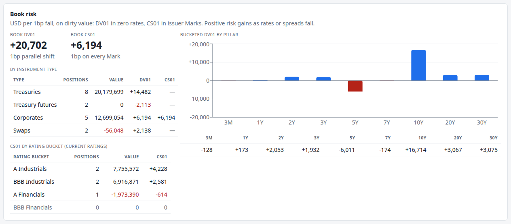
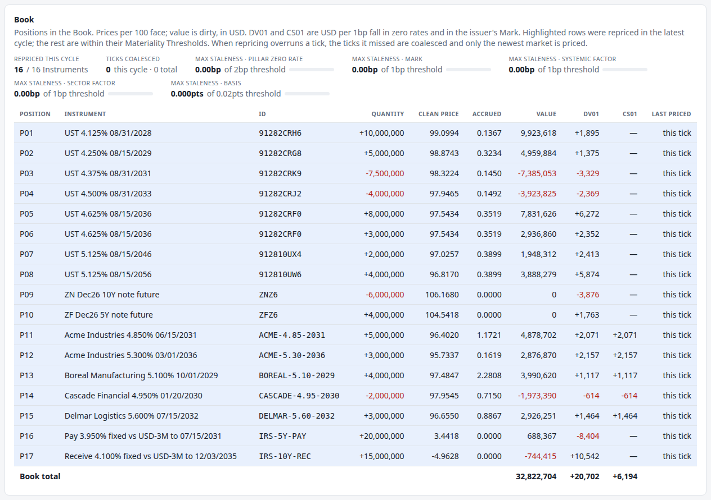

# 4. Pricing a bond and measuring its risk

!!! warning "Draft"

    This article is a draft under review and may change.

*Clean and dirty prices, DV01, Bucketed DV01, and rolling risk up across a Book.*


**Previously:** [article 2](02-the-yield-curve.md) built a discount curve from published par yields, and
[article 3](03-moving-the-curve-through-time.md) set it moving: one short rate, a closed-form curve on
every [Tick](glossary.md#tick), and a [Valuation Date](glossary.md#valuation-date) that advances only at a
[Day Rollover](glossary.md#day-rollover). Now that curve has to price something.

## The real-world problem

A trader holding 10 million face of a two-year Treasury note wants two numbers. What is it worth? And
what happens to that value if rates move?

Neither is as simple as reading a screen. The price quoted for a bond is not the amount that changes
hands. The sensitivity that matters is not a single number but a profile across the curve, because curves
rarely move in parallel. And a desk needs both answers for a whole [Book](glossary.md#book) at once,
netted, in a way that says *where* on the curve the exposure sits.

This article takes one Treasury note through both questions, then rolls the answers up across the Book.

## How it works

### A bond is its cash flows

A Treasury note pays interest every six months, and the principal at maturity. Each regular coupon is
exactly half the annual coupon rate, whatever the number of days in that particular half-year.[^cfr] So
the 4.125% note maturing 31 August 2028 pays 2.0625 per 100 of face every six months, with 100 more at
the end.

Its value is what article 2 set up: each cash flow multiplied by the discount factor for its date, added
up.

!!! formula "Present value of a bond"

    For cash flows $c_i$ at times $t_i$ (in years from the Valuation Date), and a discount curve $P$,

    $$
    V = \sum_{t_i > 0} c_i \, P(t_i).
    $$

    The engine measures $t_i$ as ACT/365: calendar days from the Valuation Date, divided by 365.

### Clean price, dirty price, accrued interest

A bond quoted at 99-03 (99 and 3/32nds, in percent of par) is not what the buyer pays. Coupons arrive in
lumps every six months, but the interest belongs to whoever held the bond each day. A buyer settling
halfway through a coupon period must compensate the seller for the interest that accrued while they held
it.[^cme-quotes] So:

- **The dirty price** (also called the full price) is what the sum above gives: the value of every
  remaining cash flow, including the coupon the next holder will collect in full.
- **Accrued interest** is the part of that next coupon that belongs to the seller.
- **The clean price** is the dirty price minus accrued interest. It is what gets quoted, because it does
  not jump down by the coupon amount on every payment date.

For Treasuries, accrued interest is counted Actual/Actual: actual days accrued, divided by the actual
days in the coupon period, times the half-year coupon.[^cfr] The period may be 181, 182, 183 or 184
days,[^cfr] so the daily amount differs slightly between periods.

!!! formula "Accrued interest and the clean price"

    With coupon rate $c$ (annual, as a decimal), $d$ days accrued since the last coupon and $D$ actual
    days in the coupon period,

    $$
    A = \frac{c}{2}\cdot\frac{d}{D},
    \qquad
    P_{\text{clean}} = P_{\text{dirty}} - A ,
    $$

    per unit of face. On 12 September 2026 the 4.125% note of August 2028 has accrued 12 days of a
    181-day period:

    $$
    A = \frac{0.04125}{2}\cdot\frac{12}{181} = 0.0013674 \;\; (0.1367 \text{ per } 100).
    $$

**Risk is measured on the dirty value, not the clean price.** The clean price is a quoting convention;
the dirty value is the money. A [Position Value](glossary.md#position-value) in the engine is always
dirty, and every sensitivity is computed by repricing the dirty value.

### DV01: bump and reprice

[DV01](glossary.md#dv01), the "dollar value of a basis point", is the change in value for a
one-basis-point move in rates. The market's simplest version bumps the bond's *yield* up and down by 1bp
and averages the two price changes.[^cme-dv01]

That works for a bond, which has a yield. It does not work for a Book that also holds futures and swaps.
So the engine bumps something every curve-sensitive Instrument shares: **the model's output zero curve**.
Every zero rate moves by 1bp, the Instrument is repriced, and the difference is its DV01. The same
definition then applies to a Treasury, a corporate bond, a future and a swap.

The engine also does not bump the short rate of article 3's model. A short-rate bump is not a parallel
shift: it moves the 30-year zero rate about half as much as the 3-month one, and it cannot be split by
tenor. Bumping the output curve keeps DV01 meaning the same thing everywhere.

Regulators define rates sensitivity the same way. Basel's standardised market-risk approach measures
"PV01", by "changing the interest rate $r$ at tenor $t$ of the risk-free yield curve in a given currency
by 1 basis point" and dividing the change in value by 0.0001.[^mar21-pv01] It is a curve bump, not a
yield bump. (Basel's PV01 is per unit of rate; the engine's DV01 is per basis point, which is the same
number divided by 10,000. The engine's glossary uses DV01 throughout.)

!!! formula "DV01 by central difference"

    For a curve $z$ and an Instrument valued at $V(z)$,

    $$
    \mathrm{DV01} = \frac{V(z - 1\mathrm{bp}) - V(z + 1\mathrm{bp})}{2},
    $$

    with the sign chosen so that a long bond has a positive DV01: it gains when rates fall. The engine
    shifts the curve by scaling discount factors,
    $P'(t) = P(t)\,e^{-\Delta(t)\,t}$, so a shift $\Delta(t)$ of 1bp at every $t$ is an exact parallel
    move in continuously compounded zero rates.

    Taking both sides (a *central* difference) rather than one cancels the leading convexity error. DV01
    still only describes small moves: the price-yield relationship is curved, so the further rates move,
    the worse a single DV01 describes the change.[^cme-dv01]

### Bucketed DV01: where on the curve

A single DV01 assumes the whole curve moves together. Real curves steepen and flatten, and a desk that is
long 10-year risk and short 5-year risk can have a DV01 near zero while still being badly exposed.

[Bucketed DV01](glossary.md#bucketed-dv01) answers "where". Instead of bumping the whole curve, bump it
around one [Pillar](glossary.md#pillar) at a time. The bump is a triangle: the full basis point at the
Pillar, fading linearly to zero at the neighbouring Pillars, and flat beyond the first and last:


*The nine Pillars of the demo. The leftmost triangle, unlabelled, is 3M; it is flat at 1 below three
months, as the 30Y triangle is beyond thirty years. The dashed line is the sum of all nine bumps, which is
1 at every tenor.*

This shape is the engine's own construction, but the idea is standard. It is the shape of Ho's key rate
durations,[^ho] and Basel asks banks to spread sensitivities across its prescribed tenors "by linear
interpolation",[^mar21-interp] which is the same triangle.

The triangles have two useful properties:

- **They add up.** At every tenor, the nine weights sum to exactly 1, so bumping all nine Pillars at once
  *is* a parallel bump. The nine Bucketed DV01s therefore add up to the parallel DV01 — to first order.
  They are not identical, because each is a separate repricing of a curved function, and second-order
  effects do not cancel exactly. In the demo at Tick 24 the Book's buckets sum to 20,701.6145 against a
  parallel DV01 of 20,701.6168: a difference of 0.002 on 20,700, or one part in nine million.
- **They are local.** A cash flow lands in at most two buckets, split by how close it is to each. A cash
  flow exactly at a Pillar lands entirely in that bucket; one halfway between two Pillars splits evenly.

!!! formula "The triangular weight"

    For Pillars at tenors $\tau_1 < \tau_2 < \dots < \tau_n$, the weight of Pillar $i$ at tenor $t$ is

    $$
    w_i(t) =
    \begin{cases}
    \dfrac{t - \tau_{i-1}}{\tau_i - \tau_{i-1}} & \tau_{i-1} < t \le \tau_i,\\[8pt]
    \dfrac{\tau_{i+1} - t}{\tau_{i+1} - \tau_i} & \tau_i < t < \tau_{i+1},\\[8pt]
    0 & \text{otherwise,}
    \end{cases}
    $$

    with $w_1(t) = 1$ for $t \le \tau_1$ and $w_n(t) = 1$ for $t \ge \tau_n$. Then
    $\sum_i w_i(t) = 1$ for every $t$, and the Bucketed DV01 at Pillar $i$ is the DV01 measured with the
    shift $\Delta(t) = 1\mathrm{bp} \times w_i(t)$.

### From an Instrument to a Book

Everything so far is per unit of notional: per 100 of face. A [Position](glossary.md#position) scales it
by its signed quantity, and the Book adds the Positions up.

!!! formula "Scaling and rolling up"

    For a Position of quantity $q$ in an Instrument with per-unit dirty value $v$ and per-unit
    sensitivities,

    $$
    V_{\text{position}} = v \cdot q, \qquad
    \mathrm{DV01}_{\text{position}} = \mathrm{DV01}_{\text{unit}} \cdot q ,
    $$

    and for the Book, $\mathrm{DV01}_{\text{Book}} = \sum_j \mathrm{DV01}_j$, bucket by bucket as well as
    in total.

A short Position has a negative quantity, so its risk enters the sum with the opposite sign and cancels
part of a long Position's. That netting is the whole point of hedging, and it is how regulators aggregate
too: Basel requires sensitivities to the same risk factor to be netted across the portfolio, with
opposite directions offsetting "irrespective of the instrument from which they derive".[^mar21-net]

## How the system does it

A Treasury bond prices itself by summing discounted cash flows. It never sees a Position or a quantity:

```java title="TreasuryBond.java" linenums="72"
    @Override
    public double dirtyValue(MarketState market) {
        LocalDate valuationDate = market.valuationDate();
        double value = 0;
        for (CashFlow cashFlow : cashFlows()) {
            if (cashFlow.date().isAfter(valuationDate)) {
                value += cashFlow.amount() * market.curve().discountFactor(
                        YearFractions.act365(valuationDate, cashFlow.date()));
            }
        }
        return value;
    }
```

[View on GitHub](https://github.com/suhasghorp/fixed-income-risk-engine/blob/series-v1/backend/src/main/java/com/fixedincomerisk/instrument/TreasuryBond.java#L72-L83)

Accrued interest is the Actual/Actual fraction of the half-year coupon, and the clean value is the dirty
value minus it:

```java title="TreasuryBond.java" linenums="97"
    /** Accrued interest per unit of notional: ACT/ACT (ICMA) within the regular period. */
    @Override
    public double accruedInterest(LocalDate valuationDate) {
        return schedule().accrualPeriod(valuationDate)
                .map(period -> couponRate / 2
                        * ChronoUnit.DAYS.between(period.accrualStart(), valuationDate)
                        / ChronoUnit.DAYS.between(period.regularStart(), period.nextCoupon()))
                .orElse(0.0);
    }

    /** Clean value per unit of notional. */
    public double cleanValue(MarketState market) {
        return dirtyValue(market) - accruedInterest(market.valuationDate());
    }
```

[View on GitHub](https://github.com/suhasghorp/fixed-income-risk-engine/blob/series-v1/backend/src/main/java/com/fixedincomerisk/instrument/TreasuryBond.java#L97-L110)

The sensitivity calculator knows nothing about bonds. It asks for a dirty value on a bumped market, which
is why the same code produces DV01 for futures and swaps:

```java title="SensitivityCalculator.java" linenums="30"
    public CurveSensitivities curveSensitivities(Instrument instrument, MarketState market) {
        double dv01 = bumpAndReprice(instrument, market, t -> ONE_BP);
        double[] bucketed = new double[pillars.size()];
        for (int i = 0; i < pillars.size(); i++) {
            int pillar = i;
            bucketed[i] = bumpAndReprice(instrument, market, t -> ONE_BP * weight(pillar, t));
        }
        return new CurveSensitivities(dv01, bucketed);
    }
```

[View on GitHub](https://github.com/suhasghorp/fixed-income-risk-engine/blob/series-v1/backend/src/main/java/com/fixedincomerisk/risk/SensitivityCalculator.java#L30-L38)

The parallel DV01 and each bucket differ only in the shift passed in. The triangular weight is the formula
box above, written out:

```java title="SensitivityCalculator.java" linenums="45"
    double weight(int i, double t) {
        double here = pillars.get(i).years();
        if (t <= here) {
            if (i == 0) {
                return 1;
            }
            double previous = pillars.get(i - 1).years();
            return t <= previous ? 0 : (t - previous) / (here - previous);
        }
        if (i == pillars.size() - 1) {
            return 1;
        }
        double next = pillars.get(i + 1).years();
        return t >= next ? 0 : (next - t) / (next - here);
    }
```

[View on GitHub](https://github.com/suhasghorp/fixed-income-risk-engine/blob/series-v1/backend/src/main/java/com/fixedincomerisk/risk/SensitivityCalculator.java#L45-L59)

The bump itself scales discount factors, and its Javadoc records why the curve is what gets bumped:

```java title="BumpedCurve.java" linenums="6"
/**
 * A curve whose zero rates are shifted by {@code shift(t)}: P'(t) = P(t)·exp(−shift(t)·t). This bumps
 * the model's output curve, not a bond yield and not the short rate: a yield bump only makes sense for
 * bonds, and a short-rate bump moves long tenors less than short ones, so it is not a parallel shift and
 * cannot be bucketed. Bumping the output curve gives one DV01 definition for every curve-sensitive
 * Instrument.
 */
record BumpedCurve(YieldCurve base, DoubleUnaryOperator shift) implements YieldCurve {

    @Override
    public double discountFactor(double timeToCashFlow) {
        return base.discountFactor(timeToCashFlow) * Math.exp(-shift.applyAsDouble(timeToCashFlow) * timeToCashFlow);
    }
}
```

[View on GitHub](https://github.com/suhasghorp/fixed-income-risk-engine/blob/series-v1/backend/src/main/java/com/fixedincomerisk/risk/BumpedCurve.java#L6-L19)

Scaling to a Position is a multiplication, with one wrinkle: a short Position's empty buckets would
otherwise come out as negative zero, which looks odd on screen:

```java title="CurveSensitivities.java" linenums="22"
    /** A Position's risk: this per-unit risk times its signed quantity. */
    public CurveSensitivities scaledBy(double quantity) {
        return new CurveSensitivities(scale(dv01, quantity),
                Arrays.stream(bucketedDv01).map(b -> scale(b, quantity)).toArray());
    }

    /** Adding 0.0 turns the −0 of a short Position's empty bucket into 0. */
    private static double scale(double risk, double quantity) {
        return risk * quantity + 0.0;
    }
```

[View on GitHub](https://github.com/suhasghorp/fixed-income-risk-engine/blob/series-v1/backend/src/main/java/com/fixedincomerisk/risk/CurveSensitivities.java#L22-L31)

## See it running

This article uses Tick 24, the first Day Rollover. At a rollover every Instrument is repriced, so every
number on the screen comes from the same market, with nothing carried over from an earlier Tick:

```bash
# Terminal 1: the engine, stopped at the first Day Rollover
cd backend && mvn spring-boot:run -Dspring-boot.run.profiles=demo \
    -Dspring-boot.run.arguments=--risk.simulation.stop-at-tick=24

# Terminal 2: the UI, then open http://localhost:5173
cd frontend && npm install && npm run dev
```

### One bond, priced

Position P01 is 10 million face of the 4.125% note maturing 31 August 2028. The Valuation Date is
12 September 2026. Four coupons and the principal are still to come:

| Date | Cash flow (per 100) | Years (ACT/365) | Discount factor | Present value |
|---|---|---|---|---|
| 2027-02-28 | 2.0625 | 0.463014 | 0.98141907 | 2.024177 |
| 2027-08-31 | 2.0625 | 0.967123 | 0.95955866 | 1.979090 |
| 2028-02-29 | 2.0625 | 1.465753 | 0.93691579 | 1.932389 |
| 2028-08-31 | 2.0625 | 1.969863 | 0.91415084 | 1.885436 |
| 2028-08-31 | 100 (redemption) | 1.969863 | 0.91415084 | 91.415084 |
| | | | **Dirty price** | **99.236175** |

Subtract the 12 days of accrued interest, 0.136740, and the clean price is **99.099435**. The UI shows
those two numbers in the Book table, and the Position's value is the dirty price times the quantity:

$$
\frac{99.236175}{100} \times 10{,}000{,}000 = 9{,}923{,}617.52 .
$$

Bump the curve down and up by a basis point, reprice, and the difference gives a DV01 of 0.0189473 per
100, or **\$1,894.73** for the Position. Its buckets are:

| Pillar | Bucketed DV01 |
|---|---|
| 3M | +7.55 |
| 1Y | +91.48 |
| 2Y | +1,795.70 |
| others | 0 |

Almost all the risk sits in the 2Y bucket, where the redemption is. The two small entries are the
coupons at 0.46 and 0.97 years: the first splits between 3M and 1Y, the second sits close to 1Y. Nothing
reaches 3Y or beyond, because the bond's last cash flow is at 1.97 years, inside the 2Y triangle. The
buckets sum to 1,894.73, the parallel DV01.

### The whole Book



- **Book DV01 +20,702.** A 1bp parallel fall in zero rates gains the Book about \$20,702.
- **By Instrument type:** the eight Treasury Positions carry +14,482 and are worth \$20,179,699; the two
  futures carry −2,113 and are worth nothing (article 6); the five corporate bonds carry +6,194 of DV01
  and the same again of [CS01](glossary.md#cs01) (article 7); the two swaps carry +2,138 on a value of
  −\$56,048 (article 9).
- **The bucket chart** is the Book's shape, and it is nothing like a single number. Two buckets dominate:
  **+16,714 at 10Y** and **−6,011 at 5Y**. The Book is long 10-year risk and short 5-year risk. A 1bp
  parallel move nets those against each other; a steepening does not.

Where do those two buckets come from? Reading the Book table:

| Position | | DV01 | Largest buckets |
|---|---|---|---|
| P05 | long 8mm 10Y note | +6,272 | 10Y +5,131, 7Y +585 |
| P06 | long 3mm of the same note | +2,352 | (the same, scaled) |
| P08 | long 4mm 30Y bond | +5,874 | 30Y +3,075, 20Y +1,375, 10Y +854 |
| P03 | short 7.5mm 5Y note | −3,329 | 5Y −3,050 |
| P16 | pay-fixed 5Y swap | −8,404 | 5Y −7,405, 3Y −949 |
| P09 | short 6mm ZN future | −3,876 | 7Y −3,345, 5Y −334 |

The 5Y bucket is negative because two different Instruments are short 5-year risk: a short bond Position
and a pay-fixed swap, which gains when rates rise. The 10Y bucket is positive mostly from the two
Positions in the 10-year note, and the 30-year bond adds to 20Y and 30Y.

The short ZN future is the interesting one. It is the desk's hedge, and its risk lands mostly in the **7Y
bucket** (−3,345), not the 10Y bucket, even though it is called a 10-year contract. The bond the future
tracks matures in about 6.9 years, so the triangles put most of its risk at 7Y. A hedge chosen by DV01
alone would look right; the buckets show it is hedging a slightly different part of the curve from the
one the Book is long. Article 6 takes this apart.



Every row was priced at Tick 24, so the "last priced" column reads *this tick* throughout. That is the
exception, not the rule: on most Ticks most rows are older than the current Tick, which is what
[article 5](05-real-time-risk-without-recomputing-everything.md) is about.

!!! realdesk "What a real desk does differently"

    - **Yield-space risk as well as curve risk.** For a single Treasury, traders often think in the
      market's own terms: a yield DV01, modified duration, and the price in 32nds.[^cme-dv01] The engine
      reports only curve-bumped risk, because that is the definition that also covers swaps and futures.
    - **Par-rate buckets, not just zero-rate buckets.** A desk hedges with real instruments, so it often
      wants sensitivity to the *par rates* it can trade rather than to zero rates. Basel explicitly
      allows either, as long as it matches the pricing models the risk function actually
      uses.[^mar21-zero]
    - **More buckets.** The demo has nine Pillars. Basel's standardised approach prescribes ten tenors
      per currency curve (0.25, 0.5, 1, 2, 3, 5, 10, 15, 20 and 30 years),[^mar21-tenors] and a desk's own
      system may carry more, plus sensitivities to spreads, volatilities and everything else it trades.
    - **Convexity and second-order risk.** DV01 describes small moves. Desks also watch convexity (how
      DV01 itself changes as rates move) and, for options, a whole set of further sensitivities.
    - **P&L explain.** At the end of each day a desk reconciles the actual profit and loss against what
      the risk numbers predicted: so much from the curve move, so much from spreads, so much from time.
      Gaps are how bad risk numbers get caught. Under Basel's internal-models approach a desk must pass a
      P&L attribution test, which checks that its risk model "captures the material drivers" of its
      P&L.[^frtb-pla]
    - **Day counts and calendars.** The engine discounts on ACT/365 from the Valuation Date and puts
      coupons on unadjusted dates. Real pricing uses each instrument's own day count and a settlement
      convention, and adjusts payment dates that fall on holidays.

## Further reading

Primary sources:

- US Treasury, [31 CFR Part 356, Appendix B, *Formulas and
  Tables*](https://www.law.cornell.edu/cfr/text/31/appendix-B_to_part_356). Half-year coupons, the daily
  interest decimal, accrued interest, and Treasury's own price-from-yield formulas.
- CME Group, *Calculating the Dollar Value of a Basis Point* (Interest Rate Resource Center). DV01 by
  bumping yield, and why it is not constant.
- CME Group, *Understanding Treasury Futures* (Labuszewski et al.). Quoting in 32nds, and the accrued
  interest a buyer pays on top of the quoted price.
- Basel Committee on Banking Supervision, [Basel Framework MAR21, *Standardised approach:
  sensitivities-based method*](https://www.bis.org/basel_framework/chapter/MAR/21.htm). PV01 as a curve
  bump, the prescribed tenors, linear interpolation onto them, and netting across the portfolio.
- Thomas S. Y. Ho, "Key Rate Durations: Measures of Interest Rate Risks", *The Journal of Fixed Income*
  2(2), 1992, pp. 29–44, [doi:10.3905/jfi.1992.408049](https://doi.org/10.3905/jfi.1992.408049).

Textbooks:

- Bruce Tuckman and Angel Serrat, *Fixed Income Securities: Tools for Today's Markets*, 4th ed., Wiley, 2022. DV01, duration, convexity, and partial '01s. The closest textbook to this article.
- Frank J. Fabozzi (ed.), *The Handbook of Fixed Income Securities*, 9th ed., McGraw-Hill, 2021. Bond
  pricing, accrued interest and key rate durations.
- Jan Mayle, *Standard Securities Calculation Methods*, Vol. 1, 3rd ed., SIA (now SIFMA), 1993. The
  industry reference for street price, yield and accrued interest conventions.

[^cfr]: 31 CFR Part 356, Appendix B, §I.A: "A semiannual interest payment represents one half of one year's interest, and is computed on this basis regardless of the actual number of days in the half-year"; the daily interest decimals "represent 1/181, 1/182, 1/183, or 1/184 of a full semiannual interest payment". Treasury does not use the label "ACT/ACT"; the market name for the convention is Actual/Actual (ICMA).
[^cme-quotes]: CME Group, *Understanding U.S. Treasury Futures* (c. 2008), p. 4: "the buyer also typically compensates the seller for any interest accrued between the last semi-annual coupon payment date and the settlement date"; and on quoting, "coupon-bearing securities are frequently quoted in percent of par to the nearest 1/32nd of 1% of par".
[^cme-dv01]: CME Group, *Calculating the Dollar Value of a Basis Point*: "The simplest way to calculate a DV01 is by averaging the absolute price changes of a Treasury security for a one-basis point (bp) increase and decrease in yield-to-maturity"; and "A common misconception is that the DV01 of a Treasury security remains fixed as the yield of the instrument changes. In truth, the price-yield relationship of a Treasury security is nonlinear."
[^mar21-pv01]: Basel Framework, MAR21.19: "PV01 is measured by changing the interest rate r at tenor t (r_t) of the risk-free yield curve in a given currency by 1 basis point ... and dividing the resulting change in the market value of the instrument by 0.0001".
[^mar21-interp]: Basel Framework, MAR21.8, footnote 3: "The assignment of risk factors to the specified tenors should be performed by linear interpolation or a method that is most consistent with the pricing functions used by the independent risk control function of a bank."
[^mar21-tenors]: Basel Framework, MAR21.8(1)(a).
[^mar21-zero]: Basel Framework, MAR21.19 FAQ1: banks "should use zero rate or market rate sensitivities consistent with the pricing models" they use for risk and P&L.
[^mar21-net]: Basel Framework, MAR21.4(2): "Sensitivities to the same risk factor must be netted to give a net sensitivity ... across all instruments in the portfolio", with opposite directions offsetting "irrespective of the instrument from which they derive".
[^frtb-pla]: Basel Framework, MAR32.24 (FRTB): the test determines "whether the risk factors included and the valuation engines used in the trading desk's risk management model capture the material drivers of the bank's P&L".
[^ho]: Ho (1992) introduced key rate durations: sensitivities to a small set of key rates whose shifts fade to zero at the neighbouring key rates. The paper is paywalled and was not read for this series; the triangular weights described here are the engine's own construction, and the standard-setting text for the same idea is Basel's linear interpolation rule above.

## Next

The Book now has a price and a risk profile, recomputed from scratch. Doing that for every Instrument on
every Tick is exactly what a real-time engine cannot afford.
[Article 5](05-real-time-risk-without-recomputing-everything.md) is the heart of the series: Risk Factors,
Dependencies, Materiality Thresholds, and the Staleness that selective repricing buys.
