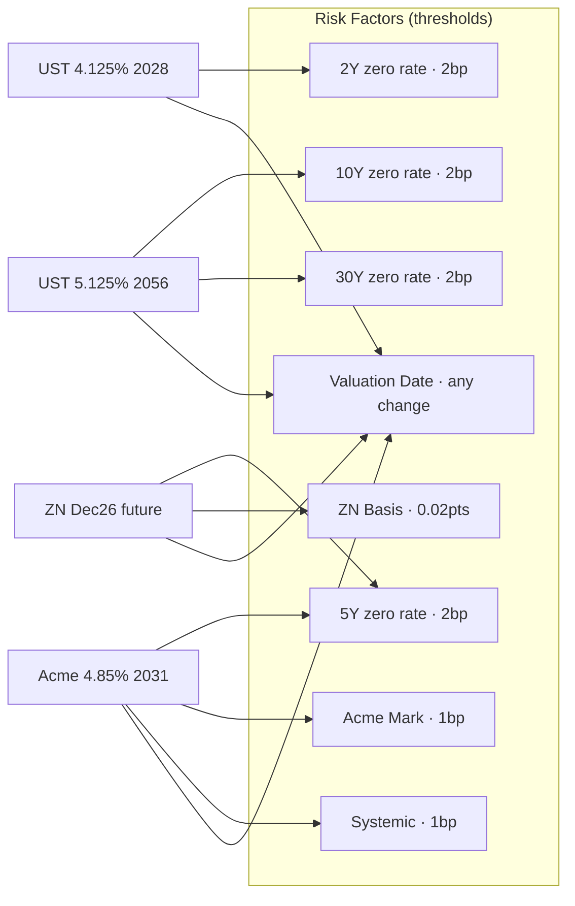
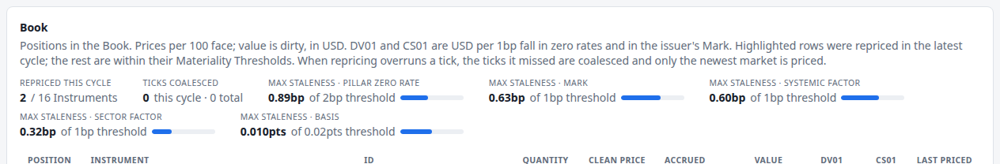
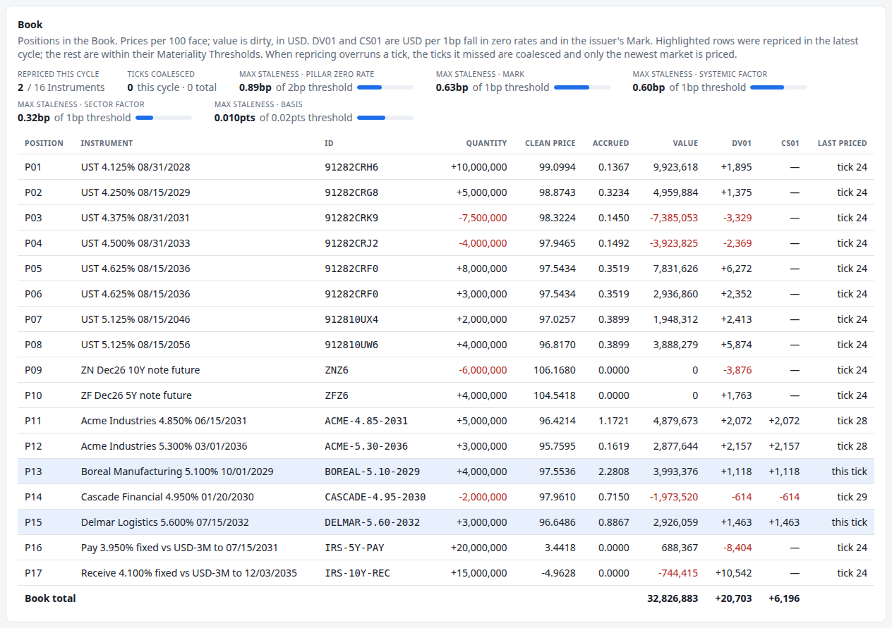

# 5. Real-time risk without recomputing everything

!!! warning "Draft"

    This article is a draft under review and may change.

*Risk Factors, Dependencies, Materiality Thresholds and Staleness: the central engineering problem.*


**Previously:** [article 4](04-pricing-a-bond-and-measuring-its-risk.md) priced a bond and measured its
[DV01](glossary.md#dv01) and [Bucketed DV01](glossary.md#bucketed-dv01) by bumping the curve and repricing.
[Article 3](03-moving-the-curve-through-time.md) moves that curve on every
[Tick](glossary.md#tick). Put those together and the engine has a problem.

## The real-world problem

Pricing one Instrument fully is not one calculation. In this engine it is **23**: one for the dirty value,
twenty for the parallel DV01 and the nine Bucketed DV01s (each is a central difference, so two repricings
each), and two more for [CS01](glossary.md#cs01).

The demo's [Book](glossary.md#book) holds 16 Instruments, so repricing everything costs 368 valuations.
Once a second that is nothing. But the numbers a real desk faces are different in every direction:

- thousands of Positions rather than seventeen, across many books;
- more risk factors per Instrument, so more bumps each;
- market data arriving many times a second rather than once.

Multiply those together and "reprice everything on every update" stops being possible. The lesson of this
article is not that the demo is slow. It is that the *shape* of the problem is the same at any scale, and
that the way out is a design decision, not a faster machine.

There are two textbook ways to cut the cost, and the engine takes neither.

- **Approximate.** Instead of repricing, estimate the change in value from sensitivities already computed:
  a Taylor expansion, delta or delta-gamma. RiskMetrics set this out in 1996: the analytical approach
  "approximates changes in value", is "computationally efficient" and lets users "estimate risk in a
  timely fashion".[^rm-taylor] The cost is accuracy. A delta approximation "is a linear approximation of a
  non linear relationship" and degrades as moves get larger.[^rm-delta]
- **Fully revalue.** Reprice every Instrument at the new market. More accurate, and the option RiskMetrics
  describes as "computationally more intensive", which "may not be the preferred approach when the goal is
  to provide senior management with a timely snapshot of risks".[^rm-full]

The engine's answer is a third one: **fully revalue, but only what has actually moved enough to matter.**
Every number on screen is an exact repricing, never an approximation. What varies is *when* that repricing
happened.

## How it works

### Risk Factors and Dependencies

A [Risk Factor](glossary.md#risk-factor) is one identified piece of market state that prices depend on: a
zero rate at a [Pillar](glossary.md#pillar), an issuer's [Mark](glossary.md#mark), a future's
[Basis](glossary.md#basis), the Systemic and Sector credit factors, and the discrete ones below. Each has a
type, and each type has a unit: basis points for rates and spreads, price points for a Basis.

An Instrument's [Dependencies](glossary.md#dependency) are the Risk Factors whose movement can change its
price. A Treasury note depends on curve Pillars and the [Valuation Date](glossary.md#valuation-date). A
corporate bond adds its issuer's Mark, rating, Sector Factor and the Systemic Factor. A future adds its
Basis and its current [Proxy Bond](glossary.md#proxy-bond).

The obvious next step is the one that does not work: watch the market for changed factors, and reprice the
Instruments that depend on them. Build systems call this *minimality*, executing a task "only if [it]
transitively depends on inputs that changed since the previous build".[^build-min] Excel does a
conservative version of it with a dirty bit per cell.[^build-min]

It fails here for a reason that comes straight out of article 3. The curve is driven by a single short
rate, so **every Pillar moves on every Tick**. Nothing is ever unchanged. An exact change-set would mark
the whole Book dirty on every Tick, and the engine would be back to 368 valuations a second.

### Materiality Thresholds

The fix is to stop asking "did it change?" and start asking "has it changed *enough*?"

Every factor type gets a [Materiality Threshold](glossary.md#materiality-threshold). An Instrument is
repriced when one of its Dependencies has moved past that threshold **since the last time that Instrument
was priced** — not since the last Tick. The demo's thresholds are:

| Factor type | Threshold |
|---|---|
| Pillar zero rate | 2bp |
| Issuer Mark | 1bp |
| Systemic and Sector Factors | 1bp |
| Futures Basis | 0.02 price points |
| Valuation Date, rating, Proxy Bond | none: any change is a move |

Comparing against the last *priced* value, rather than the last Tick, is what makes this safe. Drift
accumulates. A Pillar that creeps up 0.3bp a Tick does not hide below the threshold forever; after seven
Ticks it has moved 2.1bp and the Instruments that depend on it reprice.

!!! formula "Dirty, and the Staleness bound"

    An Instrument $I$ is dirty at market $m$ when it has never been priced, or when for some dependency
    $f$,

    $$
    \big|\,v_f(m) - v_f(m_{\text{priced}})\,\big| \;>\; \theta_{\text{type}(f)} ,
    $$

    where $v_f$ is the factor's value in its display unit, $m_{\text{priced}}$ is the market it was last
    priced at, and $\theta$ is the threshold for that factor type.

    [Staleness](glossary.md#staleness) is the left-hand side: how far a factor has moved since the
    Instruments depending on it were priced. After each cycle reprices the dirty Instruments, every
    Staleness is back at or below its threshold, so **Staleness is bounded by the thresholds**, whatever
    the market does. It is a lag with a guaranteed size, not an unknown error.

This is a trade the desk gets to set. A 2bp threshold on a Pillar says: displayed rates risk may be up to
2bp out of date, and in exchange most of the Book is left alone on most Ticks. Setting every threshold to
zero turns selective repricing off and reprices everything, every Tick.

### Only material Dependencies

There is a trap in "depends on". A coupon bond pays every six months, so its cash flows touch the short
end of the curve as well as the long. If a 30-year bond declared a dependency on every Pillar its cash
flows reach, then the fastest-moving short Pillars would drag the entire Book into every reprice, and the
threshold would buy almost nothing.

So the engine narrows each Instrument's curve Dependencies to the Pillars where it has **material
exposure**: those carrying at least 5% of its Bucketed DV01 (`risk.repricing.min-pillar-exposure`). What
is left out is immaterial by construction. The result is that short-dated Instruments reprice more often
than long-dated ones, which is what the model implies: a shock moves short rates more (article 3), and
short bonds hold their risk at those Pillars.

Measured on the demo, the 2-year note ends up depending on the 1Y and 2Y Pillars, the 30-year bond on 10Y,
20Y and 30Y, and the pay-fixed 5-year swap on 3Y and 5Y.

### Factors where any change counts

Some Risk Factors are not numbers that drift. They are discrete, and any change is a move:

- **The Valuation Date.** At a [Day Rollover](glossary.md#day-rollover) every Instrument depends on it, so
  the whole Book reprices, aged by a day.
- **An issuer's rating.** A [Rating Migration](glossary.md#rating-migration) reprices that issuer's bonds
  at once (article 8).
- **A future's Proxy Bond.** A [CTD Switch](glossary.md#ctd-switch) reprices that future (article 6).

These have no threshold, so they are never stale.

### Dependencies change while it runs

An Instrument's Dependencies are recomputed every time it is priced, from its current Bucketed DV01. That
matters because they move: as a bond ages its material Pillars shift down the curve, and when an issuer is
downgraded its bonds stop depending on their old Sector Factor and start depending on the new one. The
engine treats a factor an Instrument was *not* priced against as moved, so a new dependency takes effect on
the very next check.



## How the system does it

The whole decision is one method. An Instrument is dirty if it has never been priced, or if any dependency
has moved past its threshold since it was:

```java title="RepricingEngine.java" linenums="42"
    /** True if the Instrument was never priced, or a dependency has moved past its threshold since. */
    public boolean isDirty(String instrumentId, MarketState market) {
        Map<RiskFactorId, Double> priced = pricedAt.get(instrumentId);
        if (priced == null) {
            return true;
        }
        for (RiskFactorId factor : dependencies(instrumentId)) {
            Double pricedValue = priced.get(factor);
            if (pricedValue == null || moveInUnits(factor, market, pricedValue) > thresholds.threshold(factor.type())) {
                return true;
            }
        }
        return false;
    }

    /** Remembers the current values of the Instrument's dependencies as the ones it is priced at. */
    public void recordPriced(String instrumentId, MarketState market, long tick) {
        Map<RiskFactorId, Double> values = new HashMap<>();
        for (RiskFactorId factor : dependencies(instrumentId)) {
            values.put(factor, market.riskFactorValue(factor));
        }
        pricedAt.put(instrumentId, values);
        lastPricedTick.put(instrumentId, tick);
    }
```

[View on GitHub](https://github.com/suhasghorp/fixed-income-risk-engine/blob/series-v1/backend/src/main/java/com/fixedincomerisk/repricing/RepricingEngine.java#L42-L65)

Two details carry a lot of weight. `pricedAt` stores the factor values an Instrument was priced at, so
comparisons are against that Instrument's own history rather than the previous Tick. And a dependency with
no recorded value (`pricedValue == null`) counts as moved, which is what lets Dependencies change at
runtime without any extra bookkeeping.

Thresholds are per factor type, and the discrete types return zero, so any change exceeds them:

```java title="MaterialityThresholds.java" linenums="25"
    /** The threshold for a factor type. Discrete factors have none: any change is a move. */
    public double threshold(FactorType type) {
        return switch (type) {
            case PILLAR_ZERO_RATE -> pillarZeroRateBp;
            case MARK -> markBp;
            case SYSTEMIC, SECTOR -> creditIndexBp;
            case BASIS -> basisPoints;
            case RATING, PROXY_BOND, VALUATION_DATE -> 0;
        };
    }
```

[View on GitHub](https://github.com/suhasghorp/fixed-income-risk-engine/blob/series-v1/backend/src/main/java/com/fixedincomerisk/repricing/MaterialityThresholds.java#L25-L34)

Narrowing the curve Dependencies to material Pillars is a filter on the Instrument's declared factors,
using the sensitivities that have just been computed anyway:

```java title="MaterialDependencies.java" linenums="32"
    public static Set<RiskFactorId> of(Set<RiskFactorId> declared, List<Pillar> pillars, CurveSensitivities perUnit,
                                       double minShare) {
        double[] buckets = perUnit.bucketedDv01();
        double total = Arrays.stream(buckets).map(Math::abs).sum();
        Set<RiskFactorId> material = new LinkedHashSet<>();
        for (RiskFactorId factor : declared) {
            if (factor.type() != FactorType.PILLAR_ZERO_RATE) {
                material.add(factor);
                continue;
            }
            int bucket = indexOf(pillars, factor.name());
            if (total > 0 && Math.abs(buckets[bucket]) / total >= minShare) {
                material.add(factor);
            }
        }
        return material;
    }
```

[View on GitHub](https://github.com/suhasghorp/fixed-income-risk-engine/blob/series-v1/backend/src/main/java/com/fixedincomerisk/repricing/MaterialDependencies.java#L32-L48)

A repricing cycle then filters the Book, prices the dirty Instruments, and records both their new
Dependencies and the factor values they were priced at:

```java title="RiskSession.java" linenums="178"
    private List<PositionResult> reprice(MarketTicks ticks) {
        priced = ticks.latest();
        MarketState market = priced.market();
        List<Instrument> dirty = instruments.stream().filter(i -> repricing.isDirty(i.id(), market)).toList();
        List<Priced> results = priceAll(dirty, market, priced.tick());
        Set<String> repriced = new HashSet<>();
        for (Priced result : results) {
            repricing.setDependencies(result.instrument().id(), result.dependencies());
            repricing.recordPriced(result.instrument().id(), market, priced.tick());
            instrumentResults.put(result.instrument().id(), result.result());
            repriced.add(result.instrument().id());
        }
```

[View on GitHub](https://github.com/suhasghorp/fixed-income-risk-engine/blob/series-v1/backend/src/main/java/com/fixedincomerisk/session/RiskSession.java#L178-L189)

Only Positions whose Instrument was repriced are recomputed, and the Book rollups are rebuilt only if
something changed.

Finally, Staleness is reported, not hidden. The engine tracks the largest move of any dependency since its
Instrument was priced, per factor type:

```java title="RepricingEngine.java" linenums="80"
    public Map<FactorType, Double> maxStaleness(MarketState market) {
        Map<FactorType, Double> staleness = new EnumMap<>(FactorType.class);
        dependencies.forEach((instrumentId, factors) -> {
            Map<RiskFactorId, Double> priced = pricedAt.getOrDefault(instrumentId, Map.of());
            for (RiskFactorId factor : factors) {
                Double pricedValue = priced.get(factor);
                if (pricedValue != null) {
                    staleness.merge(factor.type(), moveInUnits(factor, market, pricedValue), Math::max);
                }
            }
        });
        return staleness;
    }
```

[View on GitHub](https://github.com/suhasghorp/fixed-income-risk-engine/blob/series-v1/backend/src/main/java/com/fixedincomerisk/repricing/RepricingEngine.java#L80-L92)

## See it running

```bash
# Terminal 1: the engine (N = 30 for the state below)
cd backend && mvn spring-boot:run -Dspring-boot.run.profiles=demo \
    -Dspring-boot.run.arguments=--risk.simulation.stop-at-tick=N

# Terminal 2: the UI, then open http://localhost:5173
cd frontend && npm install && npm run dev
```

The Book panel's top strip is the engine explaining itself. At Tick 30:



- **2 / 16 Instruments** were repriced in this cycle. The other fourteen kept the prices they were last
  given.
- **Max Staleness, Pillar zero rate: 0.89bp of a 2bp threshold.** Somewhere in the Book an Instrument is
  priced at a Pillar that has since moved 0.89bp. That is the worst case across the whole Book, and it
  cannot exceed 2bp.
- The same for Marks (0.63bp of 1bp) and the Systemic Factor (0.60bp of 1bp).

The Book table shows which two: the Boreal and Delmar corporate bonds are highlighted and read *this
tick*, while every other row still reads *tick 24*, the last [Day Rollover](glossary.md#day-rollover).



Compare that with Tick 24 itself, in [article 4](04-pricing-a-bond-and-measuring-its-risk.md): **16 / 16
Instruments**, every Staleness **0.00bp**. A Day Rollover is a discrete factor move, so the entire Book is
repriced and nothing is stale.

### What that saves

Stepping the demo through its first 240 Ticks (ten simulated days) and counting:

- **972 of 3,840 Instrument-Ticks were repriced: 25.3%.** Three quarters of the work never happened.
- **41 Ticks repriced nothing at all.** The market moved on every one of them, but not enough.
- **15 Ticks repriced all 16 Instruments.** Ten of those are the Day Rollovers; the rest are Ticks where a
  Pillar crossed its threshold for everything at once.
- **The largest Pillar Staleness over the whole run was 1.9995bp**, against the 2bp threshold. The bound
  holds.

An average Tick repriced about 4 Instruments, or 93 valuations instead of 368.

Which Instruments reprice is not random:


*Every Instrument reprices at least at the ten Day Rollovers in this run.*

- **The liquid corporate bonds reprice most** (Boreal 125, Cascade 123). Their issuers trade about four
  times a simulated day, and each trade Print or dealer Quote resets the Mark, which is a 1bp-threshold
  factor. Credit, not rates, drives their repricing (articles 7 and 8).
- **The 10-year Treasury note (70) reprices far more than the 30-year bond (30).** Both depend on the same
  kind of factor, but the short end moves more, and the 10-year note's material Pillars are 7Y and 10Y
  against the 30-year bond's 10Y, 20Y and 30Y.
- **The swaps and futures sit in between**, repricing 35 to 48 times.

### The dependency sets

Measured after 240 Ticks, the Instruments declare exactly the factors they need:

| Instrument | Dependencies |
|---|---|
| UST 4.125% 2028 (2Y) | 1Y, 2Y, Valuation Date |
| UST 4.625% 2036 (10Y) | 7Y, 10Y, Valuation Date |
| UST 5.125% 2056 (30Y) | 10Y, 20Y, 30Y, Valuation Date |
| ZN Dec26 future | 5Y, 7Y, Basis, Proxy Bond, Valuation Date |
| Pay-fixed 5Y swap | 3Y, 5Y, Valuation Date |
| Acme 4.85% 2031 | 3Y, 5Y, Mark, Rating, Sector, Systemic, Valuation Date |

Two things to notice. The 30-year bond depends on three Pillars and not on the 3M or 1Y ones, even though
it pays a coupon in a few months' time: that exposure is below 5% of its Bucketed DV01. And Acme's Sector
Factor dependency is to *BBB Industrials*, not the A Industrials it started in. Acme was downgraded at
Tick 120, and its bonds' Dependencies were rewired in the same cycle. Article 8 is about that moment.

!!! realdesk "What a real desk does differently"

    - **A real dependency graph.** Large bank risk platforms are built around one. Goldman Sachs' SecDB,
      launched in 1992, is the best known: its language Slang "has a built-in graph framework for
      financial modeling for expressing dependencies between financial instruments".[^secdb] JPMorgan's
      Athena and Bank of America's Quartz are widely reported as later systems in the same
      design.[^bankpython] Public detail on their internals is press and practitioner writing, not
      documentation, so treat descriptions of them with care. The engine's flat map from Instrument to
      factors is the same idea with one level.
    - **Incremental computation as a discipline.** Recomputing only what changed has thirty years of
      language research behind it.[^incremental] Self-adjusting computation records a dynamic dependence
      graph during a run and propagates changes through it.[^acar] Jane Street's Incremental library is
      built on that work, and names portfolio risk as a motivating case: models that depend on live
      market data and on each other.[^janestreet] Build systems add *early cutoff*: if recomputing a node
      gives the same answer, skip everything downstream.[^cutoff] A Materiality Threshold is the same
      instinct applied to inputs rather than outputs.
    - **Adjoint differentiation instead of bumping.** The engine spends 20 of its 23 valuations on curve
      bumps. Production engines get many sensitivities at once with adjoint (reverse-mode) algorithmic
      differentiation, which computes the sensitivities of a few outputs to many inputs for a cost of
      roughly one pricing.[^aad] That changes the arithmetic of this article completely, and it composes
      with selective repricing rather than replacing it.
    - **Grids and caching.** Desks spread repricing across compute grids, cache intermediate results, and
      reuse curve builds between Instruments.
    - **Governance of the tolerance.** A threshold is a promise about how wrong a screen may be. In a
      bank that is not a developer's choice: regulatory sensitivities must come from the same pricing
      models an independent risk unit uses to report market risk or actual P&L,[^mar21-consistency] and
      intraday numbers that drift from the official end-of-day run have to be explained.
    - **Different answers for different jobs.** Intraday hedging can accept a bounded lag. End-of-day
      P&L and capital cannot, and are computed from a full revaluation of the whole book.

## Further reading

Primary sources:

- J.P. Morgan/Reuters, [*RiskMetrics — Technical
  Document*](https://www.msci.com/documents/10199/5915b101-4206-4ba0-aee2-3449d5c7e95a), 4th ed., 1996.
  §1.2.2 and §2.3.1 set out sensitivity approximation against full revaluation.
- Basel Committee on Banking Supervision, [Basel Framework
  MAR21](https://www.bis.org/basel_framework/chapter/MAR/21.htm). The standardised capital charge built on
  sensitivities, and the rule that they come from the bank's own pricing models.
- A. Mokhov, N. Mitchell and S. Peyton Jones, [*Build Systems à la
  Carte*](https://www.microsoft.com/en-us/research/wp-content/uploads/2018/03/build-systems.pdf), ICFP 2018. Minimality and early cutoff, stated precisely.
- U. A. Acar, [*Self-Adjusting Computation*](https://www.cs.cmu.edu/~rwh/students/acar.pdf), PhD thesis,
  Carnegie Mellon University, 2005. Dynamic dependence graphs and change propagation.
- M. Hammer et al., [*Incremental Computation with Names*](https://arxiv.org/abs/1503.07792), OOPSLA 2015.
- M. Giles and P. Glasserman, [*Smoking Adjoints: fast evaluation of Greeks in Monte Carlo
  calculations*](https://people.maths.ox.ac.uk/gilesm/files/NA-05-15.pdf), 2005 (published in *Risk*,
  2006). Why adjoint differentiation beats bumping when there are many inputs.
- Y. Minsky, [*Introducing Incremental*](https://blog.janestreet.com/introducing-incremental/), Jane Street
  Tech Blog, 2015.
- Goldman Sachs, [*With SecDB, a Groundbreaking Risk Management Platform is
  Born*](https://www.goldmansachs.com/our-firm/history/moments/1993-secdb.html), and M. Dorko,
  [*From Runtime Efficiency to Carbon Efficiency*](https://www.infoq.com/presentations/slang/), QCon
  London 2023.

Textbooks:

- Philippe Jorion, *Value at Risk*, 3rd ed., McGraw-Hill, 2006. Delta-normal, delta-gamma and full
  revaluation compared.
- Antoine Savine, *Modern Computational Finance: AAD and Parallel Simulations*, Wiley, 2018.

[^rm-taylor]: RiskMetrics Technical Document (1996), §1.2.2 and §2.3.1.1: the approach "approximates the nonlinear relationship via a ... Taylor series expansion"; analytical models "are computationally efficient and enable users to estimate risk in a timely fashion".
[^rm-delta]: RiskMetrics Technical Document (1996), §1.2.2.1: "The delta approximation is reasonably accurate when the exchange rate does not change significantly, but less so in the more extreme cases. This is because the delta is a linear approximation of a non linear relationship."
[^rm-full]: RiskMetrics Technical Document (1996), §2.3.1.2: full valuation's "main drawback is the fact that the full valuation of large portfolios under a significant number of scenarios is computationally intensive and takes time."
[^build-min]: Mokhov, Mitchell and Peyton Jones (2018), Definition 2.1 and §2.2: a build system is minimal if it executes tasks "at most once per build and only if they transitively depend on inputs that changed since the previous build"; "Excel stores one dirty bit per cell and the calc chain from the previous build."
[^cutoff]: Mokhov, Mitchell and Peyton Jones (2018), §2.3: "When it executes a task and the result is unchanged from the previous build, it is unnecessary to execute the dependent tasks". The comparison with Materiality Thresholds is this article's, not the paper's.
[^acar]: Acar (2005), abstract: "a model of computation, called self-adjusting computation, where computations adjust to any external change to their data (state) automatically", with "novel data structures for tracking the dependences in a computation and a change-propagation algorithm".
[^janestreet]: Minsky (2015): Incremental builds "computations that can be updated efficiently when their inputs change"; "An example that comes from our own work is risk calculations ... Each of these models is dependent both on live data from the markets, and on configurations determined by users."
[^incremental]: Hammer et al. (2015), abstract: "Over the past thirty years, there has been significant progress in developing general-purpose, language-based approaches to incremental computation".
[^secdb]: Goldman Sachs firm history: "SecDB was first launched on November 24, 1992", as "a platform to price trades and assess risk for trading positions". Dorko (QCon London 2023) on Slang: it "has a built-in graph framework for financial modeling for expressing dependencies between financial instruments". The history page itself does not mention a dependency graph.
[^bankpython]: eFinancialCareers, *The \$bn struggle to replicate Goldman Sachs' special powers* (2017): "J.P. Morgan has arguably come closest to replicating SecDB with Athena"; and C. Paterson, [*An oral history of Bank Python*](https://calpaterson.com/bank-python.html) (2021), which describes a deliberately "fictional, amalgamated" system whose graph subsystem "automatically reprices derivatives ... when the value of the underlying instruments changes". Both are secondary sources.
[^aad]: Giles and Glasserman (2005): "The adjoint method outperforms a forward implementation in calculating the sensitivities of a small number of outputs to a large number of inputs. This applies, for example, in estimating the sensitivities of an interest rate derivatives book to multiple points along an initial forward curve." The "cost of roughly one pricing" is the standard result for reverse-mode differentiation, not a quotation from this paper.
[^mar21-consistency]: Basel Framework, MAR21.17: sensitivities must be based on "instrument prices or pricing models that an independent risk control unit within a bank uses to report market risks or actual profits and losses to senior management".

## Next

Selective repricing is the engine's spine, and the rest of the series hangs off it: every new Instrument
type brings a new kind of Risk Factor to the same machinery.
[Article 6](06-treasury-futures.md) adds the first of them. A Treasury future is priced from a bond it may
not even deliver, through a Basis that moves on its own and a Proxy Bond that can switch without warning.
