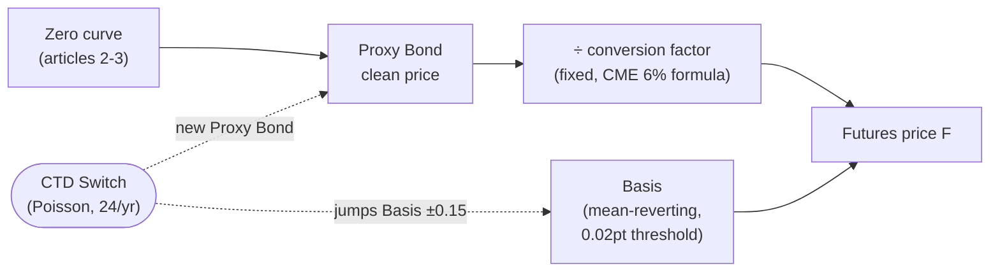
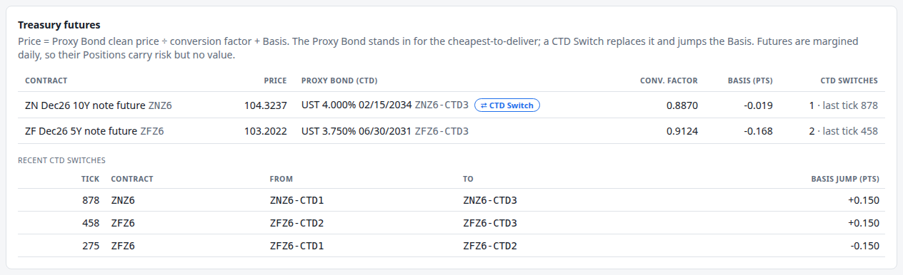

# 6. Treasury futures

!!! warning "Draft"

    This article is a draft under review and may change.

*The cheapest-to-deliver, conversion factors, the Basis, and why a future carries risk but no value.*


**Previously:** [article 5](05-real-time-risk-without-recomputing-everything.md) showed the engine repricing
only what has moved past a [Materiality Threshold](glossary.md#materiality-threshold), and promised that
each new Instrument type brings a new kind of [Risk Factor](glossary.md#risk-factor) to the same machinery.
Treasury futures bring two, and one of them does not drift: it jumps.

## The real-world problem

A desk that is long a pile of Treasuries and wants less interest rate risk has two choices. It can sell
bonds, which costs money and moves the market. Or it can sell futures.

A Treasury futures contract is an agreement to deliver Treasury notes in a delivery month. The 10-year
contract (CME's ZN) covers \$100,000 face of notes.[^rulebook] Nobody needs to fund a bond position to
trade it, gains and losses settle in cash every day, and it is the most liquid way to move rate exposure.
The Book in this series is short 6 million face of ZN for exactly that reason.

Pricing one is stranger than pricing a bond, because the contract does not say *which* note will be
delivered. The seller chooses, from a basket: for ZN, notes with an original term of at most 10 years and
a remaining term of at least 6 years 6 months and less than 8 years.[^rulebook] Whoever is short picks the
one that suits them, and that choice drives the price.

## How it works

### The conversion factor

If any note in the basket can be delivered, the contract needs a way to compare them. A 4% note and a 5%
note of different maturities are not worth the same, so delivering either at the same price would be
absurd.

The exchange publishes a **conversion factor** for each deliverable note and each contract month: "the
approximate decimal price at which \$1 par of a security would trade if it had a six percent
yield-to-maturity".[^cme-cf] At delivery the buyer pays the futures settlement price times the conversion
factor (plus accrued interest).[^rulebook] A note with a coupon below 6% has a factor below 1, and one
above 6% has a factor above 1.[^cme-6pct]

The 6% standard is a fossil: it has been 6% since the March 2000 contract, and 8% before that.[^cme-6pct]

!!! formula "CME's conversion factor"

    Take $n$ whole years and $z$ whole months from the first day of the delivery month to maturity. CME
    rounds $z$ down to a quarter for ZN, ZB, TN, TWE and UB, and to a whole month for ZF, Z3N and ZT. With
    coupon $c$ (annual, as a decimal, rounded to the nearest eighth of a percent) and

    $$
    v = \begin{cases}
    z & z < 7\\
    3 & z \ge 7 \text{ for ZN, ZB, TN, TWE, UB}\\
    z - 6 & z \ge 7 \text{ for ZF, Z3N, ZT}
    \end{cases}
    $$

    the factor is:[^cme-cf]

    $$
    a = \frac{1}{1.03^{\,v/6}}, \qquad
    b = \frac{c}{2}\cdot\frac{6 - v}{6}, \qquad
    d = \frac{c}{0.06}\,(1 - e),
    $$

    $$
    e = \begin{cases} 1/1.03^{\,2n} & z < 7\\ 1/1.03^{\,2n+1} & z \ge 7\end{cases},
    \qquad
    \mathrm{CF} = a\left[\frac{c}{2} + e + d\right] - b .
    $$

    Everything is discounted at 3% per half-year, which is the 6% notional yield. For the demo's
    `ZNZ6-CTD1`, a 4.125% note maturing 15 August 2033 against the December 2026 contract: $n = 6$,
    $z = 6$, $v = 6$, so $a = 0.970874$, $b = 0$, $e = 1/1.03^{12} = 0.701380$, $d = 0.205302$, and

    $$
    \mathrm{CF} = 0.970874 \times (0.020625 + 0.701380 + 0.205302) = 0.9003 .
    $$

### The cheapest-to-deliver

Conversion factors are meant to make every deliverable equally attractive. They do not. CME is blunt about
it: the system "is imperfect in practice".[^cme-ctd] It assumes every note in the basket yields exactly
6%, and they do not.[^cme-why-ctd]

The note that is least bad to hand over is the **cheapest-to-deliver**, the CTD: the one with the lowest
*basis*, where the basis is the note's cash price minus the futures price times its conversion
factor.[^cme-ctd] Equivalently, it usually has the highest **implied repo rate**: the return from buying
the note, selling futures against it and delivering.[^cme-irr]

Which note is cheapest depends on where yields are relative to that 6% standard. Above 6%, the bias favours
long-duration notes (low coupon, long maturity); below 6%, short-duration ones.[^cme-why-ctd] Today's
yields are far below 6%, so the CTD sits at the short end of the basket. CME shortened the ZN basket to
6y6m–7y9m from the September 2023 contract for exactly this reason: above 6% the contract would have
started tracking the same note as the Ultra 10-Year.[^cme-basket]

**The future tracks its CTD.** It "will tend to price or track or correlate most closely with the
CTD".[^cme-ctd] That is the hook the engine hangs everything on.

### What the engine models, and what it leaves out

The engine does not search a basket for the cheapest note on every Tick. Each contract carries a small
list of synthetic [Proxy Bonds](glossary.md#proxy-bond) whose maturities sit inside the real deliverable
range, one of which is current, and prices the future from it:

$$
F = \frac{P_{\text{proxy}}^{\text{clean}}}{\mathrm{CF}} + B .
$$

The first term is the Proxy Bond priced off the curve (article 4) and scaled by its conversion factor. The
second is the [Basis](glossary.md#basis): everything the curve does not explain, simulated as a
mean-reverting process of its own, in price points.

Why give the Basis its own Risk Factor rather than set it to zero? Because in the real market it is not
zero and it is not constant. Even the CTD's basis is normally wider than its cost of carry, and CME
explains the excess as the price of the short's options: which note to deliver, and when.[^cme-carry] It
moves for reasons a curve model does not see.

And why a *discrete* Proxy Bond rather than a continuous one? Because that is how the real thing behaves.
CME calls a change of CTD a "crossover" or "switch", and notes that its likelihood depends on how close
yields are to the 6% standard.[^cme-optionality] When it happens, the future stops tracking one note and
starts tracking another, and its risk changes shape at that instant.

So the engine gives each future two Risk Factors of its own:

- **The Basis**, continuous, with a 0.02 price-point Materiality Threshold;
- **The Proxy Bond**, discrete: a [CTD Switch](glossary.md#ctd-switch) is always a move, so the future
  reprices on the spot (article 5).

A CTD Switch in the demo does two things at once: it moves the contract to a different Proxy Bond, and it
jumps the Basis by ±0.15 price points. Switches arrive as a Poisson process, 24 per contract per year.



### Risk but no value

A futures position is settled in cash every day. The CFTC's glossary describes marking to market as
"calculating the gain or loss in each contract position resulting from changes in the price of the futures
... at the end of each trading session", with those amounts "added or subtracted to each account
balance".[^cftc] Yesterday's profit is already in the account.

The engine takes the modelling step that follows: an open futures Position has a
[Position Value](glossary.md#position-value) of **zero**. Its price and its risk are real; its value is
not. Treating the notional as value would inflate the Book by millions of dollars of money nobody holds.

Its DV01, on the other hand, is very real, and it comes from the note it tracks. CME puts it plainly:
Treasury futures "are not coupon bearing instruments since they do not have cash flows", and "derive their
DV01 from the cash instrument they track", with **futures DV01 = cash DV01 / conversion
factor**.[^cme-dv01] The engine gets this for free: it bumps the curve and reprices $F$, and because
$F = P/\mathrm{CF} + B$ with the Basis held fixed, the division by CF falls out of the arithmetic.

## How the system does it

Pricing a future is one line of arithmetic over the market state:

```java title="TreasuryFuture.java" linenums="68"
    /** The futures price per unit of face: F / 100. */
    @Override
    public double dirtyValue(MarketState market) {
        FuturesMarket state = market.futures(contract);
        ProxyBond proxy = currentProxy(state);
        return proxy.bond().cleanValue(market) / proxy.conversionFactor() + state.basis() / 100;
    }

    /** Futures pay no coupons; gains and losses are margined daily. */
    @Override
    public List<CashFlow> cashFlowsPaid(MarketState market, LocalDate from, LocalDate to) {
        return List.of();
    }
```

[View on GitHub](https://github.com/suhasghorp/fixed-income-risk-engine/blob/series-v1/backend/src/main/java/com/fixedincomerisk/instrument/TreasuryFuture.java#L68-L80)

Note what it uses: the Proxy Bond's **clean** price. Accrued interest is invoiced separately at delivery,
so it does not belong in the futures price.[^rulebook] `marginedDaily()` returns true, which is what makes
the Position Value zero.

The Dependencies are declared for every deliverable, not just the current one:

```java title="TreasuryFuture.java" linenums="53"
    /**
     * The Valuation Date, the Basis, the choice of Proxy Bond, and the Pillars around every deliverable's
     * remaining cash flows, so the dependencies hold whichever bond is the CTD.
     */
    @Override
    public Set<RiskFactorId> riskFactors(MarketState market, List<Pillar> pillars) {
        Set<RiskFactorId> factors = new LinkedHashSet<>();
        factors.add(RiskFactorId.basis(currency(), contract));
        factors.add(RiskFactorId.proxyBond(currency(), contract));
        for (ProxyBond deliverable : deliverables) {
            factors.addAll(deliverable.bond().riskFactors(market, pillars));
        }
        return factors;
    }
```

[View on GitHub](https://github.com/suhasghorp/fixed-income-risk-engine/blob/series-v1/backend/src/main/java/com/fixedincomerisk/instrument/TreasuryFuture.java#L53-L66)

Declaring all of them means a switch never lands on an Instrument that was not watching the Pillars the
new bond cares about. Article 5's material-exposure filter then trims the list to the Pillars that actually
carry the risk, so this costs nothing in practice.

The Basis and the switches are simulated together. The Basis is an Ornstein-Uhlenbeck process stepped the
same way as the short rate, and the switch is a Poisson draw that also jumps the Basis:

```java title="FuturesBasisSimulator.java" linenums="46"
        double switchProbability = 1 - Math.exp(-parameters.ctdSwitchIntensity() * dt);
        List<CtdSwitch> switches = new ArrayList<>();
        int index = 0;
        for (Map.Entry<String, Integer> contract : deliverableCounts.entrySet()) {
            FuturesMarket current = state.get(contract.getKey());
            double shock = shocks.get(index++);
            double basis = current.basis()
                    + parameters.meanReversion() * (parameters.longRunMean() - current.basis()) * dt
                    + parameters.volatility() * Math.sqrt(dt) * shock;
            int proxyIndex = current.proxyIndex();
            if (random.nextDouble() < switchProbability) {
                int to = random.nextInt(contract.getValue() - 1);
                to = to >= proxyIndex ? to + 1 : to;
                double jump = random.nextBoolean() ? parameters.ctdSwitchJump() : -parameters.ctdSwitchJump();
                switches.add(new CtdSwitch(contract.getKey(), proxyIndex, to, jump));
                proxyIndex = to;
                basis += jump;
            }
            state.put(contract.getKey(), new FuturesMarket(proxyIndex, basis));
        }
```

[View on GitHub](https://github.com/suhasghorp/fixed-income-risk-engine/blob/series-v1/backend/src/main/java/com/fixedincomerisk/model/FuturesBasisSimulator.java#L46-L65)

The Basis shock is correlated with the short-rate shock (article 10), so the Basis and the curve do not
wander independently.

## See it running

In the demo, the ZN contract switches its CTD at **Tick 878**. Stop just after it:

```bash
# Terminal 1: the engine, stopped just after the ZN CTD Switch
cd backend && mvn spring-boot:run -Dspring-boot.run.profiles=demo \
    -Dspring-boot.run.arguments=--risk.simulation.stop-at-tick=880

# Terminal 2: the UI, then open http://localhost:5173
cd frontend && npm install && npm run dev
```

At one Tick per second that takes about 15 minutes.



The ZN row now shows a **CTD Switch** badge, the Proxy Bond is the 4.000% note of February 2034, and the
recent-switches table records all three switches of the run so far: ZF at Ticks 275 and 458, ZN at
Tick 878, each with its ±0.150 Basis jump.

### The price, taken apart

Two Ticks are worth comparing: Tick 875, the last time the future was priced before the switch, and
Tick 878, the switch itself.

| | Tick 875 | Tick 878 |
|---|---|---|
| Proxy Bond | UST 4.125% 08/15/2033 | UST 4.000% 02/15/2034 |
| Its clean price | 93.8426 | 92.5639 |
| Conversion factor | 0.9003 | 0.8870 |
| Clean price ÷ CF | 104.2348 | 104.3561 |
| Basis (price points) | −0.1974 | −0.0324 |
| **Futures price** | **104.0374** | **104.3237** |

Both bottom rows are exactly what the Book table shows for Position P09. The price moved by 0.29 points,
and almost all of that is the Basis jumping 0.165 points: +0.150 from the switch itself plus its ordinary
drift.

### The risk changes shape

The more interesting change is the risk:

| | Tick 875 | Tick 878 |
|---|---|---|
| Proxy Bond DV01 on 6mm face | 3,373.3 | 3,546.4 |
| ÷ conversion factor | 3,746.9 | 3,998.2 |
| **P09 DV01 (short 6mm)** | **−3,746.9** | **−3,998.2** |
| Largest buckets | 7Y −3,072, 5Y −479 | 7Y −3,208, 10Y −389, 5Y −208 |

CME's rule, futures DV01 = cash DV01 / conversion factor, holds to the last decimal place in both columns,
because it is what the engine's arithmetic does.

The hedge changed without anyone trading. The old Proxy Bond matures in August 2033, about 6.8 years from
the Valuation Date, so its risk sat between the 5Y and 7Y Pillars. The new one matures in February 2034,
about 7.3 years out, so its risk spreads between 7Y and 10Y. A short position that was hedging the 5Y–7Y
part of the curve is now hedging the 7Y–10Y part, and its DV01 grew by 251 dollars per basis point.

At the Book level the 7Y bucket moves from +526 to +389 and the 10Y bucket from +15,421 to +15,032. A desk
watching only the total DV01 (20,028 to 19,776) would see a small drift. The buckets show that something
structural happened.

### Staleness, again

One detail in the futures panel is worth catching. At Tick 880 the panel shows the ZN price as 104.3237,
which is the Tick-878 price, while the Basis column reads −0.019, its current value. The future has not
been repriced since the switch, because the Basis has not moved 0.02 points since. That is
[article 5](05-real-time-risk-without-recomputing-everything.md)'s bargain in one row: the displayed price
lags the market by a bounded amount, and the panel shows you both numbers so you can see the lag.

!!! realdesk "What a real desk does differently"

    - **The CTD is computed, not assumed.** A desk runs the whole deliverable basket every day, computing
      each note's basis and implied repo rate from live prices, and the CTD falls out of that.[^cme-irr]
      The engine picks from a handful of synthetic notes and switches at random. CME publishes the
      conversion factors for listed contracts, and its Treasury Analytics tool shows the current
      CTD.[^cme-cf]
    - **The delivery options have value.** The short chooses *which* note to deliver and *on which day* of
      the delivery month,[^delivery] and the basis over carry is the market's price for those
      options.[^cme-carry] Traders call the excess the net basis, and the basis trade is a business of its
      own.[^burghardt] The engine collapses all of it into one mean-reverting number.
    - **Contracts expire.** Real futures have a delivery month, a last trading day seven business days
      before month-end,[^delivery] and a quarterly roll into the next contract. The engine models a
      single continuous front contract and never rolls.
    - **Margin is real money.** Daily settlement means cash moves every day, and initial margin has to be
      funded. The Chicago Fed has expressed Treasury futures margin in DV01 terms using exactly this
      CTD-over-conversion-factor translation.[^chicagofed] The engine has no cash account at all.
    - **Basis risk in the hedge.** CME warns that hedging a security the future does not track leaves
      basis risk.[^cme-dv01] That is precisely what the Tick-878 switch did to this Book: the hedge
      quietly moved to a different part of the curve.

## Further reading

Primary sources:

- CME Group, *CBOT Rulebook Chapter 19: U.S. Treasury Note Futures (6½ to 8-Year)*. Contract grade,
  invoice amount, conversion factors, delivery and last trading day.
- CME Group, *Calculating U.S. Treasury Futures Conversion Factors* (2024). The formula, the rounding
  conventions per contract, and worked examples for ZT, Z3N, ZF, ZN and TN.
- CME Group, *Product Modification: Delivery Basket for 10-Year Treasury Futures*, December 2022. Why the
  basket was shortened to 6y6m–7y9m, and how the CTD depends on the level of yields.
- J. W. Labuszewski, M. Kamradt and D. Gibbs, *Understanding Treasury Futures*, CME Group, 2013.
  Cheapest-to-deliver, the basis, implied repo, conversion factor biases and crossovers.
- CME Group, *Calculating the Dollar Value of a Basis Point*. Futures DV01 from the CTD.
- US Commodity Futures Trading Commission, [*CFTC
  Glossary*](https://www.cftc.gov/LearnAndProtect/AdvisoriesAndArticles/CFTCGlossary/index.htm),
  "Mark-to-Market".
- K. B. Patel and J. Spence, [*The Misleading Notion of
  Notionals*](https://www.chicagofed.org/publications/chicago-fed-letter/2022/467), Chicago Fed Letter
  467, 2022.

Textbooks:

- Galen D. Burghardt, Terrence M. Belton, Morton Lane and John Papa, *The Treasury Bond Basis*, 3rd ed.,
  McGraw-Hill, 2005. The standard reference on the basis, net basis, implied repo and delivery options.
- John C. Hull, *Options, Futures, and Other Derivatives*, 11th ed., Pearson, 2021. Interest rate futures
  and duration-based hedging.

[^rulebook]: CBOT Rulebook, Chapter 19, Rules 19101–19102: the trading unit is "U.S. Treasury Notes having a face value at maturity of one hundred thousand dollars (\$100,000)"; contract grade is notes with "(a) an original term to maturity ... of not more than 10 years; and (b) a remaining term to maturity of not less than 6 years 6 months and less than 8 years"; the invoice amount is "(\$1000 x P x c) + Accrued Interest".
[^cme-cf]: CME Group, *Calculating U.S. Treasury Futures Conversion Factors* (2024 edition): "The conversion factor represents the estimated decimal price at which \$1 par value of the security would trade if it had a yield to maturity of 6%"; $z$ is "rounded down to the nearest quarter for UB, ZB, TWE, TN and ZN, and to the nearest month for ZF, Z3N, and ZT". The same document's Exhibit 1 gives ZN's deliverable grade as notes "with a remaining term to maturity of at least six and a half years, but less than eight years, from the first day of the delivery month". Its worked example for a 4 1/8% note against the December 2023 contract also comes to 0.9003. The rulebook defines c as the price at which the note "will yield 6% per annum according to conversion factor tables prepared and published by the Exchange".
[^cme-6pct]: CME Group, *Product Modification: Delivery Basket for 10-Year Treasury Futures* (2022), footnote 1: "Prior to the March 2000 expiry month, an 8% coupon was used." Labuszewski et al. (2013): "bonds with coupons less than the 6% contract standard will have CFs that are less than 1.0".
[^cme-ctd]: Labuszewski, Kamradt and Gibbs (2013): "The intent of the conversion factor invoicing system is to render equally economic the delivery of any eligible-for-delivery securities. ... However, the CF system is imperfect in practice"; the basis is "the cash price less the 'adjusted futures price'"; "the security with the lowest basis ... may be considered CTD"; and futures "will tend to price or track or correlate most closely with the CTD".
[^cme-why-ctd]: Labuszewski, Kamradt and Gibbs (2013): the CF system "is implicitly based on the assumption that - (1) all eligible-for-delivery securities have the same yield; and (2) that yield is 6%"; long-duration securities become CTD above 6%, short-duration ones below.
[^cme-basket]: CME Group (2022): the basket moves "from 6 years, 6 months to 7 years, 9 months ... starting with the new quarterly listings beginning with the September 2023 contract month", because "in an environment of yields above 6%, the futures CTD tends toward the longest duration security in the basket".
[^cme-irr]: Labuszewski, Kamradt and Gibbs (2013): the implied repo rate is "the annualized rate of return associated with the purchase of a security, sale of futures and delivery of the same"; "the security with the lowest basis will likewise exhibit the highest implied repo rate".
[^cme-carry]: J. W. Labuszewski and F. Sturm, *Understanding U.S. Treasury Futures*, CME Group (c. 2008): "Theoretically, the basis for the cheapest-to-deliver security should equal its cost of carry. Yet, it is typical in practice that the basis for even the CTD security will exceed its cost of carry", and that premium "represents the 'reverse probability' that a particular security may become cheapest-to-deliver".
[^cme-optionality]: Labuszewski, Kamradt and Gibbs (2013): "'crossovers' or 'switch' may occur"; "Market volatility affects the probability that a crossover may occur ... If rates are close to the 6% futures contract standard ... there may be significant crossovers regardless of whether rates rise or fall."
[^cme-dv01]: CME Group, *Calculating the Dollar Value of a Basis Point*: Treasury futures "are not coupon bearing instruments since they do not have cash flows. Treasury futures track the price of the most economical security to deliver, and derive their DV01 from the cash instrument they track"; "Futures DV01 = Cash DV01 / Conversion Factor". It also warns of basis risk when hedging a security the future does not track.
[^cftc]: CFTC Glossary, "Mark-to-Market". The step from daily settlement to a zero Position Value is the engine's modelling choice, not the CFTC's wording.
[^delivery]: CBOT Rulebook, Chapter 19, Rules 19102.F and 19103: delivery may be made "upon any business day of the contract delivery month that the short Clearing Member may select", and "No trades in an expiring contract shall be made during the last 7 business days of the contract's named month of expiration."
[^burghardt]: The term "net basis" (basis minus carry) does not appear in the CME documents cited here; it is standard market usage, and Burghardt et al., *The Treasury Bond Basis*, is its reference text.
[^chicagofed]: Patel and Spence, Chicago Fed Letter 467 (2022): "The DV01 of the cheapest-to-deliver securities was adjusted by the conversion factor to derive the basis point equivalent ... of the IM."

## Next

A future is priced from a bond that the curve already prices. Corporate bonds are not so lucky: no curve
prices them, and the market that would tell you their spread mostly does not trade.
[Article 7](07-credit-and-the-missing-tape.md) is about pricing what you cannot observe: Marks, Prints and
Quotes, Matrix Pricing, and CS01.
