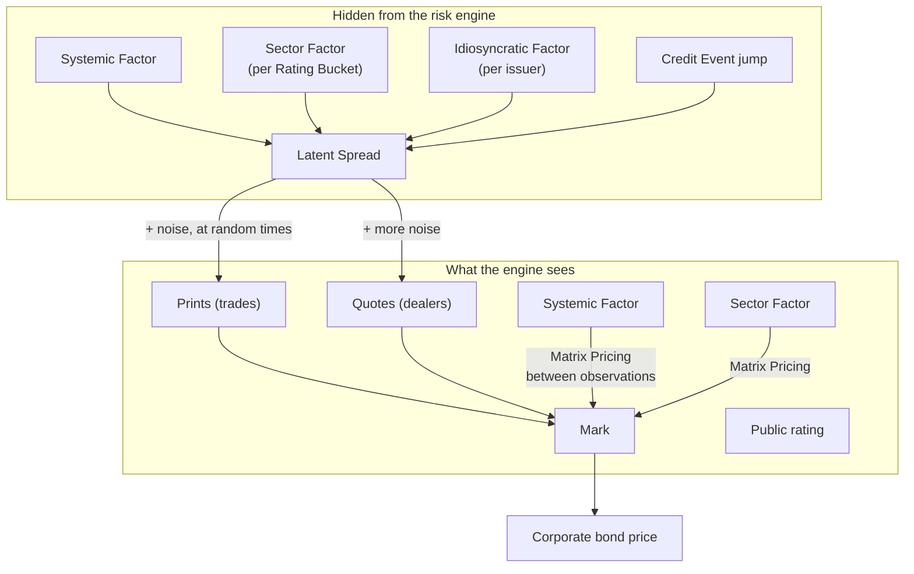
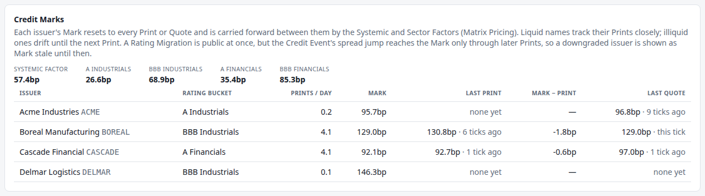

# 7. Credit and the missing tape

!!! warning "Draft"

    This article is a draft under review and may change.

*Spreads, Latent Spreads vs Marks, Prints and Quotes, Matrix Pricing and CS01.*


**Previously:** the series has priced Treasuries and futures off one curve
([articles 2](02-the-yield-curve.md)–[4](04-pricing-a-bond-and-measuring-its-risk.md)), repriced them
selectively ([article 5](05-real-time-risk-without-recomputing-everything.md)), and added a Basis that the
curve cannot explain ([article 6](06-treasury-futures.md)). Every price so far has come from something
observable. Corporate bonds break that.

## The real-world problem

A Treasury note and a corporate bond promise the same shape of cash flows. The difference is that the
company might not pay. Investors demand extra yield for that risk, the **credit spread**, and it is the
part of a corporate bond's price that the Treasury curve knows nothing about.

So a desk needs each issuer's spread. And here the market stops helping.

**Most bonds do not trade on most days.** SEC staff measured it: across sub-periods from before the 2008
crisis to 2017, "the average portion of TRACE-eligible bonds that do not trade on a given day ranges from
approximately 79% to 91%", and at least half of bonds do not trade at all on a given day.[^sec-liquidity]

**What does trade is reported, but late and partly hidden.** Dealers must report a corporate bond trade to
FINRA's TRACE "as soon as practicable, but no later than within 15 minutes of the Time of
Execution".[^finra-rule] FINRA disseminates each trade immediately, but caps the size: above \$5 million
(investment grade) it prints as "5MM+", and above \$1 million (high yield) as "1MM+", with the true size
released about six months later.[^finra-caps] So the public tape hides the size of exactly the large
institutional trades most likely to move a price.

**There is no public quote stream.** Corporate bonds trade over the counter. On electronic venues dealers
post quotes or answer requests for quote, but an RFQ response goes only to the firm that asked, and,
unlike equities, "the public can observe intra-day quote prices" is simply not true of this
market.[^sec-pretrade]

The consequence is stark. On any given afternoon, for most bonds a desk holds, there is no trade, no
public quote, and therefore no price. The price has to be *derived from evidence about other things*: what
the issuer's bonds traded at last week, where the sector is today, what a dealer said this morning.

This article is about doing that honestly, and about knowing how wrong you might be.

## How it works

### One spread per issuer

The engine prices every corporate bond as its cash flows discounted on the Treasury curve *and* on a flat
spread: the issuer's [Mark](glossary.md#mark).

!!! formula "Pricing off a Z-spread"

    With the Treasury discount factor $P(t)$ from article 2 and a continuously compounded spread $s$,

    $$
    V = \sum_{t_i > 0} c_i \; P(t_i)\, e^{-s\,t_i}.
    $$

    One $s$ per issuer prices all of that issuer's bonds. This is a Z-spread: a constant addition to the
    zero curve, not a spread to a single benchmark bond's yield.

    Because the spread enters exactly like a parallel shift of the zero curve, bumping $s$ by a basis
    point and bumping the whole curve by a basis point do the same arithmetic. That is why, for a corporate
    bond in this engine, [CS01](glossary.md#cs01) equals its [DV01](glossary.md#dv01) to the last digit.

A single flat spread per issuer is a real simplification: a desk keeps a spread *curve* per issuer, and
bonds of the same issuer trade at different spreads by maturity, seniority and covenant. What the
simplification buys is a clean question: where does that one number come from?

### The hierarchy: systemic, sector, idiosyncratic

Spreads do not move independently. When credit markets sell off, everything widens together; within that,
BBB industrials move differently from A financials; and inside a bucket, each issuer has its own story.
The engine models exactly that, as three layers:

- **The Systemic Factor**: one number for the whole market, like a credit index level.
- **A Sector Factor per [Rating Bucket](glossary.md#rating-bucket)**: a (rating, sector) pair such as BBB
  Industrials.
- **An Idiosyncratic Factor per issuer**: what is left, and the only part that belongs to the issuer alone.

Each is a mean-reverting process. The sum, plus any [Credit Event](glossary.md#credit-event) jump, is the
issuer's [Latent Spread](glossary.md#latent-spread): the truth.

**The risk engine never sees it.** In the code, the Latent Spread is package-private to the credit
simulator, reachable by the thing that produces trade reports and by nothing else. The engine sees only:

- the **Systemic** and **Sector** factors, which are observable, like published index levels;
- the issuer's **public rating**;
- occasional **[Prints](glossary.md#print)** and **[Quotes](glossary.md#quote)**.



The Systemic and Sector factors appear on both sides because they are the observable part of the truth.
That is what makes the next step possible.

### Marks: reset on evidence, carry forward in between

The Mark follows one rule:

- **On a Print or a Quote, it resets** to the observed spread. A Print wins over a Quote on the same Tick,
  because a trade is better evidence than a dealer's indication.
- **Between observations, it is carried forward by [Matrix Pricing](glossary.md#matrix-pricing)**: each
  Tick it moves by the change in the Systemic Factor plus the change in the issuer's Sector Factor, and by
  nothing else.

!!! formula "Matrix Pricing"

    Between observations, with $S$ the Systemic Factor and $K$ the Sector Factor of the issuer's current
    Rating Bucket,

    $$
    \text{Mark}_{t} = \text{Mark}_{t-1} + \big(S_t - S_{t-1}\big) + \big(K_t - K_{t-1}\big),
    $$

    and on an observation $o$ (a Print, else a Quote), $\text{Mark}_t = o$.

    The issuer's own Idiosyncratic Factor is missing from that sum, because it is unobservable. So the
    Mark tracks the market and the sector correctly, and drifts away from the truth by however much the
    issuer's own story has moved since it last traded.

This is not a toy invention. It is what the accounting standards call matrix pricing: "a mathematical
technique used principally to value some types of financial instruments, such as debt securities, without
relying exclusively on quoted prices for the specific securities, but rather relying on the securities'
relationship to other benchmark quoted securities".[^ifrs-matrix] Commercial evaluated-pricing services
work the same way: Bloomberg's BVAL prices a bond from its own trades and quotes when there is enough
corroborated data, and otherwise from comparable bonds.[^bval]

### What Prints and Quotes are worth

In the demo, each issuer's bonds throw off Prints and Quotes as Poisson arrivals, and each observation
reveals the Latent Spread **plus noise**: about 1bp for a Print, 4 to 8bp for a Quote, per issuer. Two
issuers trade about four times a simulated day; two barely trade at all.

That noise matters more than it first appears. A reset does two things at once: it removes the drift that
Matrix Pricing could not see, and it introduces fresh observation error. A Mark that has just reset is
*unbiased*, not *exact*.

### CS01 and rolling up by Rating Bucket

[CS01](glossary.md#cs01) is the credit twin of DV01: the change in value for a 1bp move in the issuer's
Mark, measured the same way, by bumping and repricing. Book-level credit risk is then rolled up by Rating
Bucket, because that is the level at which a desk thinks about credit: not "how much Acme do we own" but
"how much BBB Industrials risk do we have".

A Rating Migration moves an issuer from one bucket to another, and the rollup follows it in the same
cycle. That is [article 8](08-when-credit-breaks.md).

## How the system does it

A corporate bond prices itself exactly like a Treasury, with one extra factor per cash flow:

```java title="CorporateBond.java" linenums="81"
    @Override
    public double dirtyValue(MarketState market) {
        LocalDate valuationDate = market.valuationDate();
        double spread = market.mark(issuerId);
        double value = 0;
        for (CashFlow cashFlow : cashFlows()) {
            if (cashFlow.date().isAfter(valuationDate)) {
                double t = YearFractions.act365(valuationDate, cashFlow.date());
                value += cashFlow.amount() * market.curve().discountFactor(t) * Math.exp(-spread * t);
            }
        }
        return value;
    }
```

[View on GitHub](https://github.com/suhasghorp/fixed-income-risk-engine/blob/series-v1/backend/src/main/java/com/fixedincomerisk/instrument/CorporateBond.java#L81-L93)

`market.mark(issuerId)` is the Mark, and there is no way to ask the market for the Latent Spread: the
method does not exist. The separation is enforced by the code's structure, not by discipline.

The Mark itself is maintained by `CreditMarker`, and the whole rule fits in one method:

```java title="CreditMarker.java" linenums="38"
    /** Applies one tick: resets Marks on observations, and Matrix-Prices the rest. */
    public void update(long tick, CreditObservables observables, List<CreditObservation> observations) {
        for (Map.Entry<String, Double> entry : marks.entrySet()) {
            String issuerId = entry.getKey();
            RatingBucket was = previous.rating(issuerId);
            RatingBucket now = observables.rating(issuerId);
            if (!now.equals(was)) {
                migrations.put(issuerId, new Migration(was, now, tick, true));
            }
            Optional<CreditObservation> observed = latest(observations, issuerId);
            if (observed.isPresent()) {
                entry.setValue(observed.get().spread());
                migrations.computeIfPresent(issuerId, (id, migration) -> migration.withMarkStale(false));
            } else {
                entry.setValue(entry.getValue()
                        + (observables.systemic() - previous.systemic())
                        + (observables.sector(now) - previous.sector(was)));
            }
        }
```

[View on GitHub](https://github.com/suhasghorp/fixed-income-risk-engine/blob/series-v1/backend/src/main/java/com/fixedincomerisk/credit/CreditMarker.java#L38-L56)

The `else` branch is Matrix Pricing, and note which Sector levels it differences: the *new* bucket's level
now against the *old* bucket's level before. When an issuer is downgraded, that single line re-bases the
Mark onto its new bucket without inventing any information.

The hidden side is a separate class, and its accessor says what it is:

```java title="CreditFactorSimulator.java" linenums="107"
    /** The issuer's full, hidden spread. Package-private: the risk engine must never see it. */
    double latentSpread(String issuerId) {
        return systemic + sectors.get(ratings.get(issuerId)) + idiosyncratic.get(issuerId) + jumps.get(issuerId);
    }
```

[View on GitHub](https://github.com/suhasghorp/fixed-income-risk-engine/blob/series-v1/backend/src/main/java/com/fixedincomerisk/credit/CreditFactorSimulator.java#L107-L110)

The only route from that number to the engine is the observation simulator, whose Javadoc states the
contract: each observation "reveals the Latent Spread plus Gaussian noise, wider for Quotes", and "this is
the only path by which the Latent Spread reaches the risk engine".

## See it running

```bash
# Terminal 1: the engine
cd backend && mvn spring-boot:run -Dspring-boot.run.profiles=demo \
    -Dspring-boot.run.arguments=--risk.simulation.stop-at-tick=30

# Terminal 2: the UI, then open http://localhost:5173
cd frontend && npm install && npm run dev
```



The top row is what the engine can see of the credit market: the Systemic Factor at 57.4bp, and each
Rating Bucket's Sector Factor (A Industrials 26.6bp, BBB Industrials 68.9bp, A Financials 35.4bp, BBB
Financials 85.3bp).

Then one row per issuer, and the rows differ in a way that is the whole point of this article:

| Issuer | Bucket | Prints/day | Mark | Last Print | Last Quote |
|---|---|---|---|---|---|
| Acme Industries | A Industrials | 0.2 | 95.7bp | none yet | 96.8bp, 9 ticks ago |
| Boreal Manufacturing | BBB Industrials | 4.1 | 129.0bp | 130.8bp, 6 ticks ago | 129.0bp, this tick |
| Cascade Financial | A Financials | 4.1 | 92.1bp | 92.7bp, 1 tick ago | 97.0bp, 1 tick ago |
| Delmar Logistics | BBB Industrials | 0.1 | 146.3bp | none yet | none yet |

Delmar's Mark is worth a second look. It has never traded and never been quoted, so its 146.3bp is pure
model: the opening Mark, which is the Systemic level plus its bucket's Sector level plus its own long-run
idiosyncratic mean (57.4 + 68.9 + 20.0 = 146.3), carried forward by Matrix Pricing ever since. Nothing
about Delmar itself has been observed at any point.

### How wrong are the Marks?

The engine cannot answer that, by construction. A measurement harness can: it steps the same demo and
reads the Latent Spread that the engine is denied.


Two different failure modes, and neither is the one you might expect:

- **Boreal (liquid)** resets constantly: filled dots are Prints, hollow ones Quotes. The Mark never gets
  far from the truth, but it is *jumpy*. Each reset lands on the Latent Spread plus that observation's
  noise, and a Quote (noisier) can knock it further away than the drift it corrected.
- **Delmar (illiquid)** is smooth and slightly wrong. With no observations at all, Matrix Pricing moves it
  with the Systemic and Sector factors, which is most of the movement, and misses only its own
  idiosyncratic drift. The two lines wander apart and back together.

Over Ticks 1 to 119, the average gap between Mark and truth is:

| Issuer | Observations | Mean &#124;Mark − Latent&#124; | Worst |
|---|---|---|---|
| Boreal (liquid) | 56 | 1.70bp | 6.77bp |
| Cascade (liquid) | 48 | 2.00bp | 10.06bp |
| Acme (illiquid) | 4 | 1.14bp | 3.09bp |
| Delmar (illiquid) | 1 | 1.30bp | 2.78bp |

**The liquid names are, on average, further from the truth than the illiquid ones.** That is observation
noise at work: the liquid issuers reset often, and every reset imports error, while the quiet issuers are
carried smoothly by factors that happen to explain most of their movement. It is a genuine property of
marking illiquid credit, not an artefact: a price built from one noisy quote can be worse than a
well-constructed model price. The SEC made a related point in 2023 when it fined Bloomberg \$5 million for
not disclosing that some BVAL prices for illiquid bonds rested on a single, uncorroborated broker
quote.[^bval-fine]

The comfort is temporary, though. Matrix Pricing only works while nothing happens to the issuer that the
market has not seen. At Tick 120 something does, and Acme's gap reaches 78bp. That is the next article.

### Credit risk in the Book

At Tick 30 the Book's five corporate Positions carry **CS01 +6,196**, and their DV01 is **+6,196** too:
the same number, for the reason in the formula box. The rollup by Rating Bucket is what a credit desk
reads:

| Rating Bucket | Positions | Value | CS01 |
|---|---|---|---|
| A Industrials | 2 | 7,757,317 | +4,229 |
| BBB Industrials | 2 | 6,919,435 | +2,581 |
| A Financials | 1 | −1,973,520 | −614 |
| BBB Financials | 0 | 0 | 0 |

The negative row is the short Cascade Position: if financials spreads widen, that Position gains.

!!! realdesk "What a real desk does differently"

    - **Evaluated pricing services.** Desks and funds buy daily prices from vendors such as ICE and
      Bloomberg. ICE describes its evaluated prices as "our good faith determination as to what the holder
      may receive in an orderly transaction for an institutional round lot position", built by a
      rules-based process that "maximizes the use of relevant observable inputs, including quoted prices
      for similar assets, benchmark yield curves and market corroborated inputs".[^ice] Bloomberg attaches
      a BVAL score from 1 to 10 saying how much market data stood behind the number.[^bval] The engine's
      Mark is a one-number version of the same idea, with no score.
    - **A spread curve per issuer, not one number.** Real desks mark a curve per issuer and seniority, and
      often per bond, with liquid benchmark issues anchoring the rest.
    - **CDS and the basis.** Where a credit default swap trades on the name, it gives a second, often more
      liquid, read on the same credit, and the gap between the two (the bond-CDS basis) is watched and
      traded in its own right. The engine has no CDS.
    - **The fair-value hierarchy.** Accounting standards rank the inputs behind a price: Level 1 is an
      unadjusted quoted price in an active market for the identical asset, Level 2 any other observable
      input, Level 3 unobservable.[^ifrs-levels] Using matrix pricing instead of the bond's own quotes
      pushes a measurement down that hierarchy.[^ifrs-matrix] Most corporate bonds sit at Level 2. For US
      funds, SEC Rule 2a-5 says a market quotation is "readily available" only when it is a Level 1 price,
      and requires funds to oversee and evaluate the pricing services they use.[^rule2a5]
    - **Independent price verification.** The middle office re-marks the desk's book against independent
      sources and challenges differences. A trader's mark is not the official one.

## Further reading

Primary sources:

- SEC Division of Economic and Risk Analysis, [*Report to Congress: Access to Capital and Market
  Liquidity*](https://www.sec.gov/files/access-to-capital-and-market-liquidity-study-dera-2017.pdf), 2017.
  How rarely corporate bonds trade.
- L. Craig, A. Kim and S. W. Woo, [*Pre-trade Information in the Corporate Bond
  Market*](https://www.sec.gov/files/corporate_bond_white_paper.pdf), SEC DERA, 2020. Quotes, RFQ and why
  post-trade prices go stale.
- FINRA, [*Rule 6730, Transaction
  Reporting*](https://www.finra.org/rules-guidance/rulebooks/finra-rules/6730), and [*TRACE Reporting and
  Dissemination*](https://www.finra.org/filing-reporting/trade-reporting-and-compliance-engine-trace/trace-reporting-timeframes).
- FINRA, [*Regulatory Notice 25-17*](https://www.finra.org/rules-guidance/notices/25-17), December 2025.
  The dissemination caps, and the withdrawal of the one-minute reporting proposal.
- SEC, [*In the Matter of Bloomberg Finance
  L.P.*](https://www.sec.gov/files/litigation/admin/2023/33-11150.pdf), January 2023. How an evaluated
  pricing service actually builds a price, and what happens when the evidence is thin.
- ICE Data Pricing & Reference Data, [*Form ADV Part 2A
  brochure*](https://www.ice.com/publicdocs/data/ICE_Data_Pricing_and_Reference_Data_LLC_Part_2a.pdf).
- IFRS 13, *Fair Value Measurement* (EU-endorsed text), ¶¶72–86 and Appendix B ¶B7; FASB ASU 2011-04 for
  the converged US version (ASC 820).
- SEC, [*SEC Adopts New Rule to Modernize Fair Value Framework for Investment
  Funds*](https://www.sec.gov/newsroom/press-releases/2020-302), 2020 (Rule 2a-5).

Textbooks:

- Dominic O'Kane, *Modelling Single-name and Multi-name Credit Derivatives*, Wiley, 2008. Z-spreads, CS01
  and credit curve conventions.
- Lawrence Harris, *Trading and Exchanges*, Oxford University Press, 2003. How dealer markets work.

[^sec-liquidity]: SEC DERA, *Access to Capital and Market Liquidity* (2017), Part B.IV: "The average portion of TRACE-eligible bonds that do not trade on a given day ranges from approximately 79% to 91% across sub-periods", and "at least one-half of TRACE-eligible bonds do not trade (i.e., the median is 0%)". The data end in 2017.
[^finra-rule]: FINRA Rule 6730(a)(1): transactions in TRACE-eligible securities "must be reported as soon as practicable, but no later than within 15 minutes of the Time of Execution". Other timeframes apply in special cases. FINRA proposed a one-minute limit and the SEC approved it, but FINRA said in December 2025 that it "is not moving forward" with it (Regulatory Notice 25-17).
[^finra-caps]: FINRA Regulatory Notice 25-17: "FINRA disseminates the size of the trade as '5MM+' (for investment grade) and '1MM+' (for non-investment grade)", with uncapped sizes released "six months after the calendar quarter in which the transactions are reported".
[^sec-pretrade]: Craig, Kim and Woo (2020), §§1–2: post-trade information "could be 'stale' or even unavailable for infrequently traded corporate bonds"; RFQ responses are "available specifically to the submitter of RFQ"; and "unlike in the equity market where the public can observe intra-day quote prices, pre-trade price information in the corporate bond market may be available to more limited group of market participants."
[^ifrs-matrix]: IFRS 13, Appendix B ¶B7 (definition of matrix pricing) and ¶79(a): using an alternative pricing method such as matrix pricing "results in a fair value measurement categorised within a lower level of the fair value hierarchy".
[^ifrs-levels]: IFRS 13 ¶¶72, 81, 86. US GAAP's ASC 820 uses the same three levels; FASB and the IASB converged the texts in ASU 2011-04.
[^bval]: SEC Order, *Bloomberg Finance L.P.* (2023), ¶¶6, 9: BVAL's "direct observations algorithm requires that executable levels and indicative market quotes are statistically corroborated"; otherwise it "derives the price of a target security based on market data regarding comparable securities". The BVAL score "is designed to gauge the amount and consistency of market data used", from 1 to 10.
[^bval-fine]: SEC Order, *Bloomberg Finance L.P.* (2023), ¶¶10–11: certain prices "were based on a single broker quote with respect to the target security", generally for "illiquid, thinly-traded securities for which little observable market data exists"; penalty \$5,000,000, settled without admitting or denying the findings.
[^ice]: ICE Data Pricing & Reference Data, Form ADV Part 2A, "Evaluated Prices".
[^rule2a5]: SEC press release 2020-302 (Rule 2a-5): "A market quotation is readily available only when that quotation is a quoted price (unadjusted) in active markets for identical investments that the fund can access at the measurement date"; required functions include "overseeing and evaluating any pricing services used".

## Next

Matrix Pricing works while the world is quiet. [Article 8](08-when-credit-breaks.md) breaks it: a Credit
Event jumps an issuer's Latent Spread, a Rating Migration makes the downgrade public immediately, and the
Mark keeps pricing off the old truth until the tape catches up. It is also where an Instrument's
Dependencies change while the engine is running.
