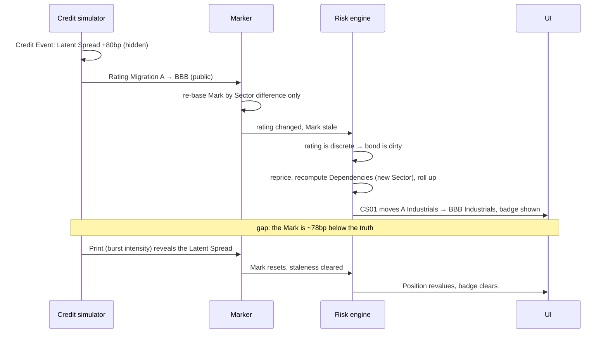
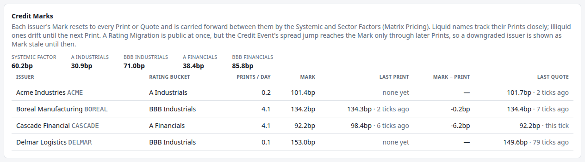
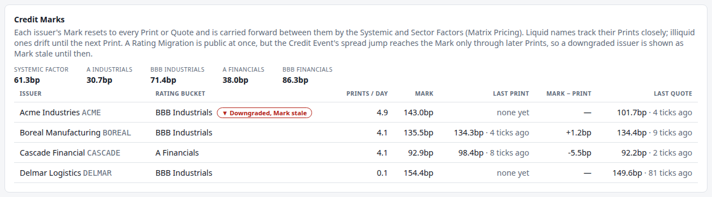
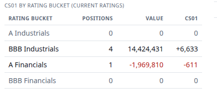
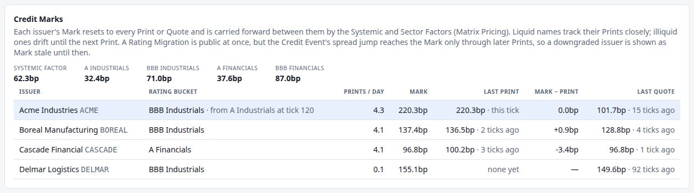

# 8. When credit breaks

!!! warning "Draft"

    This article is a draft under review and may change.

*Credit Events, Rating Migrations, and Dependencies that change while the engine runs.*


**Previously:** [article 7](07-credit-and-the-missing-tape.md) showed how a corporate bond is priced when
almost nothing is observable: one [Mark](glossary.md#mark) per issuer, reset on a
[Print](glossary.md#print) or [Quote](glossary.md#quote) and carried forward by
[Matrix Pricing](glossary.md#matrix-pricing) in between. Measured against the truth, the Marks stayed
within a couple of basis points. That held because nothing happened.

## The real-world problem

Interest rates diffuse. Credit jumps.

A company loses a contract, a regulator opens an investigation, an auditor resigns: the market's view of
that issuer can move 50 or 100bp in a morning, and it does not come back the way a rate does. S&P's data
says the same in the aggregate: since 1981 a downgrade has averaged **1.7 notches**, and of the companies
that defaulted in 2024, 91.7% were already rated CCC+ or below beforehand.[^sp-notches] Credit
deteriorates in steps.

Two different things happen when credit breaks, and a risk system has to treat them differently.

**The spread moves, and nobody tells you.** There is no announcement that a bond is now worth less. It
shows up when someone trades, and [article 7](07-credit-and-the-missing-tape.md) established how rarely
that is.

**The rating changes, and everybody knows at once.** A rating action is published. Agencies even signal
ahead: an S&P outlook "assesses the potential direction of a long-term credit rating over the intermediate
term", and a CreditWatch listing "focuses on identifiable events and short-term trends", though a
CreditWatch "does not mean a rating change is inevitable".[^sp-outlook] Moody's has outlooks and its
Watchlist.[^moodys]

So the engine faces an awkward pair: a *hidden* price move and a *public* classification change, arriving
together. What it does in between is the subject of this article.

## How it works

### A Credit Event

In the engine, a **[Credit Event](glossary.md#credit-event)** is a sudden jump in one issuer's
[Latent Spread](glossary.md#latent-spread) that decays only slowly, and that may drag the issuer down a
rating grade. Events arrive as a Poisson process (three per issuer per year in the demo), with the jump
size drawn from an exponential distribution.

The word is borrowed from a stricter usage. In a credit default swap, "Credit Event" is a closed legal
list: Bankruptcy, Failure to Pay, Obligation Acceleration, Obligation Default, Repudiation/Moratorium,
Restructuring and Governmental Intervention, as elected in each trade's confirmation.[^isda-list] Failure
to Pay, for instance, is a missed payment above a threshold after any grace period.[^isda-ftp] Whether one
has occurred is decided centrally, by the Credit Derivatives Determinations Committees, so the market gets
a single answer,[^isda-dc] on a vote needing an 80% supermajority.[^isda-vote] The engine's Credit Event is
a much looser thing: any sharp repricing of an issuer's credit, default or not.

### A Rating Migration is public; the jump is not

When a Credit Event downgrades the issuer, the engine splits the news in two:

- **The [Rating Migration](glossary.md#rating-migration) is public immediately.** The issuer's
  [Rating Bucket](glossary.md#rating-bucket) changes in the same Tick, and the engine can see it: rating
  is an observable Risk Factor.
- **The spread jump stays hidden.** It is in the Latent Spread, and reaches the Mark only through a later
  Print or Quote.

That gap is the point of this article. The engine knows the issuer has been downgraded, and knows its
Mark does not yet reflect whatever caused the downgrade. It says so on screen: **"Downgraded, Mark
stale"**.

This is not a contrivance of the simulation. It is the ordinary situation after a rating action on an
illiquid bond, and the accounting standards have language for it: even when activity in a market falls
away, "the objective of a fair value measurement remains the same", an orderly exit price and not a
distress price, and adjustments may be needed when a comparable price "is stale".[^ifrs-stale] The same
guidance says to put less weight on quotes that did not result from transactions, and more on binding
ones[^ifrs-weight] — which is why a Print beats a Quote in article 7's rule.

### Re-basing the Mark on public information only

At the migration the engine has a choice to make, and only one honest answer.

It cannot move the Mark by the size of the spread jump, because it does not know it. But leaving the Mark
completely alone would be wrong too: the issuer has demonstrably moved from one Rating Bucket to another,
and the *sector* level of the new bucket is observable, published like an index.

So Matrix Pricing does exactly that, and no more: it moves the Mark by the difference between the new
bucket's Sector Factor and the old bucket's.

!!! formula "Re-basing at a migration"

    On a Tick with no observation, where the issuer moved from bucket $b_{\text{old}}$ to
    $b_{\text{new}}$,

    $$
    \text{Mark}_t = \text{Mark}_{t-1} + \big(S_t - S_{t-1}\big) + \big(K_t(b_{\text{new}}) - K_{t-1}(b_{\text{old}})\big),
    $$

    with $S$ the Systemic Factor and $K$ the Sector Factor. The second bracket re-bases the Mark from the
    old bucket's level to the new one's. It uses only published levels, and invents nothing about the
    issuer.

    The unobserved part of the jump stays missing until a Print or Quote arrives, and the engine flags the
    Mark as stale until then.

### Dependencies change at runtime

A downgrade also rewires the engine.

A corporate bond's [Dependencies](glossary.md#dependency) include the Sector Factor **of the issuer's
current Rating Bucket**. When the bucket changes, that dependency has to point somewhere else, or the bond
would keep watching a factor that no longer drives it.

This is where [article 5](05-real-time-risk-without-recomputing-everything.md)'s design pays off:

1. The rating is a *discrete* Risk Factor, so any change is a move: the bond is dirty at once, whatever
   the thresholds say.
2. Dependencies are recomputed from the market **every time an Instrument is priced**, so the new Sector
   dependency is recorded in the same cycle as the reprice.
3. A factor the Instrument was not priced against counts as moved, so nothing can silently go unwatched.

The Book's rollup by Rating Bucket moves in that same cycle, because it is computed from the same market
state. The price, the risk, the dependency and the rollup never disagree with one another.



### Letting the tape catch up

One more mechanism matters. After a Credit Event the engine raises that issuer's Print intensity sharply
and lets it decay:

$$
\lambda_{\text{eff}} = \lambda\,\big(1 + (m - 1)\,e^{-\text{decay}\cdot\text{age}}\big),
$$

with a multiplier $m$ of 30 in the demo. A name nobody was trading suddenly trades, which is what happens
when something goes wrong at a company: the bonds that were untouched for weeks are exactly the ones that
change hands once there is news. Without the burst, an illiquid issuer could stay mispriced for a very
long time.

## How the system does it

The Credit Event itself is small: add the jump, record the time, and move the issuer down the rating
ladder if the event calls for it.

```java title="CreditFactorSimulator.java" linenums="119"
    private Optional<RatingMigration> creditEvent(String issuerId, double jumpBp, int notches) {
        jumps.merge(issuerId, jumpBp * BP, Double::sum);
        lastCreditEventTimes.put(issuerId, time);
        if (notches == 0) {
            return Optional.empty();
        }
        RatingBucket from = ratings.get(issuerId);
        return downgrade(from, notches).map(to -> {
            ratings.put(issuerId, to);
            return new RatingMigration(issuerId, from, to);
        });
    }
```

[View on GitHub](https://github.com/suhasghorp/fixed-income-risk-engine/blob/series-v1/backend/src/main/java/com/fixedincomerisk/credit/CreditFactorSimulator.java#L119-L130)

The jump goes into `jumps`, which is part of the Latent Spread and never leaves the package. The rating
change goes into `ratings`, which is published. One method, two very different kinds of information.

The marker turns a migration into a flag, and clears the flag on the first observation:

```java title="CreditMarker.java" linenums="40"
        for (Map.Entry<String, Double> entry : marks.entrySet()) {
            String issuerId = entry.getKey();
            RatingBucket was = previous.rating(issuerId);
            RatingBucket now = observables.rating(issuerId);
            if (!now.equals(was)) {
                migrations.put(issuerId, new Migration(was, now, tick, true));
            }
            Optional<CreditObservation> observed = latest(observations, issuerId);
            if (observed.isPresent()) {
                entry.setValue(observed.get().spread());
                migrations.computeIfPresent(issuerId, (id, migration) -> migration.withMarkStale(false));
            } else {
                entry.setValue(entry.getValue()
                        + (observables.systemic() - previous.systemic())
                        + (observables.sector(now) - previous.sector(was)));
            }
        }
```

[View on GitHub](https://github.com/suhasghorp/fixed-income-risk-engine/blob/series-v1/backend/src/main/java/com/fixedincomerisk/credit/CreditMarker.java#L40-L56)

`observables.sector(now) - previous.sector(was)` is the re-basing formula: the new bucket's level now,
minus the old bucket's level before.

The bond declares its Sector dependency from the market it is being priced against, so a migration moves
it automatically:

```java title="CorporateBond.java" linenums="63"
    public Set<RiskFactorId> riskFactors(MarketState market, List<Pillar> pillars) {
        LocalDate valuationDate = market.valuationDate();
        Set<RiskFactorId> factors = new LinkedHashSet<>();
        factors.add(RiskFactorId.valuationDate(currency()));
        factors.add(RiskFactorId.mark(currency(), issuerId));
        factors.add(RiskFactorId.rating(currency(), issuerId));
        factors.add(RiskFactorId.systemic(currency()));
        factors.add(RiskFactorId.sector(currency(), market.credit().rating(issuerId)));
        for (CashFlow cashFlow : cashFlows()) {
            if (cashFlow.date().isAfter(valuationDate)) {
                for (Pillar pillar : Pillar.around(pillars, YearFractions.act365(valuationDate, cashFlow.date()))) {
                    factors.add(RiskFactorId.pillarZeroRate(currency(), pillar));
                }
            }
        }
        return factors;
    }
```

[View on GitHub](https://github.com/suhasghorp/fixed-income-risk-engine/blob/series-v1/backend/src/main/java/com/fixedincomerisk/instrument/CorporateBond.java#L63-L78)

And the Print burst is a function of how long ago the event was:

```java title="CreditObservationSimulator.java" linenums="35"
    private double printIntensity(Issuer issuer) {
        double age = factors.timeSinceCreditEvent(issuer.id());
        if (Double.isInfinite(age)) {
            return issuer.printsPerYear(); // no Credit Event yet (and 0·∞ would be NaN with no decay)
        }
        double burst = (events.printBurstMultiplier() - 1) * Math.exp(-events.printBurstDecayPerYear() * age);
        return issuer.printsPerYear() * (1 + burst);
    }
```

[View on GitHub](https://github.com/suhasghorp/fixed-income-risk-engine/blob/series-v1/backend/src/main/java/com/fixedincomerisk/credit/CreditObservationSimulator.java#L35-L42)

## See it running

The demo schedules Acme's downgrade so it happens in the same place on every run:
`risk.credit.events.scheduled=ACME@120:80:1` — at Tick 120, an 80bp jump and a one-grade downgrade.

```bash
# Terminal 1: the engine (N = 119, 121 or 132 for the states below)
cd backend && mvn spring-boot:run -Dspring-boot.run.profiles=demo \
    -Dspring-boot.run.arguments=--risk.simulation.stop-at-tick=N

# Terminal 2: the UI, then open http://localhost:5173
cd frontend && npm install && npm run dev
```

### Before: Tick 119



Acme is an A Industrials name with a Mark of 101.4bp, and it has printed four times in 119 Ticks. Behind
the screen, its Latent Spread is 99.6bp: the Mark is 1.8bp too high, which is the ordinary state of
affairs from article 7.

### The downgrade: Tick 120

Everything below happens in a single Tick.

| | Tick 119 | Tick 120 |
|---|---|---|
| Rating Bucket | A Industrials | **BBB Industrials** |
| Mark | 101.4bp | **142.6bp** |
| Latent Spread (hidden) | 99.6bp | **220.5bp** |
| Mark − truth | +1.8bp | **−77.9bp** |
| Acme Prints per year | 60 | **1,800** |
| CS01: A Industrials | +4,191 | **0** |
| CS01: BBB Industrials | +2,562 | **+6,633** |

The Mark moved 41bp, which is not the 80bp jump: it is the difference between the two buckets' Sector
Factors, and nothing else. The engine has re-based on public information and is now **78bp below the
truth**, and it knows it:



The badge reads **"▼ Downgraded, Mark stale"**. Acme's Prints per day has jumped from 0.2 to 4.9, the
burst working. Its last Quote, 101.7bp, is now visibly from another world: it predates the event.

The Book's credit rollup has moved in the same cycle:



A Industrials is empty. BBB Industrials now holds four Positions worth 14.4 million with CS01 +6,633.
Acme's two bonds did not move between books or change hands; the classification moved underneath them,
and the risk report followed within the same repricing cycle. The bonds' Dependencies were rewired at the
same moment: they now watch the BBB Industrials Sector Factor.

### The wait: Ticks 121 to 131

For twelve Ticks, nothing resolves. The Mark drifts with the Systemic and Sector factors, the gap to the
truth stays at about −78bp, and the badge stays up. The Book is carrying an unrecognised loss, and the
engine's own numbers say how big it could be: Acme's Position P11 has CS01 of about 2,017, so 78bp of
missing spread is roughly

$$
2{,}017 \times 78 \approx \$157{,}000 .
$$

### The catch-up: Tick 132



A Print arrives at 220.3bp. The Mark resets to it, the badge clears, and the row shows what happened:
*BBB Industrials · from A Industrials at tick 120*, with **Mark − Print 0.0bp**.

Position P11's value falls from 4,775,428 to 4,620,849: a drop of **\$154,579**, against the \$157,000 the
CS01 estimate suggested. The loss was real from Tick 120. It only became visible at Tick 132.

From there the Mark tracks the truth within about 2bp again, and the Print intensity decays back towards
normal: 1,800 a year at the event, 1,295 by Tick 150.

!!! realdesk "What a real desk does differently"

    - **Ratings are slow, and markets are not.** Agencies publish outlooks and watch listings before
      acting,[^sp-outlook][^moodys] and desks trade on the spread long before the rating moves. The engine
      does the opposite: its rating action is instantaneous and its spread news is late. Both orderings
      happen in practice; the engine picks the one that makes the staleness visible.
    - **Rating-based rules force selling, not the downgrade itself.** A bond leaves an investment-grade
      index by its rules: the Bloomberg US Corporate Index uses the middle rating of Moody's, S&P and
      Fitch and rebalances on the last business day of the month,[^bbg-index] so a fallen angel typically
      needs two agencies to cut it, and leaves at the next rebalance rather than on the day. Insurers face
      capital charges on speculative-grade holdings, and research on insurer transactions found "elevated
      selling pressure around the downgrade and subsequent price reversals".[^ellul] Fallen angels averaged
      1.71% of investment-grade issuers a year from 1981 to 2024, and 0.76% in 2024.[^sp-angels]
    - **Migration is modelled, not just observed.** Desks and risk functions use transition matrices,
      estimated from decades of agency data, to price and stress migration risk. Over 1981–2024, a BBB
      issuer had an 87.33% chance of still being BBB a year later, 3.21% of falling to BB, and 0.14% of
      defaulting.[^sp-matrix] The engine simply draws events.
    - **Jump-to-default is its own risk.** A real book carries the risk that an issuer defaults outright,
      with recovery well below par, and that is measured separately from spread risk. The engine has no
      default: its worst case is a wide spread.
    - **Concentration limits.** Desks run limits by rating, sector and single name precisely so that one
      migration cannot move too much of the book at once.
    - **Someone checks the marks.** After a rating action, the middle office challenges the desk's marks
      against vendor prices and any trades. "Nobody has traded it" is not an accepted answer for long.

## Further reading

Primary sources:

- ISDA, *2014 ISDA Credit Derivatives Definitions*, §§4.1–4.7. The legal definition of a credit event.
- ISDA, [*Taking a Look at the DCs*](https://www.isda.org/2024/01/17/taking-a-look-at-the-dcs/), 2024, and
  the [*ISDA Credit Derivatives Determinations Committees
  Rules*](https://www.cdsdeterminationscommittees.org/). How the market reaches one answer.
- S&P Global Ratings, *Default, Transition, and Recovery: 2024 Annual Global Corporate Default And Rating
  Transition Study*, March 2025. Transition matrices, fallen angels, and notches per downgrade.
- S&P Global Ratings, *S&P Global Ratings Definitions*, December 2024, and Moody's, *Rating Symbols and
  Definitions*, June 2022. Grades, outlooks, CreditWatch and reviews.
- Bloomberg, [*Bloomberg US Corporate Index* fact
  sheet](https://assets.bbhub.io/professional/sites/27/US-Corporate-Index.pdf). The index rules that
  decide when a fallen angel drops out.
- A. Ellul, C. Jotikasthira and C. T. Lundblad, [*Regulatory pressure and fire sales in the corporate bond
  market*](https://www.fmg.ac.uk/sites/default/files/2020-08/regulatory-pressure.pdf), *Journal of
  Financial Economics*, 2011.
- IFRS 13, *Fair Value Measurement*, Appendix B ¶¶B38–B47. Marking in thin markets, and what to do with
  stale prices.

Textbooks:

- David Lando, *Credit Risk Modeling: Theory and Applications*, Princeton University Press, 2004. Rating
  transitions as a Markov chain.
- Dominic O'Kane, *Modelling Single-name and Multi-name Credit Derivatives*, Wiley, 2008. Credit events
  and settlement in practice.

[^sp-notches]: S&P Global Ratings, *2024 Annual Global Corporate Default and Rating Transition Study*: "Since 1981, the annual average for the number of notches per downgrade has been 1.7 notches"; of 2024's rated defaulters, "91.7% were rated 'CCC+' or below prior to default".
[^sp-outlook]: S&P Global Ratings Definitions (December 2024): an outlook "assesses the potential direction of a long-term credit rating over the intermediate term, which is generally up to two years for investment grade and generally up to one year for speculative grade"; CreditWatch "focuses on identifiable events and short-term trends", and "does not mean a rating change is inevitable". The commonly quoted "90 days" appears in this edition only for one specific case, so it is not a general rule.
[^moodys]: Moody's, *Rating Symbols and Definitions* (June 2022): "A Moody's rating outlook is an opinion regarding the likely rating direction over the medium term"; "A review indicates that a rating is under consideration for a change in the near term", and such ratings are "on Moody's 'Watchlist'".
[^isda-list]: *2014 ISDA Credit Derivatives Definitions*, §4.1: "'Credit Event' means ... one or more of Bankruptcy, Failure to Pay, Obligation Acceleration, Obligation Default, Repudiation/Moratorium, Restructuring, or Governmental Intervention, as specified in the related Confirmation." Read from a third-party copy of the ISDA document.
[^isda-ftp]: *2014 ISDA Credit Derivatives Definitions*, §4.5: Failure to Pay is, "after the expiration of any applicable Grace Period ..., the failure by the Reference Entity to make, when and where due, any payments in an aggregate amount of not less than the Payment Requirement".
[^isda-dc]: ISDA, *Taking a Look at the DCs* (2024): the Determinations Committees "ensure there is a single decision-making process for determining whether a credit event has occurred".
[^isda-vote]: *2016 ISDA Credit Derivatives Determinations Committees Rules*: "'Supermajority' means at least 80% of those participating in a binding vote have voted in favor of a particular answer"; questions not resolved by supermajority go to external review. The rules have been revised since 2016.
[^ifrs-stale]: IFRS 13, Appendix B ¶B41: "Even when there has been a significant decrease in the volume or level of activity for the asset or liability, the objective of a fair value measurement remains the same"; ¶B38 on adjusting prices that are stale or require significant adjustment.
[^ifrs-weight]: IFRS 13, Appendix B ¶¶B46–B47: less weight on "quotes that do not reflect the result of transactions", more weight on "quotes provided by third parties that represent binding offers".
[^bbg-index]: Bloomberg US Corporate Index fact sheet: securities "must be rated investment grade (Baa3/BBB-/BBB- or higher) using the middle rating of Moody's, S&P and Fitch"; the rebalance date is "the last business day of each month". That index-tracking funds must then sell is an inference from these rules and fund mandates.
[^ellul]: Ellul, Jotikasthira and Lundblad (2011): "Regulations either prohibit or impose large capital requirements on the holdings of speculative-grade bonds. As insurance companies hold over one third of all outstanding corporate bonds ... we document both elevated selling pressure around the downgrade and subsequent price reversals." Read from the working-paper version.
[^sp-angels]: S&P 2024 study, Table 29: fallen angels averaged 1.71% of investment-grade issuers a year (1981–2024), peaking at 3.90% in 2002, and 0.76% in 2024.
[^sp-matrix]: S&P 2024 study, Table 21 (global corporate average one-year transition rates, 1981–2024): from BBB, 87.33% stay BBB, 3.05% rise to A, 3.21% fall to BB, 0.14% default, and 5.71% have their rating withdrawn.

## Next

Credit has added jumps, discrete factors and a Book that reclassifies itself mid-run. The last Instrument
in the Book brings a different complication: a contract with two legs, one of which depends on a rate
that was fixed in the past and never changes again.
[Article 9](09-interest-rate-swaps.md) covers interest rate swaps, Fixings, and why the engine's
single-curve valuation is the biggest simplification in the series.
