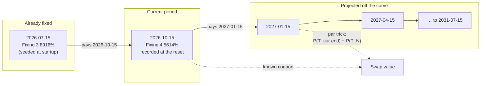
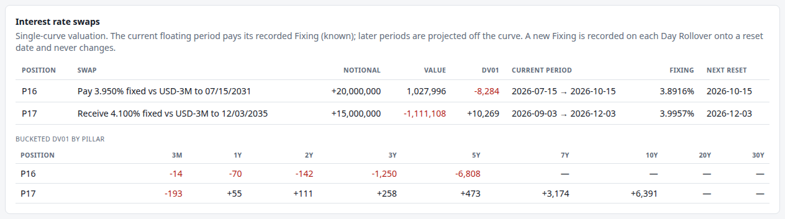
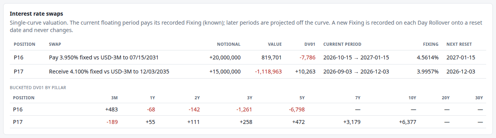
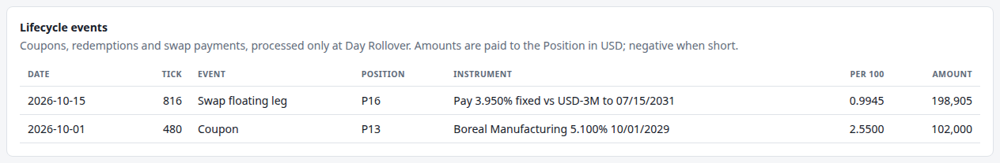

# 9. Interest rate swaps

!!! warning "Draft"

    This article is a draft under review and may change.

*Fixed vs floating, Fixings, the par trick, and single-curve vs OIS.*


**Previously:** the Book's other Instruments are all priced from a curve and, for corporates, a
[Mark](glossary.md#mark). Swaps are the last Instrument type, and the only one whose cash flows are not
all knowable in advance: half of them depend on rates that have not been set yet.

## The real-world problem

An interest rate swap is an exchange of two streams of payments on the same notional: one at a fixed rate,
one at a floating rate that resets periodically. The notional itself never changes hands. It exists only to
size the payments.

Swaps are how most interest rate risk is actually moved. A company that issued fixed-rate debt but wants
floating, an insurer with long-dated liabilities, a desk that wants 5-year risk without buying 5-year
bonds: all of them trade swaps, and the market is enormous.

For a risk engine, swaps bring one genuinely new problem. Every other Instrument in the Book has cash
flows that are known from its terms: a coupon of 4.125% is 4.125% on every date. A swap's floating leg is
known only one period at a time. The payment due at the end of the current period was fixed at its start,
and is now a hard number that cannot change. Every payment after that is a guess made from today's curve,
and will be replaced by a real rate when its period begins.

So the engine has to hold two different kinds of truth about the same leg: **a recorded fact** for the
current period, and **a projection** for the rest.

## How it works

### The two legs

The demo holds two swaps:

- **P16**: pay 3.950% fixed, receive the 3-month index, on 20 million to July 2031.
- **P17**: receive 4.100% fixed, pay the 3-month index, on 15 million to December 2035.

The fixed leg pays semi-annually on 30/360; the floating leg resets quarterly to the 3-month index and
pays ACT/360. Those are close to the conventions a vanilla USD swap used: OpenGamma's documented
convention for the classic USD swap is a fixed leg paying "every 6 months with day count '30U/360'"
against 3-month LIBOR.[^strata-libor]

Which side you are on is part of the contract, not the sign of a quantity. This is why a swap
[Position](glossary.md#position) in this engine always has a positive quantity: the quantity is the
notional, and `PAY_FIXED` or `RECEIVE_FIXED` lives on the Instrument. A payer of fixed gains when rates
rise; a receiver gains when they fall.

### The par trick

Valuing the fixed leg is article 4 again: each payment is a known amount, discounted.

The floating leg looks harder, because its payments are unknown. It is not, because of an identity worth
knowing. If the floating payments are discounted on the *same* curve that projects them, then the whole
stream of future floating payments collapses into two discount factors.

!!! formula "The floating leg, without projecting anything"

    Consider a floating leg from $T_0$ to $T_N$ paying the period rate $L_k$ on each period $[T_k, T_{k+1}]$
    with accrual $\tau_k$. If the projected rate is the curve's own forward rate,
    $L_k = \frac{1}{\tau_k}\left(\frac{P(T_k)}{P(T_{k+1})} - 1\right)$, then each payment's present value
    telescopes:

    $$
    L_k\,\tau_k\,P(T_{k+1}) = P(T_k) - P(T_{k+1}),
    $$

    so the whole leg from $T_0$ onwards is worth

    $$
    V_{\text{float}} = \sum_k \big(P(T_k) - P(T_{k+1})\big) = P(T_0) - P(T_N).
    $$

    The engine uses this for every period *except* the current one, whose rate is already fixed and is
    therefore not the curve's forward rate any more:

    $$
    V_{\text{float}} = \underbrace{L_{\text{fix}}\,\tau_{\text{cur}}\,P(T_{\text{cur end}})}_{\text{the known coupon}}
    \;+\; \underbrace{P(T_{\text{cur end}}) - P(T_N)}_{\text{everything after it}} .
    $$

    The swap's value is then the floating leg minus the fixed leg, signed by direction.

Two discount factors stand in for eighteen unknown payments. This is not an approximation: given
single-curve discounting, it is exact.

### Fixings are facts

A [Fixing](glossary.md#fixing) is the rate of the floating index recorded on a reset date. In the engine,
once recorded it is never changed, and it sets the coupon for the period starting that day.

That is how the real thing works, and the reason is worth stating. The New York Fed publishes SOFR each
business day at about 8:00 a.m. ET for the previous business day, and will only revise it later the same
day if the error exceeds one basis point.[^sofr-publish] A fixing is a dated observation, not a model
output. A system that recomputed yesterday's fixing from today's curve would be inventing history, and
would silently change the value of every swap that already paid on it.

The engine enforces this with one line: `putIfAbsent`. The first rate recorded for a date is kept forever.

There is one wrinkle at startup. Both demo swaps are part-way through a floating period when the session
begins, so their current periods were fixed in the past, before the curve existed. The engine seeds those
Fixings from the opening curve, extending it backwards at its short rate, because a curve that starts
today cannot see yesterday. It is a pragmatic choice, and the alternative (starting only swaps whose
periods begin today) would have made the demo less interesting.



### Where a swap's risk sits

A swap has no notional exchange, so its DV01 comes from the difference between the two legs. A pay-fixed
swap has a *negative* DV01 under this series' sign convention (article 4): it gains when rates rise. That
makes it the natural hedge for a Book that is long bonds, and it is why P16 sits opposite the Treasury
Positions in the 5Y bucket.

## How the system does it

The valuation is the formula box, written out. Note the branch: a current period gets its recorded Fixing,
and a swap that has not started yet is pure par trick.

```java title="InterestRateSwap.java" linenums="103"
    /** Value per unit of notional to this swap's holder: floating leg minus fixed leg for the fixed payer. */
    @Override
    public double dirtyValue(MarketState market) {
        LocalDate valuationDate = market.valuationDate();
        if (!maturityDate.isAfter(valuationDate)) {
            return 0;
        }
        double fixed = 0;
        for (Period period : fixedPeriods()) {
            if (period.end().isAfter(valuationDate)) {
                fixed += fixedRate * fixedAccrual(period) * discountFactor(market, period.end());
            }
        }
        double floating;
        Optional<Period> current = currentFloatingPeriod(valuationDate);
        if (current.isPresent()) {
            Period period = current.get();
            double fixing = market.fixings().rate(period.start());
            floating = fixing * floatingAccrual(period) * discountFactor(market, period.end())
                    + discountFactor(market, period.end()) - discountFactor(market, maturityDate);
        } else {
            floating = discountFactor(market, effectiveDate) - discountFactor(market, maturityDate);
        }
        return direction.sign * (floating - fixed);
    }
```

[View on GitHub](https://github.com/suhasghorp/fixed-income-risk-engine/blob/series-v1/backend/src/main/java/com/fixedincomerisk/instrument/InterestRateSwap.java#L103-L127)

The Fixing store is deliberately dull. `record` refuses to overwrite, and `indexRate` derives a rate from
a curve only when a new Fixing is being set:

```java title="FixingHistory.java" linenums="22"
    /**
     * Records the Fixing for {@code resetDate}, unless one is already recorded.
     *
     * @return true if recorded, false if the date already had a Fixing (which is left unchanged)
     */
    public boolean record(LocalDate resetDate, double rate) {
        return rates.putIfAbsent(resetDate, rate) == null;
    }

    public Fixings fixings() {
        return new Fixings(rates);
    }

    /**
     * The index rate for {@code resetDate} implied by {@code market}'s curve: the simple ACT/360 forward rate
     * from the reset date to three months later. For a reset date before the Valuation Date, as when
     * seeding a period already running at startup, the curve is extended backwards at its short rate,
     * since a curve starting today cannot see the past.
     */
    public static double indexRate(MarketState market, LocalDate resetDate) {
        LocalDate end = resetDate.plusMonths(INDEX_TENOR_MONTHS);
        double accrual = ChronoUnit.DAYS.between(resetDate, end) / 360.0;
        return (discountFactor(market, resetDate) / discountFactor(market, end) - 1) / accrual;
    }
```

[View on GitHub](https://github.com/suhasghorp/fixed-income-risk-engine/blob/series-v1/backend/src/main/java/com/fixedincomerisk/market/FixingHistory.java#L22-L45)

New Fixings are recorded only at a [Day Rollover](glossary.md#day-rollover) that lands on a reset date,
which keeps them on the calendar clock of article 3:

```java title="MarketSimulator.java" linenums="208"
    private void recordFixings() {
        MarketState today = new MarketState(clock.valuationDate(), shortRate.curve());
        for (InterestRateSwap swap : swaps) {
            if (swap.resetDates().contains(today.valuationDate())) {
                fixingHistory.record(today.valuationDate(), FixingHistory.indexRate(today, today.valuationDate()));
            }
        }
    }
```

[View on GitHub](https://github.com/suhasghorp/fixed-income-risk-engine/blob/series-v1/backend/src/main/java/com/fixedincomerisk/session/MarketSimulator.java#L208-L215)

## See it running

P16's floating period runs from 15 July 2026 to 15 October 2026, so it resets on the Day Rollover into
15 October, which is **Tick 816**.

```bash
# Terminal 1: the engine (N = 815 or 816)
cd backend && mvn spring-boot:run -Dspring-boot.run.profiles=demo \
    -Dspring-boot.run.arguments=--risk.simulation.stop-at-tick=N

# Terminal 2: the UI, then open http://localhost:5173
cd frontend && npm install && npm run dev
```

### Before the reset: Tick 815



P16 is in the period 2026-07-15 → 2026-10-15, paying a Fixing of **3.8916%**, the rate seeded at startup.
Its next reset is tomorrow. The Position is worth 1,027,996 with DV01 −8,284.

### The reset: Tick 816



Three things changed at once:

- **The period rolled** to 2026-10-15 → 2027-01-15.
- **A new Fixing was recorded**: **4.5614%**, the 3-month rate implied by the curve on the reset date. It
  will not change again, whatever the curve does.
- **The old period paid.** The floating leg's coupon is the old Fixing over its 92 days:

$$
3.8916\% \times \frac{92}{360} = 0.9945 \text{ per } 100 ,
$$

which on 20 million is **\$198,905.36**, and appears as a Lifecycle Event:



The Position's value falls from 1,027,996 to **819,701**. Most of that, \$198,905, is not a loss: it is
cash that has left the swap and been received by the holder. This is the same bookkeeping as a bond's
coupon at a Day Rollover (article 3).

### The value, taken apart

At Tick 816 the whole swap is four numbers:

| Component | Per 100 of notional |
|---|---|
| Fixed leg: 10 remaining payments at 3.950%, 30/360 | −17.4569 |
| Floating: known coupon, 4.5614% × 92/360, discounted | +1.1523 |
| Floating: everything after it, P(2027-01-15) − P(2031-07-15) = 0.98847748 − 0.78444638 | +20.4031 |
| **Swap value (pay fixed)** | **+4.0985** |

On 20 million that is **819,700.98**, which is exactly what the Book table shows. Eighteen future floating
payments never had to be projected individually: the two discount factors in the third row stand in for
all of them.

### Where the risk sits

The swaps panel's lower table gives each swap's [Bucketed DV01](glossary.md#bucketed-dv01). P16's risk is
concentrated at **5Y (−6,798)** and **3Y (−1,261)**, with a small positive **3M (+483)** from the known
coupon and the near-dated discount factor. P17, the 10-year receiver, sits at **10Y (+6,377)** and
**7Y (+3,179)** with the opposite sign.

That is the Book's shape from [article 4](04-pricing-a-bond-and-measuring-its-risk.md) explained: the
5-year bucket is negative because a short bond Position and a pay-fixed swap both sit there.

!!! realdesk "What a real desk does differently"

    This is the article where the engine simplifies most, so the list is long.

    - **One curve does two jobs here; a desk uses several.** The engine discounts and projects on the same
      simulated Treasury curve. Since 2007–08 the market has not: practitioners "revisit the problem of
      pricing and hedging plain vanilla single-currency interest rate derivatives using multiple distinct
      yield curves for market coherent estimation of discount factors and forward rates with different
      underlying rate tenors".[^bianchetti] Discounting comes off an overnight-rate curve, projection off
      the index's own curve, and the difference between them is a traded basis. The par trick above holds
      exactly only in the single-curve world; in a multi-curve setting the floating leg needs its own
      forward curve and the telescoping is no longer exact.
    - **Collateral decides the discount rate.** For cleared and CSA'd trades, the rate paid on posted
      collateral is the right discount rate, which is why overnight-index discounting became standard.
      LCH moved all cleared USD swaps from Fed Funds to SOFR discounting and price alignment interest in
      October 2020, transitioning "over one million cleared contracts".[^lch]
    - **LIBOR is gone.** The FCA announced on 5 March 2021 that most USD LIBOR settings would end after
      30 June 2023,[^fca] and ISDA confirmed the same announcement was an "index cessation event" fixing
      the fallback spread adjustments for all 35 settings.[^isda] The ARRC selected SOFR as its
      recommended alternative, and the New York Fed began publishing it on 3 April 2018.[^arrc]
    - **SOFR is not a term rate.** SOFR is an overnight rate: "a broad measure of the cost of borrowing
      cash overnight collateralized by Treasury securities", a volume-weighted median of actual repo
      transactions.[^sofr-def] Standard SOFR swaps compound it **in arrears**, so the coupon is known only
      at the *end* of the period, in contrast with LIBOR, which was set in advance.[^arrears] The engine's
      index is a 3-month term rate set in advance, which is the LIBOR shape. A forward-looking CME Term
      SOFR does exist, and the ARRC recommended it in July 2021, but for a limited scope rather than
      general derivatives use.[^term-sofr]
    - **Conventions are specific.** The standard USD SOFR OIS pays annually on both legs, ACT/360, with a
      2-day spot lag and a 2-day payment delay.[^strata-sofr] The engine uses unadjusted dates, no
      settlement lag, no holiday calendar and no payment delay.
    - **Most swaps are cleared.** Under Dodd-Frank the CFTC required certain interest rate swaps to be
      cleared from 2013,[^cftc-2013] and in 2022 replaced the USD LIBOR classes with USD SOFR OIS from 7
      days to 50 years, effective 31 October 2022.[^cftc-2022] Clearing brings margin, default funds and a
      clearing house's discounting conventions: none of which the engine models.
    - **Swaptions and non-vanilla structures.** Real books hold options on swaps, basis swaps, amortisers
      and cross-currency swaps, each with their own curve and volatility machinery.

## Further reading

Primary sources:

- Financial Conduct Authority, [*Announcements on the end of
  LIBOR*](https://www.fca.org.uk/news/press-releases/announcements-end-libor), 5 March 2021.
- ISDA, [*ISDA Statement on UK FCA LIBOR
  Announcement*](https://www.isda.org/2021/03/05/isda-statement-on-uk-fca-libor-announcement), 5 March 2021. The index cessation event and fixed fallback spreads.
- Alternative Reference Rates Committee, [*An Updated User's Guide to
  SOFR*](https://www.newyorkfed.org/medialibrary/Microsites/arrc/files/2021/users-guide-to-sofr2021-update.pdf),
  February 2021. In advance vs in arrears, and the compounding conventions.
- Federal Reserve Bank of New York, [*Secured Overnight Financing Rate
  Data*](https://www.newyorkfed.org/markets/reference-rates/sofr) and [*Additional Information about
  Reference Rates*](https://www.newyorkfed.org/markets/reference-rates/additional-information-about-reference-rates).
  What SOFR measures, and its publication and revision policy.
- CFTC, [*Clearing Requirement
  Determination*](https://www.cftc.gov/LawRegulation/FederalRegister/FinalRules/2012-29211.html) (2012)
  and [press release 8573-22](https://www.cftc.gov/PressRoom/PressReleases/8573-22) (2022).
- LCH, [*LCH successfully completes transition to SOFR
  discounting*](https://www.lseg.com/en/media-centre/press-releases/lch/2020/lch-successfully-completes-transition-sofr-discounting),
  October 2020.
- M. Bianchetti, [*Two Curves, One Price*](https://mpra.ub.uni-muenchen.de/22022/), MPRA Paper 22022, 2008
  (later in *Risk*, 2010). The multi-curve framework.
- OpenGamma Strata, [*FixedIborSwapConventions*](https://strata.opengamma.io/apidocs/com/opengamma/strata/product/swap/type/FixedIborSwapConventions.html)
  and [*FixedOvernightSwapConventions*](https://strata.opengamma.io/apidocs/com/opengamma/strata/product/swap/type/FixedOvernightSwapConventions.html).
  Documented market conventions, from an open-source analytics vendor.

Textbooks:

- Richard Flavell, *Swaps and Other Derivatives*, 2nd ed., Wiley, 2010. Swap cash-flow mechanics.
- Leif B. G. Andersen and Vladimir V. Piterbarg, *Interest Rate Modeling*, Atlantic Financial Press, 2010.
  Multi-curve construction and collateral discounting.
- John C. Hull, *Options, Futures, and Other Derivatives*, 11th ed., Pearson, 2021. Swaps and OIS
  discounting.

[^strata-libor]: OpenGamma Strata, `FixedIborSwapConventions.USD_FIXED_6M_LIBOR_3M`: "USD(NY) vanilla fixed vs LIBOR 3M swap. The fixed leg pays every 6 months with day count '30U/360'." A vendor's documented convention; the legal source is the ISDA definitions, which are a paid document and were not read.
[^strata-sofr]: OpenGamma Strata, `FixedOvernightSwapConventions.USD_FIXED_1Y_SOFR_OIS`: "Both legs pay annually and use day count 'Act/360'. The spot date offset is 2 days and the payment date offset is 2 days."
[^sofr-publish]: Federal Reserve Bank of New York, *Additional Information about Reference Rates*: "Each business day, the New York Fed publishes the SOFR ... at approximately 8:00 a.m. ET"; revisions occur "if the change in the rate exceeds one basis point and only on the same day as initial publication".
[^sofr-def]: Federal Reserve Bank of New York, *Secured Overnight Financing Rate Data*: SOFR is "a broad measure of the cost of borrowing cash overnight collateralized by Treasury securities", computed as "the rate associated with transactions at the 50th percentile of transaction volume", rounded to the nearest basis point.
[^arrears]: ARRC, *An Updated User's Guide to SOFR* (2021), §C: "an in arrears structure would reference an average of the rate over the current interest period", and "an average overnight rate in arrears will reflect what actually happens to interest rates over the period and will therefore fully hedge interest rate risk in a way that LIBOR or a SOFR-based forward-looking term rate will not."
[^term-sofr]: ARRC, *ARRC Formally Recommends Term SOFR*, 29 July 2021, and the ARRC SOFR transition page: the recommendation covers "transitioning legacy cash products, and for new use in business loans that would otherwise have difficulty transitioning to overnight SOFR". CME's own term-rate methodology document could not be retrieved.
[^fca]: FCA, *Announcements on the end of LIBOR* (5 March 2021): the remaining USD settings end "immediately after 30 June 2023".
[^isda]: ISDA statement, 5 March 2021: "Today's announcement constitutes an index cessation event under the IBOR Fallbacks Supplement and the ISDA 2020 IBOR Fallbacks Protocol for all 35 LIBOR settings", and "the fallback spread adjustment published by Bloomberg is fixed as of the date of the announcement".
[^arrc]: ARRC, *An Updated User's Guide to SOFR* (2021): "FRBNY, in cooperation with the Office of Financial Research, began publishing SOFR on April 3, 2018"; the ARRC page records its 2017 selection of SOFR.
[^bianchetti]: M. Bianchetti, *Two Curves, One Price* (2008), abstract.
[^lch]: LCH/LSEG press release, 20 October 2020: "successfully transitioned over one million cleared contracts from Fed Funds to SOFR discounting and Price Alignment Interest (PAI)".
[^cftc-2013]: CFTC, *Clearing Requirement Determination Under Section 2(h) of the CEA*, 77 FR 74284 (13 December 2012): "a clearing requirement will reduce counterparty credit risk and provide an organized mechanism for collateralizing the risk exposures posed by swaps."
[^cftc-2022]: CFTC press release 8573-22 (12 August 2022): adds a requirement to clear "OIS referencing U.S. dollar (USD) Secured Overnight Financing Rate (SOFR) (seven days to 50 years)" and removes the USD LIBOR requirement from 1 July 2023.

## Next

Every Instrument in the Book is now covered, and each brought its own Risk Factors. But they have been
moving as if they were strangers to one another, which they are not.
[Article 10](10-correlation.md) wires them together: one draw of correlated shocks per Tick, a Cholesky
factor, and what happens to a Book when rates and credit move in the same direction at the same time.
