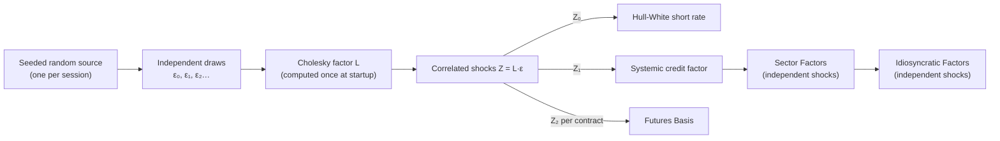

# 10. Correlation

!!! warning "Draft"

    This article is a draft under review and may change.

*Flight to quality, and generating correlated shocks with a Cholesky factor.*


**Previously:** the Book now holds every Instrument type the series covers, and each brought its own
[Risk Factors](glossary.md#risk-factor): curve [Pillars](glossary.md#pillar), a futures
[Basis](glossary.md#basis), the Systemic and Sector credit factors, issuer
[Marks](glossary.md#mark). Until now this article has let them move as if they had nothing to do with
each other.

## The real-world problem

They have a great deal to do with each other.

The familiar pattern is **flight to quality**. In a typical stress episode, as the Financial Stability
Board described the first phase of March 2020, "investors sold riskier assets and bought less risky ones,
as often happens in periods of stress", so government bond prices rise while risk assets
fall.[^fsb] Treasury yields down, credit spreads wider, at the same time.

For a Book like this one, that combination matters more than either move alone. The Book is long rates
risk (DV01 +20,702) and long credit risk (CS01 +6,194). A fall in rates is a gain; a widening of spreads
is a loss. If the two are independent, the Book's day is the sum of two unrelated draws. If they move
together in the way the market usually does, part of every rates gain is handed back in credit, and the
Book's real volatility is *lower* than the sum of its parts suggests.

Get the correlation wrong and every risk number that aggregates is wrong: stress tests, VaR, hedge
ratios, capital.

Two warnings come with this, and the article keeps both in view.

**The effect is real but modest, and often overstated.** Duffee measured it for non-callable investment
grade bonds: if the short end of the Treasury curve falls 10bp in a month, average Aa spreads rise by
"around 1.5 basis points", a modest negative relation that is stronger for lower-rated bonds.[^duffee] He
also showed why the relation looks so much stronger in bond indexes: those indexes were mostly *callable*
bonds, whose spreads react far more to Treasury yields.[^duffee-callable] Longstaff and Schwartz had
found the negative relation in Moody's yield data and argued that the rate/default correlation shapes a
risky bond's duration.[^ls]

**The relationship is not a law.** In the second phase of March 2020, the "dash for cash", investors sold
safe assets too, and "longstanding relationships in prices across different markets began to break down,
including in the core US Treasuries market".[^fsb-dash] The 10-year Treasury yield rose 64bp between 9 and
18 March 2020 before the Fed's purchases reversed it.[^bis] A correlation is an assumption about normal
times.

## How it works

### One draw, three shocks

The engine correlates the three *drivers* it simulates with diffusions: the short rate (article 3), the
Systemic credit factor (article 7) and each future's Basis (article 6). On every
[Tick](glossary.md#tick) it draws one set of correlated standard normal shocks, and hands them to the
simulators.

The demo's matrix (`risk.correlation.matrix`) is:

|  | short rate | Systemic | Basis |
|---|---|---|---|
| **short rate** | 1 | −0.3 | 0.1 |
| **Systemic** | −0.3 | 1 | 0 |
| **Basis** | 0.1 | 0 | 1 |

The −0.3 is flight to quality: rates down, spreads up. The +0.1 ties the futures Basis loosely to rates.
The 0 says the Basis and credit have no direct link, which does not mean they never move together: both
are correlated with rates, so they inherit a little correlation through it.

### From independent draws to correlated ones

Random number generators produce *independent* draws. Turning them into a set with a prescribed
correlation structure is a standard trick: multiply by a matrix whose product with its own transpose is
the target.

!!! formula "Cholesky, and why it works"

    For a target correlation matrix $\Sigma$, find a lower-triangular $L$ with

    $$
    \Sigma = L\,L^{\mathsf T}.
    $$

    Draw a vector $\varepsilon$ of independent standard normals and set $Z = L\,\varepsilon$. Then

    $$
    \operatorname{Cov}(Z) = L \operatorname{Cov}(\varepsilon) L^{\mathsf T} = L\,I\,L^{\mathsf T} = \Sigma ,
    $$

    so $Z$ has exactly the correlations asked for, and each component is still standard
    normal.[^haugh] For the demo's matrix,

    $$
    L =
    \begin{pmatrix}
    1 & 0 & 0\\
    -0.3 & 0.953939 & 0\\
    0.1 & 0.031449 & 0.994490
    \end{pmatrix}.
    $$

    Read the rows: the short-rate shock is the first draw; the Systemic shock is −0.3 of that draw plus
    0.954 of a fresh one; the Basis shock takes a little of both and adds a third.

    The order matters for the arithmetic, not the result: whichever factor is first gets the "pure" draw,
    and the others are built to match their correlations with what has already been fixed.

### Not every matrix is a correlation matrix

You cannot pick three numbers freely. A correlation matrix must be "a symmetric positive semidefinite
matrix with unit diagonal",[^higham] and it is easy to write down three pairwise correlations that no set
of random variables can have. If A and B are strongly positively correlated, and B and C are too, then A
and C cannot be strongly *negatively* correlated.

The test is the Cholesky factorisation itself. Attempting it is the standard way to check positive
definiteness: if a pivot comes out zero or negative, the matrix is not positive definite, and the check is
faster than computing eigenvalues.[^higham-chol] The engine gets its validation for free, because it needs
the factor anyway.

In practice, matrices estimated from real data often fail this test, typically because each pair was
estimated from a different sample of days. Practitioners then replace the matrix with the nearest valid
one.[^higham-nearest] The engine takes the blunter route: it refuses to start.

### What stays independent

Only three drivers are correlated. Deliberately left independent:

- **Sector Factors** (one per [Rating Bucket](glossary.md#rating-bucket)) and **Idiosyncratic Factors**
  (one per issuer). They inherit common movement through the Systemic Factor, which is exactly the
  hierarchy of article 7: shared first, specific second.
- **[Credit Events](glossary.md#credit-event)**, **[CTD Switches](glossary.md#ctd-switch)** and the
  arrival of **[Prints](glossary.md#print)** and **[Quotes](glossary.md#quote)**. These are jumps and
  arrivals, not diffusions, and correlating them would need a different apparatus.

That is a simplification with a name: in a real crisis, defaults and downgrades cluster, and liquidity
dries up across issuers at once.



## How the system does it

The matrix validates itself on construction, and the Cholesky routine doubles as the positive-definiteness
check:

```java title="CorrelationMatrix.java" linenums="77"
    private static double[][] cholesky(double[][] a) {
        double[][] l = new double[SIZE][SIZE];
        for (int i = 0; i < SIZE; i++) {
            for (int j = 0; j <= i; j++) {
                double sum = a[i][j];
                for (int k = 0; k < j; k++) {
                    sum -= l[i][k] * l[j][k];
                }
                if (i == j) {
                    if (sum <= TOLERANCE) {
                        throw invalid("must be positive definite", a);
                    }
                    l[i][i] = Math.sqrt(sum);
                } else {
                    l[i][j] = sum / l[j][j];
                }
            }
        }
        return l;
    }
```

[View on GitHub](https://github.com/suhasghorp/fixed-income-risk-engine/blob/series-v1/backend/src/main/java/com/fixedincomerisk/model/CorrelationMatrix.java#L77-L96)

Generating a Tick's shocks is then three lines of arithmetic on rows of $L$:

```java title="CorrelatedShockGenerator.java" linenums="26"
    /** Draws the next tick's shocks, in a fixed order: short rate, Systemic, then one per futures contract. */
    public Shocks next(RandomGenerator random, int futuresContracts) {
        double e0 = random.nextGaussian();
        double e1 = random.nextGaussian();
        double shortRate = shortRateRow[0] * e0;
        double systemic = systemicRow[0] * e0 + systemicRow[1] * e1;
        List<Double> basis = new ArrayList<>(futuresContracts);
        for (int i = 0; i < futuresContracts; i++) {
            basis.add(basisRow[0] * e0 + basisRow[1] * e1 + basisRow[2] * random.nextGaussian());
        }
        return new Shocks(shortRate, systemic, basis);
    }
```

[View on GitHub](https://github.com/suhasghorp/fixed-income-risk-engine/blob/series-v1/backend/src/main/java/com/fixedincomerisk/model/CorrelatedShockGenerator.java#L26-L37)

Each futures contract gets its own third draw, so two contracts have the configured correlations with
rates and credit, and are correlated with each other only through those. The draws come from the session's
single seeded source in a fixed order, which is what keeps the demo reproducible (article 3).

## See it running

The shocks are not shown in the UI: they are inputs, not results. To see them, the same measurement
harness that read the hidden spreads in article 7 steps the demo and records
`RiskSession.lastShocks()`.

Over the first **2,000 Ticks**:

| Pair | Target | Realised |
|---|---|---|
| short rate vs Systemic | −0.30 | **−0.2995** |
| short rate vs Basis | +0.10 | **+0.0855** |
| Systemic vs Basis | 0.00 | **+0.0045** |


*The left panel is the raw independent draws; the right is the same Ticks after multiplying by $L$. The
cloud tilts, and nothing else changes: both axes are still standard normal.*

The correlation survives the journey into the factors themselves. Measuring the *changes* in what the UI
displays, rather than the shocks behind them:

- 10Y zero rate vs the Systemic Factor: **−0.3007**
- 10Y zero rate vs the ZN Basis: **+0.0923**

### What it costs the Book

Per Tick, the 10Y zero rate moves with a standard deviation of 0.834bp and the Systemic Factor 0.428bp.
Combined with the −0.30 correlation, that implies a beta of **0.154bp of spread per 1bp of rates**, in the
opposite direction.

So for the Book at Tick 24 (DV01 +20,702, CS01 +6,194), a 1bp fall in rates is worth:

| Component | P&L on a 1bp fall in rates |
|---|---|
| Rates P&L | **+20,702** |
| Credit P&L (Systemic widens 0.154bp) | **−956** |
| **Net** | **+19,745** |

About **5%** of the rates gain is handed back through credit. With independent factors it would have been
the full +20,702.

That 0.154 is worth a moment. Duffee's empirical estimate, about 1.5bp of Aa spread per 10bp move in
Treasury yields, is 0.15.[^duffee] The demo's number is not calibrated to his: it falls out of a
correlation picked by hand and the relative volatilities of two simulated processes. The agreement is a
coincidence, but a reassuring one, and it is the right order of magnitude for a non-callable investment
grade book.

### Refusing an impossible matrix

Correlations are configuration, so they can be set to nonsense. The engine checks at startup:

```bash
cd backend && mvn spring-boot:run -Dspring-boot.run.profiles=demo \
    -Dspring-boot.run.arguments=--risk.correlation.matrix=1,0.9,-0.9;0.9,1,0.9;-0.9,0.9,1
```

```text
Invalid correlation matrix (short rate, Systemic Factor, Basis): must be positive definite;
got [[1.0, 0.9, -0.9], [0.9, 1.0, 0.9], [-0.9, 0.9, 1.0]]
```

The application does not start. Rates and credit are strongly positively correlated in that matrix, credit
and the Basis too, yet rates and the Basis strongly negatively: no three random variables behave that way.

!!! realdesk "What a real desk does differently"

    - **Correlations drive the capital number.** Basel's standardised market-risk approach prescribes
      correlations between buckets and risk factors, and requires the whole calculation to be run three
      times: with the prescribed correlations, with every one scaled up by 25% (capped at 100%), and with
      every one scaled down, taking the worst of the three.[^frtb] That is a regulator saying plainly
      that a single correlation estimate should not be trusted.
    - **Correlations move, and they move worst when it matters.** The March 2020 sequence is the standard
      example: flight to safety, then a dash for cash in which the usual relationships
      broke.[^fsb][^fsb-dash] Desks handle this with stressed correlation scenarios and by testing hedges
      under regime change, not with one matrix.
    - **Estimating them is its own discipline.** Historical windows, exponential weighting, implied
      correlations from options, factor models such as principal components (article 3's level, slope and
      curvature), and shrinkage towards a structured target. Matrices built pairwise are routinely
      invalid, and get replaced by the nearest valid matrix.[^higham-nearest]
    - **Flight to liquidity, not only to quality.** Part of the Treasury rally in a crisis is a premium
      for liquidity rather than credit safety: Longstaff found a liquidity premium in Treasury prices,
      measured against Treasury-guaranteed Refcorp bonds, that "can be more than fifteen percent of the
      value of some Treasury bonds".[^longstaff] Beber, Brandt and Kavajecz separated the two motives in
      euro-area government bonds and found that credit quality explains most spreads, while in stress the
      *flows* chase liquidity.[^beber]
    - **Jumps cluster too.** Real defaults, downgrades and liquidity shocks arrive together. The engine
      correlates only its diffusions.

## Further reading

Primary sources:

- Financial Stability Board, [*Holistic Review of the March Market
  Turmoil*](https://www.fsb.org/uploads/P171120-2.pdf), November 2020. Flight to safety, then the dash for
  cash.
- A. Vissing-Jorgensen, [*The Treasury market in spring 2020 and the response of the Federal
  Reserve*](https://www.bis.org/publ/work966.htm), BIS Working Paper 966, 2021.
- G. R. Duffee, [*The Relation Between Treasury Yields and Corporate Bond Yield
  Spreads*](https://www.econ2.jhu.edu/People/Duffee/jf_spreads.pdf), *Journal of Finance*, 1998. The
  modest negative relation, and the callable-bond effect behind the larger index numbers.
- F. A. Longstaff and E. S. Schwartz, "A Simple Approach to Valuing Risky Fixed and Floating Rate Debt",
  *Journal of Finance* 50(3), 1995.
- F. A. Longstaff, [*The Flight-to-Liquidity Premium in U.S. Treasury Bond
  Prices*](https://www.nber.org/papers/w9312), NBER Working Paper 9312, 2002.
- A. Beber, M. W. Brandt and K. A. Kavajecz, [*Flight-to-Quality or Flight-to-Liquidity? Evidence from the
  Euro-Area Bond Market*](https://www.nber.org/papers/w12376), NBER Working Paper 12376, 2006.
- N. J. Higham, [*Computing the nearest correlation matrix — a problem from
  finance*](https://eprints.maths.manchester.ac.uk/232/), IMA Journal of Numerical Analysis, 2002, and
  [*Cholesky factorization*](https://personal.maths.manchester.ac.uk/higham/papers/high09c.pdf), WIREs
  Computational Statistics, 2009.
- Basel Committee on Banking Supervision, [Basel Framework
  MAR21](https://www.bis.org/basel_framework/chapter/MAR/21.htm), ¶¶21.6–21.7. The three correlation
  scenarios.
- M. Haugh, [*Generating Random Variables and Stochastic
  Processes*](https://www.columbia.edu/~mh2078/MonteCarlo/MCS_Generate_RVars.pdf), Columbia University
  lecture notes, 2017.

Textbooks:

- Paul Glasserman, *Monte Carlo Methods in Financial Engineering*, Springer, 2004. Generating correlated
  normals, and much else in this series.
- Riccardo Rebonato, *Volatility and Correlation*, 2nd ed., Wiley, 2004. Correlation estimation and its
  discontents.

[^fsb]: Financial Stability Board, *Holistic Review of the March Market Turmoil* (2020), §2: "In the first phase (flight to safety) ... investors sold riskier assets and bought less risky ones, as often happens in periods of stress", and "Usually at times of stress equity prices decline while government bond prices increase."
[^fsb-dash]: FSB (2020), §2: "In the second, more acute phase (dash for cash) ... investors sold risky as well as relatively safe assets in an attempt to obtain cash or cash-like instruments", and "longstanding relationships in prices across different markets began to break down, including in the core US Treasuries market."
[^bis]: A. Vissing-Jorgensen, BIS Working Paper 966 (2021), abstract: "The 10-year yield increased by 64 bps from March 9 to 18, 2020, leading the Federal Reserve to purchase \$1T of Treasuries in 2020Q1."
[^duffee]: G. R. Duffee (1998), introduction: "If, say, the short end of the Treasury yield curve shifts down by 10 basis points between months t and t + 1, average yield spreads on Aa-rated noncallable corporate bonds rise by around 1.5 basis points. The negative relation is stronger for lower-rated noncallable bonds."
[^duffee-callable]: Duffee (1998), abstract: "Although yield spreads on both callable and noncallable corporate bonds fall when Treasury yields rise, this relation is much stronger for callable bonds", which matters for "commonly used corporate bond indexes, which are composed primarily of callable bonds".
[^ls]: F. A. Longstaff and E. S. Schwartz (1995), abstract: "we find that credit spreads are negatively related to interest rates and that durations of risky bonds depend on the correlation with interest rates." Abstract only; the full text is paywalled.
[^haugh]: M. Haugh, *Generating Random Variables and Stochastic Processes* (2017): "Our problem therefore reduces to finding C such that CᵀC = Σ. We can use the Cholesky decomposition of Σ to find such a matrix." Glasserman's *Monte Carlo Methods in Financial Engineering* covers the same result; that section was not read for this series.
[^higham]: N. J. Higham (2002): "A correlation matrix is a symmetric positive semidefinite matrix with unit diagonal."
[^higham-chol]: N. J. Higham, *Cholesky factorization* (2009): "An important use of Cholesky factorization is for testing whether a symmetric matrix is positive definite ... This test is much faster than computing all the eigenvalues."
[^higham-nearest]: Higham (2002), §1: correlations computed pairwise from inconsistent data sets give "only an approximate correlation matrix", motivating the computation of the nearest true correlation matrix.
[^frtb]: Basel Framework, MAR21.6–21.7: the aggregation "must be repeated, corresponding to three different scenarios"; under the high-correlation scenario the parameters "are uniformly multiplied by 1.25, with ρ and γ subject to a cap at 100%".
[^longstaff]: F. A. Longstaff (2002), abstract: "We find a large liquidity premium in Treasury bonds, which can be more than fifteen percent of the value of some Treasury bonds."
[^beber]: A. Beber, M. W. Brandt and K. A. Kavajecz (2006), abstract: "the bulk of sovereign yield spreads is explained by differences in credit quality", while "the destination of large flows into the bond market is determined almost exclusively by liquidity."

## Next

Every piece of the market is now in place, and correlated. What remains is the machinery that makes it a
*real-time* system rather than a batch job. [Article 11](11-the-runtime.md) is the runtime: two threads, a
single-slot hand-off where the newest market wins, coalescing when repricing falls behind, a worker pool,
and the stream of Risk Updates that reaches the browser.
