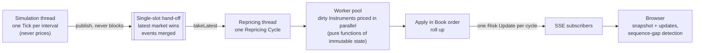
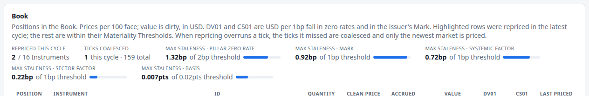

# 11. The runtime

!!! warning "Draft"

    This article is a draft under review and may change.

*Threads, a latest-wins hand-off, coalescing, a worker pool, and streaming risk to the browser.*


**Previously:** ten articles have built a market and priced a [Book](glossary.md#book) against it. Every
one of them has quietly assumed something this article has to deliver: that the risk on screen keeps up
with a market that never stops moving.

## The real-world problem

A risk system has a producer and a consumer running at different speeds.

The market produces. It does not care how long pricing takes, and it will not wait. The engine consumes:
it reprices, aggregates and publishes, and that takes as long as it takes. When the producer is faster
than the consumer, something has to give, and the choice determines what kind of system you have.

There are three bad answers and one good one.

- **Block the producer.** Make the market wait for pricing. Market time then depends on compute load,
  which is nonsense: the market does not stop because your engine is busy. In a simulation it is worse
  than nonsense, because the simulated clock silently slows down whenever the Book gets harder to price.
- **Queue everything.** Keep every update and work through the backlog. Risk then falls further and
  further behind, and the numbers on screen describe a market that no longer exists. The queue is a
  monument to work you cannot do.
- **Drop updates blindly.** Cheap, but it loses events that matter: a coupon payment, a rating change.

The fourth answer: **keep the newest market, merge what you skipped, and never block the producer.**

That is not an invention of this project. Market data platforms do it as a service level and call it
*conflation*: multiple updates within an interval are collapsed so the consumer gets only the latest
value, with the option to flag updates that must never be conflated, such as trades.[^conflation]

## How it works

### Two threads, and one rule about who writes what

The engine runs two loops:

- **The simulation thread** advances the market one [Tick](glossary.md#tick) per wall-clock interval and
  publishes it. It never prices anything, so its pace never depends on the Book.
- **The repricing thread** takes the newest market, reprices the dirty Instruments (article 5), rolls up,
  and publishes one [Risk Update](glossary.md#risk-update) per
  [Repricing Cycle](glossary.md#repricing-cycle).

The state they share is immutable. Each Tick carries a complete `MarketState` built by the simulation
thread and never modified afterwards, which is exactly the Single Writer Principle: every piece of mutable
data is owned by one execution context for all mutations.[^single-writer] Java's memory model makes
handing it over safe: an object whose fields are final is correctly published to any thread that sees the
reference once its constructor has finished.[^jmm-final] Everything in the market state is a record.

### The single-slot hand-off

Between the two threads sits one slot holding at most one pending cycle's worth of Ticks.

- **Publishing never blocks.** If the slot is empty, the Tick goes in. If the repricing thread has not
  taken the previous Tick yet, the new one is *merged* into it.
- **Taking clears the slot.** The repricing thread waits until something is there, takes everything, and
  leaves the slot empty.

!!! formula "What a merge keeps, and what it drops"

    Merging Ticks $t_1, \dots, t_n$ into one cycle gives

    $$
    \text{market} = \text{market}(t_n), \qquad
    \text{events} = \bigcup_{i=1}^{n} \text{events}(t_i),
    $$

    with $\text{coalesced} = n - 1$ reported as telemetry.

    Only the **newest market** is priced: prices and risk should describe the market as it is now, and
    pricing the intermediate states would be work whose answers are already stale.

    Every **event** survives: coupons, redemptions, swap payments,
    [CTD Switches](glossary.md#ctd-switch) and [Rating Migrations](glossary.md#rating-migration) from all
    $n$ Ticks go into the cycle's one Risk Update. Events are facts about what happened, and dropping
    them would lose money and history.

That asymmetry is the whole design. States are replaceable; events are not.

### Parallel pricing that still gives one answer

Within a cycle, dirty Instruments are priced on a worker pool. That is only safe because pricing is a pure
function of the immutable market and the Instrument's own terms: no shared mutable state, no ordering
requirement. The results are collected and applied in Book order on the repricing thread, so the output
does not depend on which worker finished first. `java.util.concurrent` supplies the visibility
guarantees: work done before submitting a task is visible to the task, and the task's results are visible
after `Future.get()`.[^jcip]

The same property is what makes the tests possible. `RiskSession` exposes a `step()` seam that runs the
simulation and pricing on the calling thread, one Tick or one coalesced cycle at a time, which is how
every figure in this series was measured.

### Getting it to the browser

Each cycle produces one message. A client that has just connected gets a
[Risk Snapshot](glossary.md#risk-snapshot), the complete state; after that it gets Risk Updates carrying
only what changed.

The transport is Server-Sent Events: a long-lived HTTP response with the MIME type `text/event-stream`,
encoded as UTF-8.[^sse-mime] Each message is a few lines, `event`, `id` and `data`, terminated by a blank
line, which is what dispatches the event.[^sse-fields] The `id` field sets the browser's "last event ID",
which it sends back in a `Last-Event-ID` header if the connection drops and it reconnects,[^sse-lastid]
and `EventSource` reconnects on its own.[^sse-reconnect]

The engine uses the sequence number as the `id`, and the client applies a simple rule:

- a Risk Update whose sequence is the snapshot's plus one is applied;
- one that is older or duplicated is ignored;
- one that skips a number means something was missed, so the client marks itself out of sync, keeps
  showing the last good state, and reconnects for a fresh snapshot.

A subscriber that cannot keep up is disconnected after 256 queued messages rather than being allowed to
slow the engine down. It reconnects and resyncs.



## How the system does it

The hand-off is fifteen lines, and they are the heart of the runtime:

```java title="MarketHandoff.java" linenums="20"
    /** Called by the simulation thread: never blocks on repricing. */
    synchronized void publish(MarketTick tick) {
        pending = pending == null ? MarketTicks.of(tick) : pending.plus(tick);
        notifyAll();
    }

    /** Called by the repricing thread: waits for at least one Tick, then takes everything published since. */
    synchronized MarketTicks takeLatest() throws InterruptedException {
        while (pending == null) {
            wait();
        }
        MarketTicks taken = pending;
        pending = null;
        return taken;
    }
```

[View on GitHub](https://github.com/suhasghorp/fixed-income-risk-engine/blob/series-v1/backend/src/main/java/com/fixedincomerisk/stream/MarketHandoff.java#L20-L34)

`publish` has no bound to wait on and no queue to fill: the merge is the backpressure. The merge itself is
where the asymmetry lives:

```java title="MarketTicks.java" linenums="29"
    /** These Ticks followed by {@code next}, which becomes the newest. */
    public MarketTicks plus(MarketTick next) {
        if (next.tick() != latest.tick() + 1) {
            throw new IllegalArgumentException("Tick " + next.tick() + " does not follow " + latest.tick());
        }
        List<LifecycleEvent> events = new ArrayList<>(lifecycleEvents);
        events.addAll(next.lifecycleEvents());
        List<CtdSwitchEvent> switches = new ArrayList<>(ctdSwitches);
        switches.addAll(next.ctdSwitches());
        return new MarketTicks(next, count + 1, dayRollover || next.dayRollover(), events, switches);
    }
```

[View on GitHub](https://github.com/suhasghorp/fixed-income-risk-engine/blob/series-v1/backend/src/main/java/com/fixedincomerisk/session/MarketTicks.java#L29-L39)

`next` replaces the market; the event lists grow; `dayRollover` is sticky. A merged cycle therefore ages
the Book if *any* of its Ticks crossed a [Day Rollover](glossary.md#day-rollover).

The repricing loop is a plain while-loop, and its error handling says something about the design goal: one
bad cycle must not stop the engine, because the next cycle prices the newest market anyway.

```java title="RepricingLoop.java" linenums="41"
    private void run() {
        while (!Thread.currentThread().isInterrupted()) {
            try {
                MarketTicks ticks = handoff.takeLatest();
                stream.priceAndPublish(ticks);
                if (!cycleDelay.isZero()) {
                    Thread.sleep(cycleDelay);
                }
            } catch (InterruptedException e) {
                Thread.currentThread().interrupt();
            } catch (RuntimeException e) {
                // One bad cycle must not stop repricing; the next cycle prices the newest market again.
                log.error("Repricing cycle failed", e);
            }
        }
    }
```

[View on GitHub](https://github.com/suhasghorp/fixed-income-risk-engine/blob/series-v1/backend/src/main/java/com/fixedincomerisk/stream/RepricingLoop.java#L41-L56)

On the client, applying a message is a pure function, which is why it can be unit-tested without a browser
or a server:

```typescript title="riskState.ts" linenums="23"
export function applyRiskMessage(state: RiskState, message: RiskStreamMessage): RiskState {
  if (message.type === 'risk-snapshot') {
    return { snapshot: message.snapshot, sync: 'in-sync' };
  }

  const { update } = message;
  const { snapshot } = state;
  if (snapshot === null || state.sync !== 'in-sync') {
    return state;
  }
  if (update.sequence <= snapshot.sequence) {
    return state; // stale or duplicate
  }
  if (update.sequence !== snapshot.sequence + 1) {
    return { ...state, sync: 'resync-required' };
  }
  return { snapshot: applyUpdate(snapshot, update), sync: 'in-sync' };
}
```

[View on GitHub](https://github.com/suhasghorp/fixed-income-risk-engine/blob/series-v1/frontend/src/api/riskState.ts#L23-L40)

### One property file, one framework change

A detail worth keeping, because it is the kind of thing that silently breaks a stream.

The engine writes one Server-Sent Event and flushes it, so it reaches the browser immediately. From Spring
Framework 7.0.6, `flush()` on the output stream handed to a `StreamingResponseBody` does
nothing by default: the change makes flush calls no-ops there, with a property to restore the old
behaviour.[^spring-flush] Without it, each event's bytes would sit in the container's 8KB buffer until the
next write pushed them out, so the UI would run exactly one Risk Update behind, and a stopped run would
never deliver its final state.

The fix is one line in `spring.properties`, read before any application configuration, and the comment in
that file explains why it is there. A test, `StoppedStreamTest`, fails if the flag is removed.

## See it running

Coalescing does not happen in the normal demo: repricing 16 Instruments takes far less than a second.
The `demo-slow` profile forces it, with Ticks every 200ms and an artificial 1-second delay per repricing
cycle:

```bash
# Terminal 1: ticks five times a second, repricing deliberately slowed to one cycle a second
cd backend && mvn spring-boot:run -Dspring-boot.run.profiles=demo,demo-slow \
    -Dspring-boot.run.arguments=--risk.simulation.stop-at-tick=200

# Terminal 2: the UI, then open http://localhost:5173
cd frontend && npm install && npm run dev
```

The engine says so at startup:

```text
Repricing slowed by PT1S per cycle: expect ticks to be coalesced
Simulation thread ticking every PT0.2S
```

Consuming the stream directly and counting what arrives:

| Measured over the run | |
|---|---|
| Ticks simulated | 200 |
| Repricing cycles | 41 |
| Tick advance per cycle | 5, every time |
| Ticks coalesced per cycle | 1 to 5, mean 3.97 |
| **Ticks coalesced in total** | **159 of 200** |
| Sequence gaps seen by the client | none |

Five Ticks per cycle is exactly what the configuration implies: the simulation produces five a second and
repricing manages one cycle a second. **The simulation never slowed down**: 200 Ticks of simulated market
happened on schedule, and the engine priced the newest of every five.



The UI reports it: **ticks coalesced, 159 total**. Two other numbers on that strip are worth comparing with
[article 5](05-real-time-risk-without-recomputing-everything.md)'s normal run:

- **Max Staleness on a Pillar zero rate is 1.32bp of the 2bp threshold**, against 0.89bp in the normal
  demo. With five Ticks between cycles the market moves further between reprices, so displayed prices lag
  more, though still within the bound.
- **Cycles reprice more Instruments.** In the normal demo an average Tick repriced about 4 of 16; under
  `demo-slow` many cycles reprice all 16, because five Ticks of market movement pushes more factors past
  their thresholds.

That is the trade in its purest form. Coalescing does not lose events and does not delay the market; it
buys timeliness with Staleness, and the Staleness stays inside the bound that
[article 5](05-real-time-risk-without-recomputing-everything.md) set.

!!! realdesk "What a real desk does differently"

    - **Separate processes, not threads.** The production shape is market data, pricing and aggregation as
      separate services over a message bus, so each scales and fails independently. Published guidance on
      risk libraries separates the same stages: work out the market data required, build it (optionally
      applying scenario perturbations), price, then aggregate results.[^opengamma] At this scale, an
      in-process hand-off of immutable state shows the same design with far less machinery.
    - **Conflation is a product feature.** Vendors sell conflated and unconflated feeds, with conflation
      either time-based or triggered by backpressure, and with certain message types exempt.[^conflation]
      The engine's hand-off is a hand-rolled version of the same idea.
    - **Grids and caches.** Repricing spreads over a compute grid, with distributed caches for curves and
      intermediate results, rather than a four-thread pool in one JVM.
    - **Persistence and replay.** Real systems persist every market snapshot and every risk run, so a
      number on a screen at 11:04 can be reproduced tomorrow. The engine keeps nothing: its reproducibility
      comes from the seed.
    - **Entitlements and audit.** Who may see which book, and who saw what when. Not modelled at all here.
    - **Reconciliation.** The intraday stream has to agree, within tolerance, with the official end-of-day
      batch, and explaining the differences is somebody's daily job.
    - **Performance discipline.** At serious message rates, the details that matter are mechanical:
      avoiding contended locks and CAS operations,[^lmax] and avoiding false sharing, where independent
      variables on the same cache line contend as if they were one.[^false-sharing] This engine ticks once
      a second and needs none of it, but the vocabulary is worth having.

## Further reading

Primary sources:

- WHATWG, [*HTML Living Standard*, §9.2 Server-Sent
  Events](https://html.spec.whatwg.org/multipage/server-sent-events.html). The stream format, field
  names, reconnection and `Last-Event-ID`.
- Spring Framework, [issue
  #36385](https://github.com/spring-projects/spring-framework/issues/36385) and the
  `ServletServerHttpResponse.FLUSH_ENABLED_PROPERTY_NAME`
  [Javadoc](https://docs.spring.io/spring-framework/docs/current/javadoc-api/org/springframework/http/server/ServletServerHttpResponse.html).
  Why hand-rolled SSE needs a property set from 7.0.6.
- M. Thompson, [*Single Writer
  Principle*](https://mechanical-sympathy.blogspot.com/2011/09/single-writer-principle.html), and
  [*False Sharing*](https://mechanical-sympathy.blogspot.com/2011/07/false-sharing.html).
- Refinitiv (LSEG), *Elektron as a Service — Service Description* (2019) and *Real-Time Distribution
  System — Open Message Model* white paper (2020). What conflation means as a product.
- OpenGamma Strata, [*Calculation Flow*](https://strata.opengamma.io/calculation_flow/). How an
  open-source risk library separates market data, scenarios, pricing and aggregation.
- LMAX, [*Disruptor: High performance alternative to bounded queues*](https://lmax-exchange.github.io/disruptor/disruptor.html).
  Measured costs of contended locks and CAS.
- Oracle, [*Java Language Specification*, §17.5 `final` Field
  Semantics](https://docs.oracle.com/javase/specs/jls/se21/html/jls-17.html#jls-17.5), and the
  [`java.util.concurrent` package
  summary](https://docs.oracle.com/en/java/javase/21/docs/api/java.base/java/util/concurrent/package-summary.html)
  on memory consistency.

Textbooks:

- Brian Goetz et al., *Java Concurrency in Practice*, Addison-Wesley, 2006. Safe publication, immutability
  and executors.
- Martin Kleppmann, *Designing Data-Intensive Applications*, O'Reilly, 2017. Streams, backpressure and
  replay, at a larger scale than this.

[^conflation]: Refinitiv (LSEG), *Elektron as a Service — Service Description* (2019): "Conflation is a bandwidth management capability ... whereby the first update and any other updates received within the specified interval are conflated (i.e. multiple quote updates are condensed into a single time based update that only delivers the latest value received within that time window)", with "position keeping systems" named as typical users. The *Real-Time Distribution System Open Message Model* white paper (2020) adds that conflation "can be based on time or may vary based on more complex parameters (e.g. channel capacity, congestion, etc.)", that just-in-time conflation is "backpressure-based", and that an update can carry a "Do Not Conflate" flag "(e.g. market-price trades, news headlines, etc.)".
[^single-writer]: M. Thompson, *Single Writer Principle*: each piece of mutable data should be owned by exactly one execution context for all mutations.
[^jmm-final]: Java Language Specification §17.5: an object's final fields are correctly initialised as seen by any thread that reads the reference after the constructor completes.
[^jcip]: `java.util.concurrent` package summary: actions in a thread before submitting a task *happen-before* the task's execution, and the task's actions happen-before the results are retrieved via `Future.get()`.
[^sse-mime]: WHATWG HTML Living Standard, §9.2: "This event stream format's MIME type is `text/event-stream`", and "Event streams in this format must always be encoded as UTF-8."
[^sse-fields]: WHATWG HTML Living Standard, §9.2: the field names are `event`, `data`, `id` and `retry`; `data` lines accumulate, joined with a line feed, and a blank line dispatches the event.
[^sse-lastid]: WHATWG HTML Living Standard, §9.2: the `id` field sets the last event ID buffer, which the browser sends in the `Last-Event-ID` header when it reconnects.
[^sse-reconnect]: WHATWG HTML Living Standard, §9.2: `EventSource` reconnects automatically after an implementation-defined delay, which a `retry` field can override.
[^spring-flush]: Spring Framework issue #36385 and commit e0b54e244e, in milestone 7.0.6: flush calls on the output stream from `ServletServerHttpResponse#getBody()` become no-ops, with `spring.http.response.flush.enabled=true` restoring the previous behaviour. The issue notes that "specific cases like SSE and streaming do require manual flush calls", and the property is described as a temporary measure.
[^lmax]: M. Thompson, D. Farley, M. Barker, P. Gee and A. Stewart, *LMAX Disruptor* (2011), §§2.1–2.2 and 3.2. Incrementing a 64-bit counter 500 million times took 300ms on one thread, 10,000ms with a lock, and 224,000ms with two threads contending on that lock; and "The ideal algorithm would be one with only a single thread owning all writes to a single resource". The absolute numbers are 2011 hardware; the proportions are the point.
[^false-sharing]: M. Thompson, *False Sharing*: independent variables written by different threads that share a cache line contend as though they were a single variable.
[^opengamma]: OpenGamma Strata, [*Calculation Flow*](https://strata.opengamma.io/calculation_flow/): calculations "operate on a list of trades, a list of columns and some rules"; a stage "takes the market data requirements and attempts to build a market data for the requirements"; a scenario stage applies "one or more sets of perturbations"; and the output is "a table containing the input trades as the rows and the requested measures as the columns".

## Next

That is the series. Eleven articles ago the question was what a risk system is for; the answer has turned
out to be a chain of quite specific engineering decisions:

- a curve **bootstrapped** from published par yields, interpolated so its forwards stay sane
  ([article 2](02-the-yield-curve.md));
- a **one-factor model** that moves it while reproducing today's prices exactly
  ([article 3](03-moving-the-curve-through-time.md));
- **bump-and-reprice** risk on the model's output curve, bucketed by Pillar
  ([article 4](04-pricing-a-bond-and-measuring-its-risk.md));
- **selective repricing** on Materiality Thresholds, which is what makes the whole thing real-time
  ([article 5](05-real-time-risk-without-recomputing-everything.md));
- prices **derived from evidence** rather than observed, for futures
  ([article 6](06-treasury-futures.md)) and for credit
  ([articles 7](07-credit-and-the-missing-tape.md) and [8](08-when-credit-breaks.md));
- cash flows that are **half fact and half projection** ([article 9](09-interest-rate-swaps.md));
- factors that **move together** ([article 10](10-correlation.md));
- and a runtime that keeps the newest market winning.

The engine is on GitHub, the demo is reproducible from a single seed, and every number in these articles
came out of it. Clone it, run it, and change a threshold to see what breaks.
