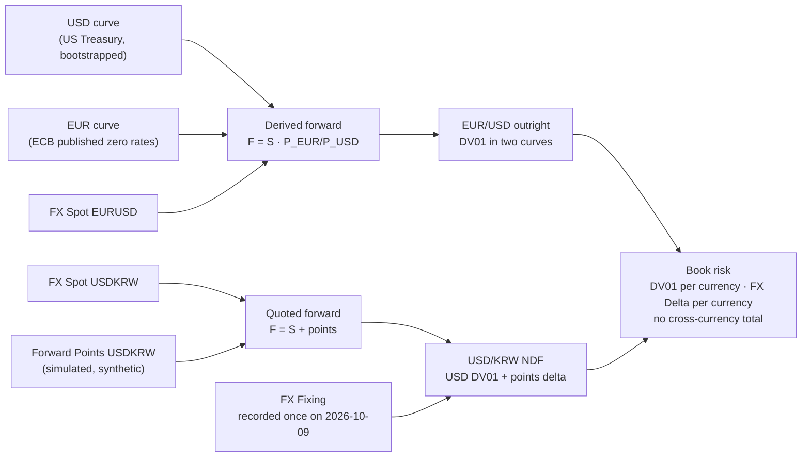
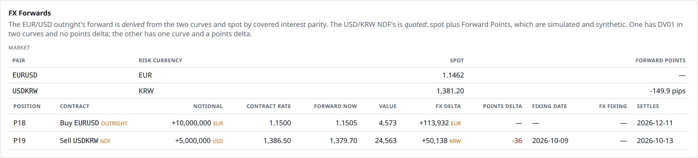
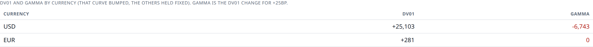
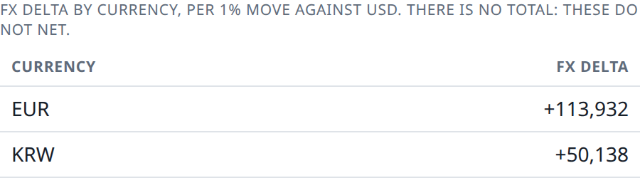
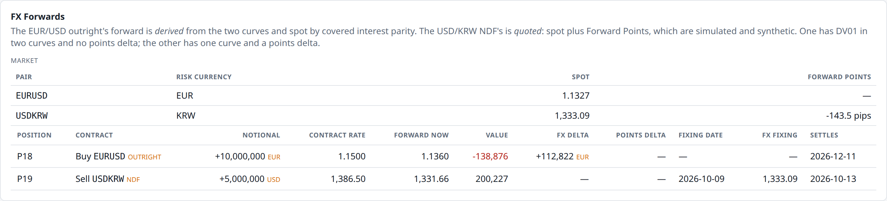
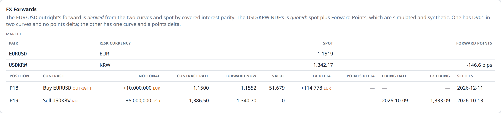
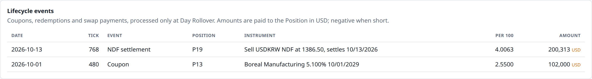

# 12. Two currencies, two kinds of forward

!!! warning "Draft"

    This article is a draft under review and may change.

*Covered interest parity, quoted Forward Points, FX Fixings, and why currency exposures never net.*


**Previously:** eleven articles priced a Book in one currency, and the glossary has been quietly promising
since article 1 that there is a [Reporting Currency](glossary.md#reporting-currency) and that not
everything is denominated in it. This article is where that promise comes due: a second curve, two
exchange rates, and two contracts that look identical on a term sheet and are priced by completely
different machinery.

## The real-world problem

Foreign exchange is the largest market there is. In April 2025 it turned over **$9.6 trillion a day**, and
the fastest-growing piece of it was the one this article is about: outright forwards traded $1.8 trillion
a day, 19% of the total, up 60% in three years.[^bis-turnover]

A desk ends up holding FX whether or not it means to. A euro bond pays euros. A dollar fund that buys
Korean assets has won exposure it never asked for. A treasurer who will receive €10 million in December
would rather know today what that is worth in dollars. All three hedge the same way: with a
[FX Forward](glossary.md#fx-forward), an agreement to exchange two currency amounts on a future date at a
rate fixed today.

For a risk engine, the second currency breaks an assumption that has held for eleven articles: that there
is one curve, and that a number is a number. Three things stop being true at once.

- **Value needs a currency.** A euro forward is worth euros; the Book reports dollars. Something has to
  convert, and at which rate is a decision, not a detail.
- **A basis point stops being a basis point.** The Book now prices off two curves. Shifting both by 1bp
  gives a number, but it is not a [DV01](glossary.md#dv01) of anything a desk can trade, because nobody
  moves the euro and dollar curves together on command.
- **There is a new risk factor that is not a rate.** Spot itself moves, and a euro exposure and a won
  exposure are not two units of the same thing. They must not be added up.

And then there is a complication the market itself invented. For most currency pairs, the forward rate is
not quoted at all — it is *derived* from the two currencies' interest rates. For others, it cannot be, and
the market quotes it directly. The Book holds one of each, deliberately.

## How it works

### The forward you never have to be told

Start with the deliverable case: EUR/USD, where both currencies can be freely bought, sold and delivered.

Suppose you want euros in three months. You have two ways to get them, and both are available today:

1. **Buy them forward** at the rate $F$ agreed now, paying $F$ dollars per euro in three months.
2. **Buy them now** at spot $S$, and park them in a euro deposit for three months. To pay for that you
   borrow dollars for three months.

Both routes deliver one euro on the same day. Both are risk-free in the sense that every rate is agreed
today. So they must cost the same — otherwise there is a money machine. Setting them equal gives the
forward rate, and no one has to quote it.

!!! formula "Covered interest parity"

    Write $P_{\text{USD}}(T)$ and $P_{\text{EUR}}(T)$ for the two currencies' discount factors to the
    forward date — exactly the discount factors of [article 2](02-the-yield-curve.md), one curve each.
    To have one euro at $T$ you need $P_{\text{EUR}}(T)$ euros today, which costs $S \cdot P_{\text{EUR}}(T)$
    dollars, financed by borrowing that amount and repaying it at $T$. Equating the two routes:

    $$
    F = S \cdot \frac{P_{\text{EUR}}(T)}{P_{\text{USD}}(T)} .
    $$

    The value today of a contract to buy one euro at the agreed rate $K$ is then the difference between
    what you receive and what you pay, each discounted on its own curve:

    $$
    V = S \cdot P_{\text{EUR}}(T) - K \cdot P_{\text{USD}}(T) ,
    $$

    which is zero exactly when $K = F$. A forward struck at the parity rate is worth nothing on day one,
    which is why forwards are traded at that rate and cost nothing to enter.

The relation is old and it is the reason a forward rate is a *funding price*, not a forecast. It "verges
on a physical law in international finance", in the BIS's phrase: "the interest rate differential between
two currencies in the cash money markets should equal the differential between the forward and spot
exchange rates".[^bis-cip] Nothing in it predicts where the euro is going. If euro rates are below dollar
rates, euros are worth more forward than spot, and that is arithmetic rather than opinion.

### The forward that has to be quoted

Now take USD/KRW. The Korean won cannot be freely delivered offshore, and that single fact takes the
derivation above apart. There is no won deposit a foreign investor can freely use, no offshore won curve
to build, and therefore no second discount factor to divide by.

The market's answer is the [NDF](glossary.md#ndf), the non-deliverable forward. The BIS's definition is
the clearest short one: NDFs are "contracts for the difference between an agreed exchange rate and the
actual spot rate at maturity, settled with a single payment for one counterparty's profit". They exist
because they "allow hedging and speculation in a currency without providing or requiring funding in
it".[^bis-ndf] Nothing is delivered; one net amount changes hands, in a currency that can be — almost
always dollars.[^bis-guidelines]

The won is not an odd example to pick. "The KRW/USD pair is now by far the most traded NDF
globally",[^bis-ndf] and the BIS survey names it as one of only six NDF pairs big enough to be reported
separately.[^bis-guidelines-six]

Because no curve derives it, the price has to come from somewhere, and the market quotes it directly as
**[Forward Points](glossary.md#forward-points)**: the difference between the forward and spot rates,
quoted in pips. A national FX committee's convention document puts it plainly — "the difference between
the spot and the forward rates is referred to as the 'forward points' or 'forward pips'".[^afma] The
points are a traded price, the way a Treasury future's Basis is in [article 6](06-treasury-futures.md), and
in this engine they are simulated as their own [Risk Factor](glossary.md#risk-factor) for the same reason.

!!! formula "A quoted forward, and what an NDF pays"

    The forward rate is spot plus the quoted points, converted at the pair's pip size (0.01 KRW for
    USD/KRW, 0.0001 for EUR/USD):

    $$
    F = S + \text{points} \times \text{pip} .
    $$

    On the fixing date the contract is struck against a published FX Fixing $F_{\text{fix}}$, and one net
    amount settles, per unit of the **dollar** notional, for the seller of dollars:

    $$
    \text{settlement} = \frac{K}{F_{\text{fix}}} - 1 ,
    $$

    the difference between the contracted rate and the fixing, expressed in the currency that can actually
    be paid. Before the fixing date the engine values it by standing the quoted forward in for the unknown
    fixing and discounting on the settlement currency's curve:

    $$
    V = \left(\frac{K}{F} - 1\right) P_{\text{USD}}(T) .
    $$

The two shapes are mirror images, and that is the point of holding one of each:

| | Deliverable outright (EUR/USD) | NDF (USD/KRW) |
|---|---|---|
| Forward rate | **derived** from two curves and spot | **quoted** as spot plus points |
| At maturity | both amounts exchanged in full | one net payment, in dollars |
| Rates risk | DV01 in **both** curves | DV01 in the **settlement** curve only |
| Points risk | none — there are no points | a points delta per pip |
| Needs a fixing | no | yes |

This is the engine's ninth decision record, and it is worth saying why the inconsistency is deliberate.
Deriving a won forward would have meant inventing a Korean curve, which is a bigger lie than admitting the
points are the primitive. Quoting the EUR/USD forward would have thrown away the series' best example of a
price that is derived rather than observed.

### An FX Fixing is a different animal from a Fixing

[Article 9](09-interest-rate-swaps.md) introduced the [Fixing](glossary.md#fixing): an interest rate
recorded on a reset date, which sets a coupon and is never revised. An
[FX Fixing](glossary.md#fx-fixing) is the same discipline doing a different job: an exchange rate
recorded on a fixing date, which sets a **settlement amount** and is never revised.

The real thing is specific to the point of being bureaucratic, and the specificity is the interesting
part. The standard USD/KRW NDF settles in US dollars against a named rate: "KRW KFTC18", defined by ISDA
and EMTA as "the Korean Won/U.S. Dollar market average rate … reported by Seoul Money Brokerage Services,
Ltd. … available by approximately 4:00 p.m., Seoul time".[^annex-a] The template sets the valuation date
on a Seoul business day and the settlement date on a New York one, no more than two business days
later, and specifies what happens when the rate is not published: postpone, then fall back to a dealer
survey.[^emta-template]

A whole contract hangs on one number published by one broker at one time of day. That is why a fixing, in
a risk system, is a *recorded observation* and not something a model may recompute. The engine keeps FX
Fixings in exactly the store shape article 9 used for interest rate Fixings, and enforces the same rule
with the same line of code.

### Two exposures that must not be added

Once the Book holds currency risk, the reporting question arrives: what is it exposed to, and by how
much?

[FX Delta](glossary.md#fx-delta) is the answer, and the engine defines it as the change in Book value for
a **1% move** in one currency against the Reporting Currency. Not a pip: a pip is meaningless on a
Position sized in millions and is not comparable across a pair quoted at 1.15 and one quoted at 1,388. A
percentage is comparable across both.

The harder half of the decision is what *not* to do. The Book's euro exposure and its won exposure are not
two amounts of the same thing, and adding them produces a number with no meaning: no trade moves the euro
and the won together, so no hedge corresponds to the total. The engine therefore reports FX Delta **per
currency, with no total**, and the panel says so on screen. Rates risk works the same way one level up: a
Book DV01 across two curves is labelled *all curves, 1bp each* precisely because it is not a basis point
of anything you can trade.

### The one process that does not pull back

Every other continuous Risk Factor in this engine mean-reverts. The short rate is pulled to a
Hull-White level ([article 3](03-moving-the-curve-through-time.md)); the futures Basis, the credit
factors and the swaption vol surface all revert to a long-run mean.

[FX Spot](glossary.md#fx-spot) does not, and that is a modelling decision with a reason behind it.

!!! formula "Driftless geometric Brownian motion, on the logarithm"

    The engine holds $\ln S$ and moves it as

    $$
    d\ln S = -\tfrac{1}{2}\sigma^2\,dt + \sigma\,dW ,
    $$

    so $S$ is lognormal, always positive, and $\mathbb{E}[S_T] = S_0$: the model's best guess of tomorrow's
    rate is today's. The variance of $\ln S$ grows **linearly** in time, $\sigma^2 T$, rather than
    flattening to $\eta^2/2\kappa$ as a mean-reverting factor's does.

Mean-reverting a spot rate would mean asserting that the euro has a fair value the engine knows and the
market does not. That is a currency forecast wearing a parameter's clothes, and it would quietly make
every long-dated FX Position profitable. Uncertainty that grows without bound is the honest default, and
it matches the practical fact that forward rates are funding prices rather than predictions.

### The whole picture



## How the system does it

The outright's value is the formula box with the names left in. Two discount factors, from two different
curves, and a spot rate:

```java title="FxForward.java" linenums="94"
    /** Value per unit of base-currency notional, in the quote currency; zero once matured. */
    @Override
    public double dirtyValue(MarketState market) {
        if (!maturityDate.isAfter(market.valuationDate())) {
            return 0;
        }
        double years = YearFractions.act365(market.valuationDate(), maturityDate);
        double baseLeg = market.fx().spot(pair.pair())
                * market.curve(pair.baseCurrency()).discountFactor(years);
        double quoteLeg = contractRate * market.curve(pair.quoteCurrency()).discountFactor(years);
        return direction.sign * (baseLeg - quoteLeg);
    }
```

[View on GitHub](https://github.com/suhasghorp/fixed-income-risk-engine/blob/series-v1/backend/src/main/java/com/fixedincomerisk/instrument/FxForward.java#L94-L105)

`market.curve(currency)` is the signature that changed when the engine grew a second currency. It used to
be `market.curve()`, and there used to be a single curve to return. There is deliberately no default: an
Instrument must name the currency it discounts in, because the alternative — a currency-less `curve()`
that quietly returns the dollar one — would price a euro cash flow on a dollar curve and produce a number
that looks fine.

The NDF's value is one discount factor and one ratio, but the interesting method is the one that decides
*which rate* the settlement is struck on:

```java title="FxNdf.java" linenums="125"
    /**
     * The rate the settlement is struck on: the quoted forward until the fixing date, and the FX Fixing
     * recorded on it from then on.
     *
     * <p>Once fixed, the settlement amount is known and stops moving with spot — which is why this reads
     * the recorded Fixing and fails if there is none, rather than quietly falling back to today's spot.
     */
    public double settlementRate(MarketState market) {
        return market.valuationDate().isBefore(fixingDate)
                ? forwardRate(market)
                : market.fx().fixings().rate(pair.pair(), fixingDate);
    }
```

[View on GitHub](https://github.com/suhasghorp/fixed-income-risk-engine/blob/series-v1/backend/src/main/java/com/fixedincomerisk/instrument/FxNdf.java#L125-L136)

The comment is load-bearing. A missing Fixing throws; it does not fall back to spot. A fallback would have
produced a plausible settlement amount that drifts with the market after the rate was struck, which is the
kind of bug that gets found in a reconciliation weeks later.

The store behind it is four lines of logic and one rule, and it is the FX twin of article 9's
`FixingHistory`:

```java title="FxFixingHistory.java" linenums="17"
    /**
     * Records the FX Fixing for {@code pair} on {@code fixingDate}, unless one is already recorded.
     *
     * @return true if recorded, false if that (pair, date) already had a Fixing, which is left unchanged
     */
    public boolean record(String pair, LocalDate fixingDate, double rate) {
        if (!(rate > 0)) {
            throw new IllegalArgumentException("An FX Fixing must be positive; got " + rate
                    + " for " + pair + " on " + fixingDate);
        }
        return rates.putIfAbsent(new FxFixings.Key(pair, fixingDate), rate) == null;
    }
```

[View on GitHub](https://github.com/suhasghorp/fixed-income-risk-engine/blob/series-v1/backend/src/main/java/com/fixedincomerisk/market/FxFixingHistory.java#L17-L28)

`putIfAbsent`, again. Two different markets, two different jobs, one rule: the first observation recorded
for a date wins forever.

FX Delta is bump-and-reprice, like every other sensitivity in [article 4](04-pricing-a-bond-and-measuring-its-risk.md),
with one twist that is easy to get backwards:

```java title="SensitivityCalculator.java" linenums="121"
    /** One pair's contribution, from a central difference about a 1% move in its risk currency. */
    public double fxDelta(Instrument instrument, MarketState market, FxPair pair) {
        if (!market.fx().spot().containsKey(pair.pair())) {
            return 0;
        }
        double spot = market.fx().spot(pair.pair());
        double up = instrument.dirtyValue(withSpot(market, pair, pair.spotAfterRiskCurrencyMove(spot, ONE_PERCENT)));
        double down = instrument.dirtyValue(withSpot(market, pair, pair.spotAfterRiskCurrencyMove(spot, -ONE_PERCENT)));
        return (up - down) / 2;
    }
```

[View on GitHub](https://github.com/suhasghorp/fixed-income-risk-engine/blob/series-v1/backend/src/main/java/com/fixedincomerisk/risk/SensitivityCalculator.java#L121-L130)

The twist is `spotAfterRiskCurrencyMove`. "The euro strengthens 1%" and "the won strengthens 1%" move
their quotes in opposite directions, because the risk currency sits on opposite sides of the two pairs:
EUR/USD is dollars per euro, so a stronger euro means spot **rises**; USD/KRW is won per dollar, so a
stronger won means spot **falls**. The Instrument does not need to know this and the risk report must not
get it wrong, so the knowledge lives on the pair.

## See it running

The two FX Positions are in the Book from the first Tick: **P18**, buy €10 million against dollars at
1.1500 for 11 December 2026, and **P19**, sell $5 million against won at 1,386.50, fixing on
9 October 2026 and settling on the 13th.

```bash
# Terminal 1: the engine (N = 24, 672 or 768)
cd backend && mvn spring-boot:run -Dspring-boot.run.profiles=demo \
    -Dspring-boot.run.arguments=--risk.simulation.stop-at-tick=N

# Terminal 2: the UI, then open http://localhost:5173
cd frontend && npm install && npm run dev
```

### The market, and the two contracts: Tick 24



The upper table is the market: EUR/USD spot at **1.1462**, USD/KRW at **1,381.20** with Forward Points of
**−149.9 pips**. EUR/USD has no points, and the dash is not missing data — a deliverable pair does not have
any.

The lower table is the two contracts, and the column to watch is *Forward now*: **1.1505** for the
outright and **1,379.70** for the NDF. One of those numbers was computed from two curves; the other was
read off a quoted price. The panel does not distinguish them, and neither would a trading screen.

### The derived forward, taken apart

At Tick 24 the outright has 0.246575 years to run, and the two curves give:

| | Value |
|---|---|
| $P_{\text{EUR}}(T)$, ECB curve | 0.9940319508 |
| $P_{\text{USD}}(T)$, Treasury curve | 0.9903154736 |
| Ratio | 1.0037528216 |
| Spot $S$ | 1.146160 |
| **Forward $F = S \times$ ratio** | **1.150462** |
| Contract rate $K$ | 1.1500 |

Those discount factors are two continuously compounded zero rates: **2.4276%** for the euro and **3.9468%**
for the dollar, a differential of **151.9bp**. The forward sits **43.0 pips** above spot, which over
0.246575 years is **1.52% annualised** — the interest differential, to within the rounding of this table.
Covered interest parity is not an approximation here; it is the definition the engine prices from.

The value follows:

$$
V = S \cdot P_{\text{EUR}} - K \cdot P_{\text{USD}} = 1.1393200966 - 1.1388627946 = 0.0004573020
$$

per euro of notional, which on €10 million is **\$4,573.02**. The contract was struck at 1.1500 when the
parity forward was near it, and three weeks of market movement have made it worth a few thousand dollars.

### Where its risk lives

P18's DV01 is **+0.11**, which looks like nothing and is the most interesting number on the page. Split by
currency it is:

| Currency | P18 DV01 |
|---|---|
| USD | **−280.82** |
| EUR | **+280.93** |
| Total (all curves, 1bp each) | +0.11 |

The two legs are nearly the same size and point in opposite directions, because the contract is long a
euro cash flow and short a dollar one of almost equal present value. A parallel move in *both* curves
barely touches it. A move in *one* of them is worth about \$281 a basis point. This is precisely why the
Book reports DV01 per currency and labels the cross-currency total rather than trusting it:



The Book's dollar DV01 is **+25,102.90** and its euro DV01 is **+280.93** — the whole of the euro number is
P18's euro leg, because nothing else in the Book touches the ECB curve. The headline **+25,383.83** is the
sum, and it is labelled *all curves, 1bp each* because that is all it is.

The NDF's rates risk is **+0.21** — twenty-one cents a basis point. It settles a single dollar amount in a
month, so all the curve does is discount it. Its real exposures are elsewhere:



**EUR +113,932** and **KRW +50,138**, with no total, and the panel says why: *there is no total: these do
not net*. The euro number is P18's alone and the won number is P19's alone. Below it sits the points
delta, **−36** per pip on USD/KRW, which belongs to the NDF and only to the NDF — the same separation as a
future's DV01 holding its Basis fixed in article 6.

Both of the FX Delta numbers are large next to the Positions' values. P19 is worth \$24,563 and moves
\$50,138 for a 1% move in the won: an FX forward is a leveraged bet on a rate, which is what makes it a
hedging instrument.

### The Fixing: Tick 672

The NDF's fixing date, 9 October 2026, is the [Day Rollover](glossary.md#day-rollover) at **Tick 672**.



Three things are visible at once, and the third is the one that matters.

- **An FX Fixing was recorded: 1,333.09**, that day's spot. The won has strengthened a long way from the
  contracted 1,386.50 — good for P19, which sold dollars.
- **The quoted forward has already moved away from it**, to 1,331.66. The market keeps trading; the fixing
  does not care.
- **The NDF's FX Delta and points delta are gone**, both showing a dash. The settlement amount is now a
  known number of dollars. Spot can do what it likes and the won exposure is over: all that is left is
  discounting a fixed amount to the settlement date, a DV01 of **+0.22**.

A Tick later, at 673, the quoted forward has moved again, to 1,331.40, and the settlement rate is still
**1,333.092960**. That is `putIfAbsent` doing its job, and it is the whole reason a fixing is stored rather
than computed.

### The settlement: Tick 768

Four days later, on 13 October 2026, the money moves.





One payment, in dollars, of **\$200,313** — 200,312.51 before the panel rounds it — and the arithmetic is the formula box:

$$
\frac{K}{F_{\text{fix}}} - 1 = \frac{1386.50}{1333.09296} - 1 = 4.006250\% \quad\text{of \$5,000,000} = \$200{,}312.51 .
$$

No won was ever paid or received. The Position's value falls to **zero** on the same Tick — it has no
future left — having been worth \$200,291 the Tick before. The difference between those two numbers is the
last day of discounting, not a profit.

Meanwhile P18 is still running, and it shows what an unhedged currency position feels like from the
inside. Its value at these three moments:

| Tick | Date | EUR/USD spot | P18 value |
|---|---|---|---|
| 24 | 2026-09-12 | 1.1462 | **+\$4,573** |
| 671 | 2026-10-08 | 1.1337 | **−\$129,081** |
| 768 | 2026-10-13 | 1.1519 | **+\$51,679** |

A 1.1% fall in the euro moved a €10 million forward by about \$134,000, and a 1.6% recovery moved it back
and further. Nothing else about the contract changed. That is FX Delta, realised.

!!! realdesk "What a real desk does differently"

    - **Covered interest parity does not hold exactly any more.** The engine treats it as an identity. In
      the market it has been violated persistently since 2007: the deviations are "large, persistent, and
      systematic", and "not explained away by credit risk or transaction costs", with a pronounced spike
      when forwards sit on bank balance sheets at quarter-end.[^du] The gap is the **cross-currency
      basis**, itself a traded price, and a desk prices a long-dated FX forward off a cross-currency basis
      curve rather than off two government curves. A real system has that curve, and a basis risk figure
      to go with it.
    - **A desk discounts on the collateral curve, not the government one.** As with swaps in article 9, a
      CSA'd forward is discounted at the rate paid on its collateral, and which currency the collateral is
      posted in changes the price.
    - **Delivering two currencies is its own risk.** Settling both legs in full exposes each side to the
      other failing between the two payments — Herstatt risk, named for the 1974 collapse of Bankhaus
      Herstatt. It is not a historical curiosity: **\$2.2 trillion of daily turnover was still exposed to
      it in April 2022**.[^bis-settlement] The mitigation is payment-versus-payment, where "the final
      payment of one currency occurs if, and only if, the final payment of the other currency takes
      place", largely through CLS, which settles 18 currencies.[^bis-settlement] The engine's outright
      settles as two [Lifecycle Events](glossary.md#lifecycle-event) and models none of this. (Worth noting against the obvious guess:
      the won *is* a CLS currency.[^cls] The NDF exists because of Korea's restrictions on offshore won,
      not because the payments could not be settled safely.)
    - **Value dates and calendars are real work.** Spot is two business days, not today.[^bis-guidelines]
      The EMTA template for a USD/KRW NDF takes its valuation date on a **Seoul** business day and its
      settlement date on a **New York** one, with conventions for unscheduled holidays and a 14-day
      deferral period.[^emta-template] The engine has no holiday calendar and no settlement lag: its dates
      are the dates in the reference data.
    - **A fixing can fail, and there is machinery for that.** The same template names the fallbacks when
      KFTC18 is not published: postpone the valuation, then use the SFEMC KRW Indicative Survey Rate, then
      let the calculation agent determine it.[^emta-template] The engine's fixing cannot fail, because it
      is drawn from its own simulated spot.
    - **The NDF's payoff is convex in the fixing, and the engine ignores it.** Standing the quoted forward
      in for the expected fixing is not quite right, because $K/F - 1$ is a convex function of $F$ and the
      settlement is paid in dollars. A desk applies a small adjustment; this engine deliberately does not,
      and at one month's tenor the error is tiny.
    - **Forward points are quoted for a curve of tenors, and they move for reasons.** The engine simulates
      a single one-month points level as a mean-reverting process. A desk sees a term structure of points
      per tenor, driven by relative funding, capital rules and hedging flow.
    - **FX forwards are a funding market, not just a hedging one.** The dollar obligations created by FX
      swaps and forwards are off balance sheet and enormous: about **\$26 trillion** for non-banks outside
      the United States, and an estimated \$39 trillion for non-US banks, "more than double their
      on-balance sheet dollar debt".[^bis-debt] None of that plumbing exists here.
    - **There is a code of conduct, and desks sign up to it.** The FX Global Code sets out principles of
      good practice for the wholesale market; its December 2024 revision updated five of the 55 principles,
      several of them to strengthen guidance on settlement risk.[^gfxc]
    - **Non-deliverability is policy, and policy moves.** Since July 2024 registered foreign institutions
      trade directly in Korea's onshore market and the session runs to 2 a.m. the next day, covering London
      hours; 52 of them had registered by mid-2025.[^mofe] The NDF market exists because of a restriction,
      and restrictions get lifted.

### Which numbers here are real

The series' rule is that a reader can check the inputs, so it is worth being exact about which ones are
real in this article.

- **Real.** The euro curve is the ECB's published euro area AAA-rated central government bond spot curve,
  estimated with the Svensson model on a continuously compounded basis and updated every TARGET business
  day at noon.[^ecb-yc] Both starting spot rates are ECB euro foreign exchange reference rates for
  18 September 2026: EUR/USD **1.146** directly, and USD/KRW as KRW/EUR **1590.76** divided by it, giving
  **1388.0977312390926**.[^ecb-fx] Either can be pulled from the ECB's own API in one line:

    ```bash
    curl -s "https://data-api.ecb.europa.eu/service/data/EXR/D.USD+KRW.EUR.SP00.A\
    ?startPeriod=2026-09-18&endPeriod=2026-09-18&format=csvdata" | cut -d, -f1,7,8
    ```

- **Synthetic.** The NDF's Forward Points — their long-run mean of −150 pips, their speed of reversion and
  their volatility — are invented. Live NDF points are not freely published, and inventing a Korean curve
  to derive them would have been worse than admitting the points are the primitive. The demo's spot
  volatilities (8% and 9%) are plausible round numbers, not calibrations.

Everything else in the article — the forwards, the values, the fixing, the settlement, the risk numbers —
is computed by the engine from those inputs.

## Further reading

Primary sources:

- Bank for International Settlements, [*OTC foreign exchange turnover in April
  2025*](https://www.bis.org/statistics/rpfx25_fx.htm), Triennial Central Bank Survey, September 2025, and
  the [*reporting guidelines for turnover in April
  2025*](https://www.bis.org/publications/triennial-survey/2025survey-guidelinesturnover.pdf), whose
  instrument definitions are the cleanest short statement of what spot, an outright forward and an NDF are.
- C. Borio, R. McCauley, P. McGuire and V. Sushko, [*Covered interest parity lost: understanding the
  cross-currency basis*](https://www.bis.org/publ/qtrpdf/r_qt1609e.htm), BIS Quarterly Review, September 2016.
- W. Du, A. Tepper and A. Verdelhan, [*Deviations from Covered Interest Rate
  Parity*](https://www.nber.org/papers/w23170), NBER Working Paper 23170, 2017; *Journal of Finance* 73(3),
  2018, 915–957.
- R. McCauley and C. Shu, [*Non-deliverable forwards: impact of currency internationalisation and
  derivatives reform*](https://www.bis.org/publ/qtrpdf/r_qt1612h.htm), BIS Quarterly Review, December 2016.
- ISDA and EMTA, [*Annex A to the 1998 FX and Currency Option
  Definitions*](https://www.emta.org/media/xa0n2urc/annex-a-to-the-1998-fx-and-currency-option-definitions-june-30-2023.pdf)
  (amended 30 June 2023), and the [*SFEMC & EMTA Template Terms for KRW/USD Non-Deliverable FX Forward
  Transactions*](https://www.sfemc.org/files/Indicative%20Survey/NDF/KRW-USD/2022-09-27-KRW%20Template%20Rev%202006.pdf).
  The legal shape of the contract this article prices.
- M. Glowka and T. Nilsson, [*FX settlement risk: an unsettled
  issue*](https://www.bis.org/publ/qtrpdf/r_qt2212i.htm), BIS Quarterly Review, December 2022.
- C. Borio, R. N. McCauley and P. McGuire, [*Dollar debt in FX swaps and forwards: huge, missing and
  growing*](https://www.bis.org/publ/qtrpdf/r_qt2212h.htm), BIS Quarterly Review, December 2022.
- European Central Bank, [*Euro foreign exchange reference
  rates*](https://www.ecb.europa.eu/stats/policy_and_exchange_rates/euro_reference_exchange_rates/html/index.en.html)
  and [*Euro area yield
  curves*](https://www.ecb.europa.eu/stats/financial_markets_and_interest_rates/euro_area_yield_curves/html/index.en.html).
- Global Foreign Exchange Committee, [*GFXC updates FX Global
  Code*](https://www.globalfxc.org/press-p250124/), 24 January 2025.

Textbooks:

- Iain J. Clark, *Foreign Exchange Option Pricing: A Practitioner's Guide*, Wiley, 2011. Conventions, value
  dates, and non-deliverable payoffs.
- Antonio Castagna, *FX Options and Smile Risk*, Wiley, 2010. The market's own vocabulary.
- John C. Hull, *Options, Futures, and Other Derivatives*, 11th ed., Pearson, 2021. Covered interest parity
  as a textbook statement.

[^bis-turnover]: BIS, *OTC foreign exchange turnover in April 2025*: "Trading in OTC FX markets reached $9.6 trillion per day in April 2025"; "Turnover of FX spot and outright forwards was 42% and 60% higher, respectively. Their shares in global turnover thus increased, from 28% and 15%, to 31% and 19%, respectively."
[^bis-cip]: Borio, McCauley, McGuire and Sushko (2016): "The interest rate differential between two currencies in the cash money markets should equal the differential between the forward and spot exchange rates."
[^bis-ndf]: McCauley and Shu (2016): "NDFs are contracts for the difference between an agreed exchange rate and the actual spot rate at maturity, settled with a single payment for one counterparty's profit"; "They allow hedging and speculation in a currency without providing or requiring funding in it"; "The KRW/USD pair is now by far the most traded NDF globally."
[^bis-guidelines]: BIS, *Reporting guidelines for turnover in April 2025*. Spot is delivery "within two business days"; an outright forward is delivery "more than two business days later"; and NDFs "differ from deliverable forwards in that there is no physical delivery of the two underlying currencies at maturity. An NDF contract is settled in cash (very often in US dollars, or any other pre-agreed currency)."
[^bis-guidelines-six]: Same guidelines: dealers report NDF volumes separately "for six currency pairs with significant turnover: USD/CNY, USD/INR, USD/KRW, USD/BRL, USD/RUB and USD/TWD."
[^afma]: AFMA-AFXC, *Foreign Exchange and Foreign Currency Options Conventions*, 2 April 2015: "The difference between the spot and the forward rates is referred to as the 'forward points' or 'forward pips'." The same document describes an NDF as "normally, but not exclusively, quoted and settled in US dollars".
[^annex-a]: ISDA and EMTA, *Annex A to the 1998 FX and Currency Option Definitions* (amended 30 June 2023): "'KRW KFTC18' or 'KRW02' each means that the Spot Rate for a Rate Calculation Date will be the Korean Won/U.S. Dollar market average rate, expressed as the amount of Korean Won per one U.S. Dollar, for settlement in two Business Days, reported by Seoul Money Brokerage Services, Ltd. (www.smbs.biz) that is available by approximately 4:00 p.m., Seoul time."
[^emta-template]: *SFEMC & EMTA Template Terms for KRW/USD Non-Deliverable FX Forward Transactions*, 17 May 2006: "Settlement Currency: U.S. Dollars"; "Settlement Rate Option: KRW KFTC18 (KRW02)"; settlement "in no event later than two Business Days after the date on which the Spot Rate is determined"; "Relevant City for Business Day for Valuation Date: Seoul" and "…for Settlement Date: New York"; disruption fallbacks "1. Valuation Postponement 2. Fallback Reference Price: SFEMC KRW Indicative Survey Rate (KRW04) … 4. Calculation Agent Determination of Settlement Rate".
[^du]: Du, Tepper and Verdelhan (2017/2018), abstract: the deviations "imply large, persistent, and systematic arbitrage opportunities"; "Contrary to the common view, these deviations for major currencies are not explained away by credit risk or transaction costs. They are particularly strong for forward contracts that appear on the banks' balance sheets at the end of the quarter."
[^bis-settlement]: Glowka and Nilsson (2022): "$2.2 trillion was at risk on any given day in April 2022, up from an estimated $1.9 trillion in April 2019"; in a PvP arrangement "the final payment of one currency occurs if, and only if, the final payment of the other currency takes place"; CLS is "a global financial market infrastructure that provides for PvP in 18 currencies".
[^cls]: CLS, [*CLSSettlement currencies*](https://www.cls-group.com/products/settlement/clssettlement/currencies/), read 27 September 2026: the Korean won is listed among the eligible currencies.
[^bis-debt]: Borio, McCauley and McGuire (2022): FX swaps and forwards create "forward dollar payment obligations that do not appear on balance sheets and are missing in standard debt statistics"; non-US banks' missing dollar debt is "more than double their on-balance sheet dollar debt and more than 10 times their capital".
[^gfxc]: GFXC press release, 24 January 2025: "Updates have been made to five of the Code's fifty-five principles", strengthening guidance on FX settlement risk and transparency; the December 2024 version "will supersede the July 2021 version".
[^mofe]: Ministry of Economy and Finance, Republic of Korea, *The Extension of FX Market Trading Hours: Progress Over the Past Year and Additional Improvement Measures*, 4 July 2025: the onshore market now runs to "2 a.m. the following day", covering London hours, with 52 registered foreign institutions participating.
[^ecb-yc]: ECB, *Euro area yield curves*: the curves are "updated every TARGET business day at noon (12:00 CET)" and cover fixed and zero-coupon bonds issued by euro area central governments from three months to 30 years. The engine reads the AAA series `YC.B.U2.EUR.4F.G_N_A.SV_C_YM.SR_<tenor>`, whose key names the Svensson model and continuous compounding — which is why the euro curve needs no bootstrap.
[^ecb-fx]: ECB, *Euro foreign exchange reference rates*: "usually updated at around 16:00 CET every working day", "based on the daily concertation procedure between central banks across Europe, which normally takes place around 14:10 CET". The ECB adds that they "are published for information purposes only", which is why the engine uses them as a starting level rather than as a traded rate.

## Next

The Book now prices in two currencies, and the last Positions in it are the two that are not linear at all.
Article 13 is about options on swaps: a quoted volatility surface the engine cannot
derive from anything it already has, the Bachelier model the market quotes in, Vega and Gamma, and an
exercise decision made once and never revisited.
