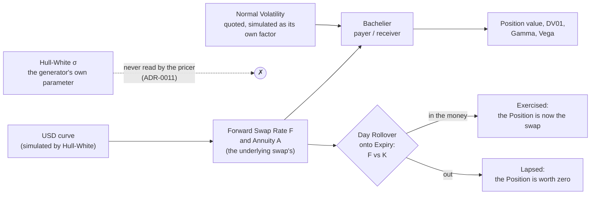
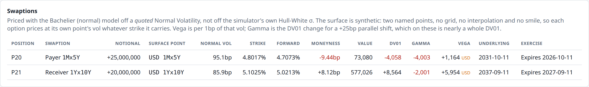
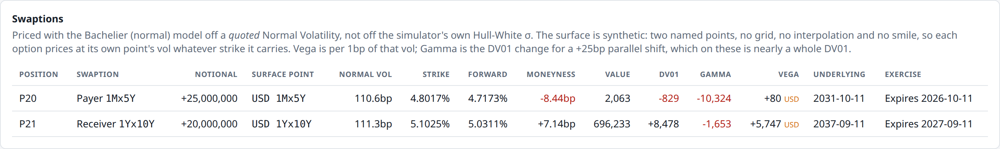
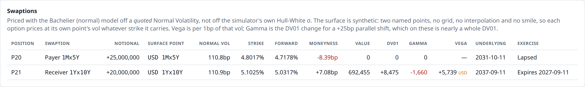
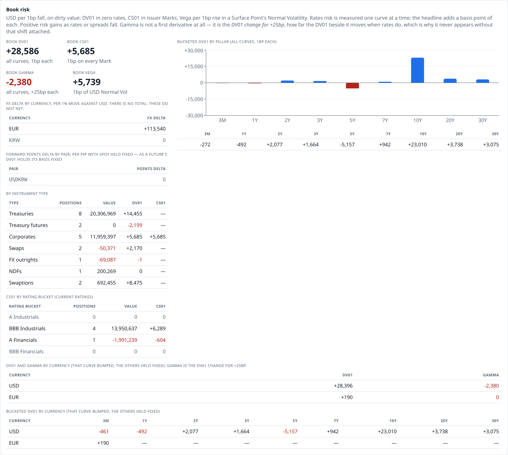

# 13. Options on a swap

*Bachelier, a quoted volatility surface, Vega and Gamma, and a decision made once.*

**Previously:** twelve articles have priced a Book, and every price in them came from something the engine
could derive or observe — a curve, a [Mark](glossary.md#mark), a Basis, a spot rate, a quoted forward
point. This one needs a number that none of those produce, and the engine's answer to where it comes from
is the last interesting decision in the series.

## The real-world problem

A [Swaption](glossary.md#swaption) is the right, but not the obligation, to enter an interest rate swap
([article 9](09-interest-rate-swaps.md)) at an agreed fixed rate on an agreed date. A **payer**
swaption is the right to pay that fixed rate; a **receiver** is the right to receive it. After that date
the option is either a swap or nothing at all.

The reason they exist is that a rate you may need is not the same as a rate you will need. A borrower
deciding in a month whether to fix, an issuer whose bond is callable, a fund that wants protection against
a move without giving up the move in its favour: all of them want the shape of an option rather than the
shape of a swap. It is a small corner of a very large market — interest rate options turned over
**$245 billion a day** in April 2025 against $7.9 trillion for OTC interest rate derivatives as a whole,
3% of the total, though the fastest growth in the survey at +55% over three years.[^bis-ird]

For a risk engine, the swaption is where the pattern of the last eleven articles finally breaks.

Everything in the Book so far has been priced from something the engine either builds or is told. A
Treasury comes off the curve. A future comes off a Proxy Bond and a Basis. A corporate comes off a curve
and an issuer's Mark. A swap comes off the curve and a recorded Fixing. An FX outright comes off two
curves and spot. Every one of those is a *price* or a *rate* — an observable level.

An option needs something else: a view about how far the rate might move before the option expires. No
amount of curve arithmetic produces it, because the curve says where rates are, not how much they wander.
That number is **volatility**, and it has to come from outside.

Which raises the question this article is really about: where does an engine get a number it cannot
derive, and what stops it cheating?

## How it works

### An option on a swap is an option on one number

[Article 9](09-interest-rate-swaps.md) left two quantities lying around, and they turn out to be exactly
what an option on a swap needs.

- The **[Forward Swap Rate](glossary.md#forward-swap-rate)** $F$: the fixed rate that would make the
  underlying swap worth zero today. It is what the option is struck against.
- The **[Annuity](glossary.md#annuity)** $A$: the discounted sum of the underlying's fixed accruals. It is
  what a basis point of swap rate is *worth*.

A swap worth $A \cdot (F - K)$ to the fixed payer is a swap whose whole value is one number, $F$, scaled by
another, $A$. So an option on that swap is an option on $F$, and the Annuity comes along as a multiplier.
That is why a swaption pricer does not need to know what a coupon is: article 9's swap already does.

### Bachelier, and why the market quotes volatility in basis points

The model the market uses for this is the oldest one there is. Louis Bachelier wrote it in his 1900
doctoral thesis, "marking the birth of mathematical finance", five years before Einstein's paper on
Brownian motion.[^bachelier] It assumes the underlying moves by **absolute** amounts — normally
distributed — rather than by proportional ones.

For seventy years that was an embarrassment: an absolute process lets the price go negative, and a stock
price cannot. Black-Scholes fixed that with a lognormal process, and Bachelier was filed under history.
Rates markets rehabilitated it, for two reasons that are worth separating.

The first is empirical, and it has nothing to do with negative rates: "swaptions are quoted and
risk-managed by Bachelier volatility … because the proportionality between the daily changes in and the
level of the interest rate — a key assumption of the BS model — is empirically weak".[^choi] A 10bp day is
a 10bp day whether the 5-year rate is at 2% or at 5%, in a way that a lognormal model, which says the move
should scale with the level, does not capture.

The second is that rates went to zero and then through it. "The negative interest rates observed in some
developed countries after the 2008 global financial crisis forced fixed-income trading desks to reconsider
their option pricing models."[^choi] A lognormal model cannot price an option on a rate that might be
negative without a shift parameter invented for the purpose; a normal model does not notice. The same
property was called on in public in April 2020, when oil futures went negative and the CME and ICE
temporarily switched their oil and gas options from Black-Scholes to Bachelier to cope.[^choi]

So the swaption market quotes **[Normal Volatility](glossary.md#normal-volatility)**, in basis points per annum: not "18% vol" but "95
basis points of vol", an absolute amount the rate might move in a year. The Federal Reserve's own analysis
of swaption-implied volatility works in basis points throughout.[^feds]

!!! formula "The Bachelier price of a swaption"

    With $A$ the Annuity, $F$ the Forward Swap Rate, $K$ the strike, $\sigma$ the Normal Volatility as a
    decimal and $T$ the year fraction to Expiry, write $d = (F-K)/(\sigma\sqrt{T})$. Then

    $$
    \begin{aligned}
    \text{payer} &= A\left[(F-K)\,\Phi(d) + \sigma\sqrt{T}\,\varphi(d)\right], \\
    \text{receiver} &= A\left[(K-F)\,\Phi(-d) + \sigma\sqrt{T}\,\varphi(d)\right],
    \end{aligned}
    $$

    with $\Phi$ and $\varphi$ the standard normal CDF and density. Subtracting the two gives
    **put–call parity** for swaptions,

    $$
    \text{payer} - \text{receiver} = A\,(F-K),
    $$

    which is the underlying swap: owning the right to pay and having sold the right to receive *is* paying
    fixed. The engine tests that identity over 1,230 combinations of strike, vol and expiry, and it holds
    to 1e−14.

    Two features earn their place. The Annuity sits outside the bracket as its own factor, so the option
    ties straight back to the curve code the rest of the Book already uses. And nothing in the formula
    takes a logarithm, so $F$ and $K$ may be zero or negative and the price stays finite — the whole reason
    the market moved to it.

    **Vega**, the derivative with respect to $\sigma$, is $A\sqrt{T}\,\varphi(d)$, the same for a payer and
    a receiver: the two differ by $A(F-K)$, which does not contain $\sigma$.

### The surface is a quote, and the engine is not allowed to cheat

Here is the uncomfortable part. This engine **already contains** a model of how rates move: Hull-White,
from [article 3](03-moving-the-curve-through-time.md), with a volatility parameter σ that drives the whole
simulation. Pricing the Book's swaptions from it would be easy and would even be defensible in a textbook:
Hull-White reproduces the initial curve exactly and gives European swaptions in closed form.

The engine refuses, and the refusal is the same one [article 7](07-credit-and-the-missing-tape.md) made
about credit. There, the simulator knows each issuer's Latent Spread and the risk engine is never allowed
to see it; it prices from the issuer's Mark, which is what the market can observe. Here, Hull-White's σ is
a parameter of the *simulated world* — it is how the market is generated, not something anyone in that
market could look up. An engine that prices its options from the generator's own parameters is right by
construction, and being right by construction is the one thing a risk system must never be. Every
interesting question in this project lives in the gap between what generates the world and what the engine
can see.

So the volatility is a **quote**. The engine simulates a Normal Volatility as its own
[Risk Factor](glossary.md#risk-factor), and the pricer reads it exactly as it reads a Mark: a number the
market hands over, with no claim that it is consistent with anything else. That inconsistency is real, and
it has a name — an uncalibrated surface — and it is what most desks run, because the market quotes the
surface and the model is fitted to it, not the other way round.

### Two named points, and no grid

A real volatility surface is a grid: expiry against tenor, and a smile across strikes at each cell. This
engine has **two named [Surface Points](glossary.md#surface-point)**, `USD 1Mx5Y` and `USD 1Yx10Y`, and no interpolation between them:

```properties
risk.vol.surface-points=USD 1Mx5Y, USD 1Yx10Y
risk.vol.USD.1Mx5Y.long-run-mean-bp=95
risk.vol.USD.1Yx10Y.long-run-mean-bp=85
```

Each swaption names the one point it prices from, and prices at that point's vol whatever strike it
carries — so there is no smile either. A third swaption would be a third name here and a third long-run
mean, and the engine fails at startup if an option names a point nobody quotes.

That is a simplification, but it is the honest shape of the simplification. Two quotes are two quotes.
Fitting a surface through them and interpolating would manufacture the appearance of a market that does
not exist, which is the kind of lie a risk system should not tell about its own inputs.

### Volatility as a process, on its logarithm

The quoted vol has to move, and how it moves is the third modelling choice in three articles.

!!! formula "An OU process on log vol"

    The engine holds $\ln\sigma$ and steps it as

    $$
    d\ln\sigma = \kappa\,(\ln\bar\sigma - \ln\sigma)\,dt + \eta\,dW ,
    $$

    so $\sigma = e^{\ln\sigma}$ is positive whatever the shock, and $\ln\sigma$ reverts to $\ln\bar\sigma$
    with stationary spread $\eta/\sqrt{2\kappa}$. The demo uses $\kappa = 2$ and $\eta = 0.6$, with
    $\bar\sigma$ of 95bp and 85bp for the two points.

Compare the three continuous factors the last three articles introduced, because the differences are all
deliberate:

| Factor | Process | Why |
|---|---|---|
| Futures Basis (article 6) | OU on the **level** | A basis is a spread; it can be either sign, and it pulls back |
| FX Spot (article 12) | driftless GBM on the **log**, no reversion | Pulling a currency back to a level would be a free forecast |
| Normal Volatility | OU on the **log** | Vol reverts — the most robust fact in rates volatility — but must stay positive |

A volatility that diffuses through zero is not a market state; it is an option at a negative premium.
Stepping the logarithm makes that impossible by construction rather than by clamping, which is the same
trick [article 12](12-two-currencies.md) uses to keep spot positive.

### Vega, and the Greek that needs a warning label

An option brings two new risk numbers, and one of them is easy.

**[Vega](glossary.md#vega)** is the change in value for a 1bp rise in the Surface Point's Normal Volatility. It is measured the
way every sensitivity in this series is measured — bump the input, reprice, take the difference — and it is
reported **per currency and never netted**, the shape FX Delta established in article 12.

**[Gamma](glossary.md#gamma)** is the awkward one. An option's value is curved in the rate, so its DV01 is not a constant: the
whole point of an option is that its exposure changes as the market moves. The natural way to report that
is a second derivative, and a second derivative in a basis point is numerically invisible on a Book of
this size. So the engine reports something a desk can actually use:

!!! formula "Gamma, defined as a change in DV01"

    $$
    \Gamma = \mathrm{DV01}(\text{curve} + 25\text{bp}) - \mathrm{DV01}(\text{curve})
    $$

    It is **not** a derivative. It is the answer to "how much does the DV01 beside it move if rates rise a
    quarter of a percent", which is why the panel never shows a Gamma without the shift attached — the
    number is meaningless without it, and a number called "gamma" with no shift is a different quantity in
    every system that reports one.

### The decision at the end

A European swaption ends on one date — its [Expiry](glossary.md#expiry) — and on that date somebody
decides. The engine's rule is three sentences long:

- At the [Day Rollover](glossary.md#day-rollover) onto the Expiry, compare the Forward Swap Rate against
  the strike, from that day's curve. That is the [Exercise Decision](glossary.md#exercise-decision).
- Record the answer, once, with `putIfAbsent`.
- Never recompute it.

The third sentence is the interesting one. If rates move back through the strike the next Tick, the
recorded decision stands, because that is what exercising means. A decision that is recomputed every Tick
is not a decision; it is a comparison. This is the same discipline as article 9's
[Fixing](glossary.md#fixing) and article 12's [FX Fixing](glossary.md#fx-fixing) — three stores, three
different jobs, one rule: the first thing recorded for a date wins forever.

Both swaptions here are **physically settled**, the USD convention: exercising leaves the holder in the
underlying swap. Read literally that means the Book loses a swaption and gains a swap. It does not. One
Instrument values as an option before Expiry, as its underlying swap after it if exercised, and as exactly
zero if not. The [Position](glossary.md#position) keeps its id and its place in the Book.

The alternative — a Book that changes shape mid-session — is a much larger feature than it sounds. Risk
Updates are keyed by Position id, so it would need an add and a remove in the wire protocol, in the
browser's reducer and in every rollup that assumes a stable set of keys, all to model something an
Instrument can already express: a thing whose value and whose Dependencies change at a point in its life.
A matured bond and a settled forward already sit in the Book at zero rather than vanishing from it.

And an exercise is deliberately **not** a [Lifecycle Event](glossary.md#lifecycle-event). A Lifecycle Event
is a cash flow; an exercise pays nothing. Widening the term to cover it would have made it mean "anything
that happens at a rollover", which is exactly the erosion article 12 refused when it gave **FX Fixing** its
own name instead of stretching **Fixing** across two different jobs.



## How the system does it

The pricer is the formula box and nothing else. Four lines around a normal CDF:

```java title="BachelierModel.java" linenums="37"
    /** The right to pay {@code strike} and receive floating: worth {@code A·(F − K)} in the money. */
    public static double payer(double annuity, double forwardRate, double strike, double normalVol,
                               double timeToExpiry) {
        double sigmaRootT = sigmaRootT(normalVol, timeToExpiry);
        if (sigmaRootT == 0) {
            return annuity * Math.max(forwardRate - strike, 0);
        }
        double d = (forwardRate - strike) / sigmaRootT;
        return annuity * ((forwardRate - strike) * cdf(d) + sigmaRootT * pdf(d));
    }
```

[View on GitHub](https://github.com/suhasghorp/fixed-income-risk-engine/blob/series-v1/backend/src/main/java/com/fixedincomerisk/model/BachelierModel.java#L37-L46)

The `sigmaRootT == 0` branch is not defensive programming. It is the state every option passes through on
its Expiry date, when $T$ reaches zero: the price degenerates to intrinsic value rather than dividing by
zero. A case, not an edge case.

The Instrument holds the three states an option has in its life, and the branch at the top is ADR-0012 in
code:

```java title="Swaption.java" linenums="115"
     * Before Expiry, the premium per unit of the underlying's notional: an option is bought, so it is
     * never negative whichever way the market has moved. From the Expiry it is the underlying swap if the
     * recorded Exercise Decision says so, and exactly zero if it does not — at which point it can and
     * does go negative, because it is a swap now and no longer an option.
     *
     * <p>The Position never moves and the Book never changes shape; what changed is what this Position
     * <em>is</em>. ADR-0012.
     */
    @Override
    public double dirtyValue(MarketState market) {
        if (!market.valuationDate().isBefore(expiryDate)) {
            return wasExercised(market) ? underlying.dirtyValue(market) : 0;
        }
        double annuity = underlying.annuity(market);
        if (annuity <= 0) {
            return 0;
        }
        return isPayer()
                ? BachelierModel.payer(annuity, underlying.forwardRate(market), strike(),
                        market.vols().normalVol(surfacePoint.label()), yearsToExpiry(market))
                : BachelierModel.receiver(annuity, underlying.forwardRate(market), strike(),
                        market.vols().normalVol(surfacePoint.label()), yearsToExpiry(market));
    }
```

[View on GitHub](https://github.com/suhasghorp/fixed-income-risk-engine/blob/series-v1/backend/src/main/java/com/fixedincomerisk/instrument/Swaption.java#L115-L137)

`underlying.annuity(market)` and `underlying.forwardRate(market)` are article 9's swap answering questions
about itself. The swaption owns no schedule, no day count and no coupon logic; it owns an Expiry, a Surface
Point and a swap.

The decision is made in the simulator, at the rollover, and it is four lines of comparison wrapped in one
guard:

```java title="MarketSimulator.java" linenums="351"
    private void recordExerciseDecisions() {
        MarketState today = new MarketState(clock.valuationDate(), curves(), Map.of(),
                MarketState.CreditMarket.NONE, fixingHistory.fixings());
        for (Swaption swaption : swaptions) {
            if (!clock.valuationDate().equals(swaption.expiryDate())) {
                continue;
            }
            double forward = swaption.underlying().forwardRate(today);
            boolean inTheMoney = swaption.isPayer() ? forward > swaption.strike() : forward < swaption.strike();
            exerciseHistory.record(swaption.id(), swaption.expiryDate(), inTheMoney);
        }
    }
```

[View on GitHub](https://github.com/suhasghorp/fixed-income-risk-engine/blob/series-v1/backend/src/main/java/com/fixedincomerisk/session/MarketSimulator.java#L351-L362)

And the store it records into is the third member of a family the series has now built three times:

```java title="ExerciseHistory.java" linenums="20"
    /**
     * Records whether {@code swaptionId} was exercised at {@code expiry}, unless a decision is already
     * recorded.
     *
     * @return true if recorded, false if that (swaption, Expiry) had already decided, which stands
     */
    public boolean record(String swaptionId, LocalDate expiry, boolean exercised) {
        return decisions.putIfAbsent(new ExerciseDecisions.Key(swaptionId, expiry), exercised) == null;
    }
```

[View on GitHub](https://github.com/suhasghorp/fixed-income-risk-engine/blob/series-v1/backend/src/main/java/com/fixedincomerisk/market/ExerciseHistory.java#L20-L28)

The volatility process is six lines, and the only thing worth noticing is what is being stepped:

```java title="NormalVolSimulator.java" linenums="23"
    /** Starting away from the long-run mean, as {@link NdfPointsSimulator} allows for Forward Points. */
    public NormalVolSimulator(NormalVolParameters parameters, double startingVol) {
        if (!(startingVol > 0)) {
            throw new IllegalArgumentException("A Normal Volatility must start positive, got " + startingVol);
        }
        this.parameters = parameters;
        this.logLongRunMean = Math.log(parameters.longRunMean());
        this.logVol = Math.log(startingVol);
    }

    public void advance(double dt, double shock) {
        logVol += parameters.meanReversion() * (logLongRunMean - logVol) * dt
                + parameters.volOfVol() * Math.sqrt(dt) * shock;
    }

    /** The Normal Volatility, in decimal: 0.0095 is 95bp per annum. */
    public double vol() {
        return Math.exp(logVol);
    }
```

[View on GitHub](https://github.com/suhasghorp/fixed-income-risk-engine/blob/series-v1/backend/src/main/java/com/fixedincomerisk/model/NormalVolSimulator.java#L23-L41)

The state is `logVol`. `vol()` exponentiates on the way out, and positivity is a property of the
representation rather than a rule anyone has to enforce.

## See it running

The Book's two options are **P20**, a payer on a 5-year swap struck at 4.8017% expiring 11 October 2026,
and **P21**, a receiver on a 10-year swap struck at 5.1025% expiring 11 September 2027. Both were struck at
the Forward Swap Rate on the session's start date, so both began exactly at the money.

```bash
# Terminal 1: the engine (N = 24, 719 or 720)
cd backend && mvn spring-boot:run -Dspring-boot.run.profiles=demo \
    -Dspring-boot.run.arguments=--risk.simulation.stop-at-tick=N

# Terminal 2: the UI, then open http://localhost:5173
cd frontend && npm install && npm run dev
```

### Two options, one screen: Tick 24



The quoted surface is on the left of each row: **95.1bp** for the 1Mx5Y point and **85.9bp** for the
1Yx10Y. Neither came from the curve, and nothing on this screen could have derived them.

| | P20, payer 1Mx5Y | P21, receiver 1Yx10Y |
|---|---|---|
| Strike | 4.8017% | 5.1025% |
| Forward Swap Rate | 4.7073% | 5.0213% |
| Moneyness | **−9.44bp** (out) | **+8.12bp** (in) |
| Normal Vol | 95.1bp | 85.9bp |
| Value | \$73,080 | \$577,026 |
| DV01 | −4,058 | +8,564 |
| Gamma (+25bp) | −4,003 | −2,001 |
| Vega (1bp of vol) | +1,164 | +5,954 |

Three things in that table are worth slowing down for.

**The payer is worth \$73,080 while being out of the money.** Its intrinsic value is zero: if it expired
today it would pay nothing. Every cent of it is time value — thirty days in which a 9.44bp gap might close.
The receiver, in the money by 8.12bp, splits differently: of its 0.0288512936 per unit of notional,
0.0060943960 is intrinsic and 0.0227568977 is time value.

**Both Gammas are nearly as large as the DV01s beside them.** The payer's DV01 is −4,058 and its Gamma is
−4,003: if rates rose 25bp, that DV01 would become about **−8,061**, roughly double. The option would be in
the money, and an option in the money behaves like the swap it can turn into. The receiver's pair works the
other way — DV01 +8,564, Gamma −2,001 — because the same 25bp rise pushes *it* out of the money and takes
delta away. No bond in this Book behaves like either: a bond's DV01 barely notices 25bp.

**Vega is the whole reason this article exists.** The Book's Vega is **USD +7,117.88**, and all of it is
these two Positions. Before the Book held an option there was no Vega line on the screen at all — the
rollup is generic, so an Instrument that does not read the surface measures zero and a Book with no
optionality shows nothing.

### The measurement checks the formula

The engine reports Vega by bumping the Surface Point and repricing, like every other sensitivity in the
series. `BachelierModel` also has the closed form, $A\sqrt{T}\,\varphi(d)$, which is never used for
reporting — it exists so the measurement can be checked against something derived independently.

| | Closed form × notional | Measured by bump-and-reprice |
|---|---|---|
| P20 | 0.0000465647 × 25,000,000 = **1,164.12** | **1,164.11** |
| P21 | 0.0002976889 × 20,000,000 = **5,953.78** | **5,953.77** |

Six significant figures apart. A central difference is not supposed to match a derivative exactly, and how
far apart they are is a property of the bump size, not a defect.

### The life of an option that was in the money and still expired worthless

The payer had thirty simulated days. Here is all of them, measured at six Ticks:

| Tick | Date | Moneyness | Value | DV01 | Gamma |
|---|---|---|---|---|---|
| 24 | 2026-09-12 | −9.44bp | 73,080 | −4,058 | −4,003 |
| 240 | 2026-09-21 | **+1.06bp** | 127,087 | −5,756 | −3,460 |
| 480 | 2026-10-01 | −1.80bp | 75,703 | −5,191 | −4,694 |
| 600 | 2026-10-06 | −22.78bp | 2,825 | −519 | −5,994 |
| 719 | 2026-10-10 | −8.44bp | 2,063 | −829 | −10,324 |
| 720 | 2026-10-11 | −8.39bp | **0** | 0 | 0 |

**It was in the money at Tick 240** — by a single basis point, worth \$127,087 — and it still expired
worthless. Nothing decided that except seed 42 and the arithmetic; the run was not chosen to produce it.

Read down the Value column and you can watch time value evaporate. At Tick 600 the option is 22.78bp out
with five days left and is worth \$2,825. At Tick 719 it has come back to 8.44bp out — a much better place
to be — and is worth \$2,063, *less* than it was when it was three times further away. Nine days of
remaining life are worth more than 14bp of moneyness, and then they are gone.

Read down the Gamma column and you can watch the opposite. Gamma grows from −4,003 to **−10,324** as the
option approaches its Expiry, while its DV01 collapses from −4,058 to −829. At Tick 719 the Gamma is
**1,245% of the Position's own DV01**:



That number is the article's argument in a single line. A DV01 of −829 says "this Position moves \$829 for
a basis point", which sounds like almost nothing in a Book with 28,000 of DV01 in it. The Gamma beside it
says that a 25bp rise would turn that −829 into about **−11,153**: the option would be in the money, and
the Position would have the delta of a 5-year swap on 25 million. One day from Expiry, the linear number
has stopped describing this Position at all, and a risk report that showed only DV01 would be telling the
desk it holds almost nothing.

### The decision: Tick 720



On the Day Rollover onto 11 October 2026, the Forward Swap Rate was **4.717794%** against a strike of
**4.8017%**. Out of the money by **8.39bp**, so the decision recorded was *not exercised*, and the row now
reads **Lapsed**: value zero, DV01 zero, Gamma zero, and a dash where the Vega was. P20 is still P20, still
in the Book, in the same place.

Eight basis points. The Book is worth \$33 million and the option was one bad month away from being a
5-year swap on 25 million; instead it is a row of zeros. That is what options do, and an article that only
showed the branch where the option paid off would be a brochure rather than a description.

The Book's risk changes with it:



| | Tick 719 | Tick 720 |
|---|---|---|
| Book Vega | +5,826 | **+5,739** |
| Book Gamma (+25bp) | −12,697 | **−2,380** |
| Book DV01 | +27,764 | +28,586 |

Book Gamma falls by a factor of five in one Tick. Nothing was traded and no price moved unusually: an
option simply stopped being one, and with it went the largest source of curvature in the Book. Vega
barely moves, because the payer had almost none left to lose.

**What this run does not show.** The Forward Swap Rate stays below the strike after Expiry — 4.7192% at
Tick 721, 4.6914% at Tick 768, 4.7181% at Tick 880 — so the demo never puts the recorded decision to the
test by having rates cross back through the strike. The guarantee is in `putIfAbsent` and in the test
suite, not on this screen. It is worth being precise about the difference between what a system promises
and what a particular run happens to demonstrate.

!!! realdesk "What a real desk does differently"

    - **A real surface is a surface.** Expiries down one axis, tenors across the other, and a **smile** of
      strikes at every cell, fitted with a model like SABR and interpolated between quotes. This engine has
      two points, no strike dimension and no smile, so every strike prices at the same vol — which for an
      option far from the money is simply the wrong price.
    - **The surface would be calibrated.** The honest way to close the gap this article describes is to
      calibrate the simulator's own dynamics to the quoted surface, so the world and its options agree.
      That is real work and it is deliberately out of scope here; the inconsistency is stated instead of
      hidden.
    - **Cash settlement is a choice with a history.** These two are physically settled. Cash-settled
      swaptions need a rule for turning a swap into an amount, and the rule changed: the EUR market moved
      from "Par Yield Curve – Unadjusted" to **Collateralized Cash Price** on 26 November 2018, tying the
      settlement discounting to the collateral the market actually posts.[^isda-ccp]
    - **Swaptions are bilateral, and margined.** The US clearing mandate covers four classes of interest
      rate swap — fixed-to-floating, basis, FRA and OIS — and options are not among them, so a swaption is
      typically uncleared. Uncleared does not mean unmargined: the BCBS-IOSCO margin requirements for
      non-centrally cleared derivatives completed their phase-in on **1 September 2022**, so a desk posts
      initial and variation margin against exactly these positions.[^umr]
    - **Greeks come in a bigger set.** Theta, the vega ladder by expiry and tenor bucket rather than one
      number per currency, and the distinction between sticky-strike and sticky-delta risk when the smile
      moves. This engine reports one Vega per currency, which is the right first step and not the finished
      article.
    - **Exercise is an operation, not an arithmetic comparison.** Notices, deadlines, a calculation agent
      and a counterparty who may see it differently. The engine compares two numbers at midnight.
    - **The surface moves for reasons.** Supply and demand from callable issuance and hedging flow, and the
      market's view of how uncertain policy is, move quoted vol in ways no mean-reverting process
      reproduces. The Federal Reserve's own work links swaption-implied volatility to macroeconomic
      uncertainty about inflation and growth.[^feds]

### Which numbers here are real

This is the article where the engine invents the most, so it is worth being blunt about it.

- **Invented.** The **entire volatility surface**: both long-run means (95bp and 85bp), the speed of
  reversion, the vol of vol. Nothing here is calibrated to a market quote, and no vol in this article was
  ever observed anywhere. It is the largest synthetic input in the series — larger than the NDF's Forward
  Points in [article 12](12-two-currencies.md) — and it is synthetic for a plain reason: swaption vol
  surfaces are commercial data, and this project publishes everything it uses.
- **Real.** Everything the options are priced *against*. The underlying swaps' conventions, the curve they
  discount on and the Forward Swap Rates and Annuities that come off it are the same machinery as
  [article 9](09-interest-rate-swaps.md), anchored to the published US Treasury par curve of
  11 September 2026.
- **Struck, not chosen.** Both strikes are the Forward Swap Rate as of the session's start date, rounded to
  0.01bp, so both options began exactly at the money rather than at a level picked to make the article come
  out well. The reference data records them rather than computing them at startup, so a run on a live curve
  starts slightly away from the money — which is the honest outcome, not a bug.

A reader who wants to see how much the synthetic surface matters can change one number:
`risk.vol.USD.1Mx5Y.long-run-mean-bp`. Raising it makes P20 worth more at every Tick and changes nothing
about whether it expired in the money, which is a decent one-line summary of what volatility is and is not.

## Further reading

Primary sources:

- J. Choi, M. Kwak, C. W. Tee and Y. Wang, [*A Black–Scholes user's guide to the Bachelier
  model*](https://arxiv.org/abs/2104.08686), arXiv:2104.08686, 2022 (*Journal of Futures Markets*). The
  history, the market's use of normal vol, and the 2020 exchange switch.
- L. Bachelier, *Théorie de la spéculation*, Annales scientifiques de l'École Normale Supérieure, 1900. The
  original.
- Bank for International Settlements, [*OTC interest rate derivatives turnover in April
  2025*](https://bis.org/statistics/rpfx25_ir.htm), Triennial Central Bank Survey, September 2025.
- C. Sarisoy, [*Drivers of Option-Implied Interest Rate
  Volatility*](https://www.federalreserve.gov/econres/notes/feds-notes/drivers-of-option-implied-interest-rate-volatility-20241024.html),
  FEDS Notes, Federal Reserve Board, 24 October 2024.
- ISDA, [*Market Practice Change for Settlement of EUR Swaptions to Collateralized Cash
  Price*](https://www.isda.org/2018/11/26/market-practice-change-for-settlement-of-eur-swaptions-to-collateralized-cash-price/),
  26 November 2018.
- BCBS-IOSCO, [*Margin requirements for non-centrally cleared
  derivatives*](https://www.bis.org/bcbs/publ/d499.htm), April 2020. The September 2022 final phase.
- R. Baviera and M. D. Massaria, [*The additive Bachelier model with an application to the oil option market
  in the Covid period*](https://arxiv.org/abs/2506.09760), arXiv:2506.09760, 2025.

Textbooks:

- Leif B. G. Andersen and Vladimir V. Piterbarg, *Interest Rate Modeling*, Atlantic Financial Press, 2010.
  The standard reference for swaptions, the annuity measure and volatility modelling.
- Riccardo Rebonato, *Volatility and Correlation*, 2nd ed., Wiley, 2004.
- P. S. Hagan, D. Kumar, A. S. Lesniewski and D. E. Woodward, "Managing Smile Risk", *Wilmott*, September
  2002. SABR — what a desk fits to the surface this engine invents.

[^bis-ird]: BIS, *OTC interest rate derivatives turnover in April 2025*: "Turnover of OTC IRD averaged $7.9 trillion per day in April 2025"; "Trading in interest rate options picked up by 55%, but turnover remained relatively small at $245 billion (3% global share)." The options line covers interest rate options generally, not swaptions alone.
[^bachelier]: Choi, Kwak, Tee and Wang (2022), §1: "Louis Bachelier pioneered an option pricing model in his Ph.D. thesis (Bachelier, 1900), marking the birth of mathematical finance. He offered the first analysis of the mathematical properties of Brownian motion (BM) to model the stochastic change in stock prices, and this preceded the work of Einstein (1905) by five years."
[^choi]: Choi, Kwak, Tee and Wang (2022), §1: "The Bachelier model has been widely used at least in the fixed income markets—swaptions are quoted and risk-managed by Bachelier volatility. This is because the proportionality between the daily changes in and the level of the interest rate—a key assumption of the BS model—is empirically weak"; "The negative interest rates observed in some developed countries after the 2008 global financial crisis forced fixed-income trading desks to reconsider their option pricing models"; and, on 2020, "the Chicago Mercantile Exchange (CME) and Intercontinental Exchange (ICE) temporarily changed their models for oil and natural gas options from the BS to the Bachelier model until August 2020 to handle the negative prices." The exchanges' own notices are paywalled to automated access and were not read.
[^feds]: C. Sarisoy, *Drivers of Option-Implied Interest Rate Volatility*, FEDS Notes, 24 October 2024. The note works in basis points throughout and describes its measure as "the swaption-implied volatility of one-year swap rate at a horizon of one year ahead"; it attributes moves to macroeconomic uncertainty about inflation and growth.
[^isda-ccp]: ISDA, *Market Practice Change for Settlement of EUR Swaptions to Collateralized Cash Price*, 26 November 2018: the convention moved "from 'Par Yield Curve – Unadjusted' to 'Collateralized Cash Price'". The mechanics live in Supplement 58 to the 2006 ISDA Definitions, a paid document that was not read here.
[^umr]: BCBS-IOSCO, *Margin requirements for non-centrally cleared derivatives* (April 2020): "the final implementation phase will take place on 1 September 2022". That swaptions fall outside the US clearing mandate is read from the CFTC's clearing requirement determination, which names four interest rate swap classes — fixed-to-floating, basis, FRA and OIS — none of which is an option.

## Next

There is no next. Thirteen articles ago this series started with a Book of bonds and the question of what a
risk system is for; it ends with an option that expired eight basis points out of the money, in the same
Book, priced by the same engine, on the same seed.

What the last two articles added was not more Instruments so much as two admissions. Article 12's forward
had to be **derived** for one currency and **quoted** for another, because that is what the two markets
do. This one's option had to be priced from a number the engine cannot derive at all — and the engine is
careful not to peek at the simulator that could have told it. Both are versions of the series' one real
subject: a risk system is defined less by what it computes than by what it refuses to assume it knows.

The engine is on GitHub, the demo runs from one seed, and every number in all thirteen articles came out of
it. Change a threshold, move a strike, run it past Tick 720 and watch an option die. It will tell you
something the articles could not.
